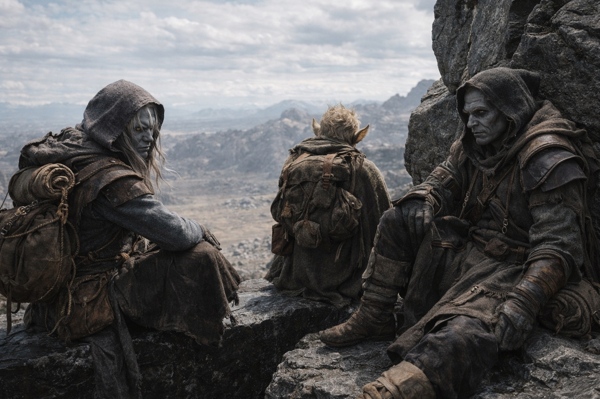
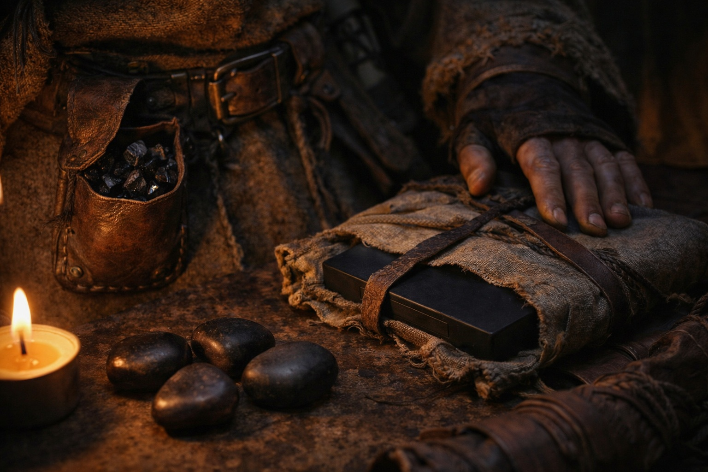
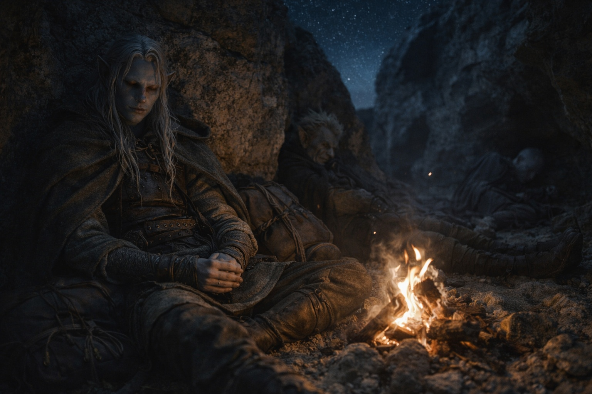

---
order: 282
title: "The Departure: The Weight"
description: "He counted what he carried because counting was what he did when the alternative was feeling."
date: 2024-09-25
language: en
chapter: 31
subchapter: 5
storyline: drusniel
canon_phase: main
canon_sequence: D-031-005
narrative_weight: high
category: Wyrmreach
author: Drusniel
type: Main
tags: ['#the departure', '#drusniel', '#wyrmreach']
thumbnail: image.jpg
featured: false
counterpart_path: site/content/posts/es/wyrmreach/la-partida-el-peso/index.mdx
counterpart_title: "La Partida: El Peso"
---

## Chapter 31 | Part 5 | The Weight

---

He counted what he carried because counting was what he did when the alternative was feeling.

Evening. The Thornfield border was behind them, crossed without ceremony at a point where Szoravel's map showed a gap in Nyxara's patrol schedule. The gap had been there. The schedule had held. Whether that meant Szoravel's intelligence was accurate or Nyxara had allowed them through was a question Drusniel filed under problems he couldn't solve and wouldn't examine until forced.

They'd made camp in a formation of rocks that provided windbreak and sightlines, the kind of natural shelter that Srietz identified by instinct and Drusniel was learning to see. The goblin had built a small fire from vegetation that burned low and hot and produced minimal smoke, another skill from the catalogue of survival knowledge he'd accumulated in three years of slavery and however many years of not being anyone's possession.

Srietz had spoken to Drusniel twice since the conversation on the stone shelf. Both times about practical matters: water purification, the edibility of a root he'd found. The words came directly, not through Elion. Progress. Or the beginning of it. Or the appearance of it maintained because the alternative, silence, was an inefficiency Srietz couldn't afford.

Elion slept. Or performed sleeping. The distinction had become academic.

Drusniel sat against the rock with his pack beside him and catalogued.

The debts. Two owed to the Voice, the entity that had saved his life in the Nightmare Sea and then saved his companions when starvation would have claimed them. The Voice had been absent during the volcano crossing, silent when he'd needed it most, and that silence had taught him something he couldn't unlearn: he could survive without it. The knowledge should have been liberating. Instead it sat in his chest like a question mark, because if the Voice was optional for survival, then the debts were optional too, and if the debts were optional, the Voice had paid a price for favors he might have managed alone. Which meant the debts were either legitimate costs or they were leverage. And the Voice had not volunteered which.

One debt to Nyxara. A conversation, promised during the audience in her territory, content undefined, deadline now expired. She'd come to collect and he'd run. The debt hadn't dissolved with distance. It had gained interest. Whatever she wanted from that conversation, the wanting would be sharper now, edged with the inconvenience of pursuit and the indignity of being dodged by someone she considered a minor asset.

The artifact. The Null. Erase phase of the Nexus Chassis. Sitting in his pack, wrapped in cloth, dark and featureless and carrying a purpose that its handlers disagreed about. Szoravel wanted the barrier renewed. Zaelar wanted it dismantled. The Null didn't care. It was a tool. What it did depended on the parameters entered at activation, and the person entering those parameters was supposed to be Drusniel, because he was compatible. Not special. Not chosen. Compatible. A key that fit a specific lock because the lock was particular, not because the key was remarkable.

He'd found that comforting for about an hour. Then the comfort had eroded into something worse: the understanding that compatibility didn't grant understanding. He could activate the Chassis without knowing what it would do. He could repair the barrier or collapse it depending on alignment, and the people who understood alignment couldn't agree on what the correct alignment was.

The directions. A ridge of black stone. A river that ran backward. A tower half consumed by earth. Three paths, one silent. Pulled from the Dreamlands in seven minutes of controlled projection that had cost him blood from his ear and a night of sleep so broken that the waking world still carried a residual shimmer, a half-degree offset that made every surface feel provisional.

Szoravel had given him three calibration crystals. Tomorrow night he'd project again. Build a composite. Look for the fracture lines that repeated. The structural directions that persisted when everything else shifted. That was the route. Unreliable, costly, facilitated by crystals that reduced the friction between his consciousness and a plane where something vast could find him.

He was different than when he'd started.

The realization arrived without fanfare. He'd known it intellectually since the Nightmare Sea, since the first debt, since the crystals began changing the way his body processed Wyrmreach's hostile environment. But knowing it and accounting for it were different operations, and tonight, on the far side of the Thornfield border with his companions sleeping and the fire burning low, the accounting was unavoidable.

He was carrying crystals that had adapted his body to conditions that should kill him. His consciousness could project into a plane of collective dreaming. He bore two debts to an entity whose nature he couldn't verify and whose interests he couldn't predict. He was the compatible interface for a system whose purpose its creators disputed. He had a companion who refused to look at him and a companion who might be hosting something ancient in his body without knowing.

He'd left Umbra'kor as a failed trial candidate with a stolen artifact and a dead family. Weeks later he was something else. Something that didn't have a name because the categories didn't exist for someone caught between instrument and person, between tool and user, between the thing that maintained the barrier and the thing that broke it.

The Voice stirred.

Not words. Not the clear, articulated interventions he'd experienced during the debts. A presence. A warmth in the space behind his sternum where the debts lived, where the Voice's influence resided, where the connection between them was strongest. It stirred the way a sleeper shifts in the dark: movement without consciousness, weight redistributing, the system adjusting before the occupant wakes.

Then, quiet as breath:

*Almost ready.*

Two words. More suggestion than speech, more vibration than language, pressed into his awareness with the delicacy of someone testing whether a door was locked.

*Almost there.*

He didn't ask where. He was afraid he already knew.

The fire burned low. The wind moved through the rock formation with a sound like breathing. Srietz slept against the far wall, close enough to help, far enough to hurt. Elion's stillness held its usual ambiguity. The landscape of Wyrmreach extended in every direction, hostile and wrong and the only direction forward.

Drusniel closed his eyes. The Null pressed against his spine through the pack. The crystals hummed at his belt. The Voice settled back into whatever space it occupied when it wasn't speaking, and the silence it left behind was not absence but anticipation.

He kept his eyes closed. Sleep didn't come for a long time, and when it did, it was thin and shallow and full of fractures that might have been dreams or might have been the Dreamlands leaking through, and he carried all of it, all the weight, all the debts, all the directions and distances and damaged trust, into the dark.

In the morning, they would walk.

They walked.

---

**End of Chapter 31 — Act 2 Closes**

