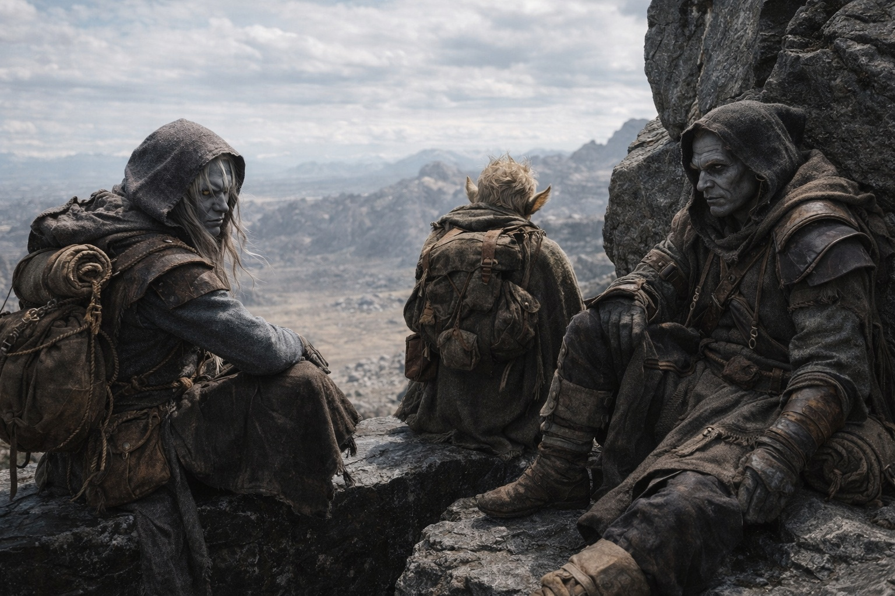
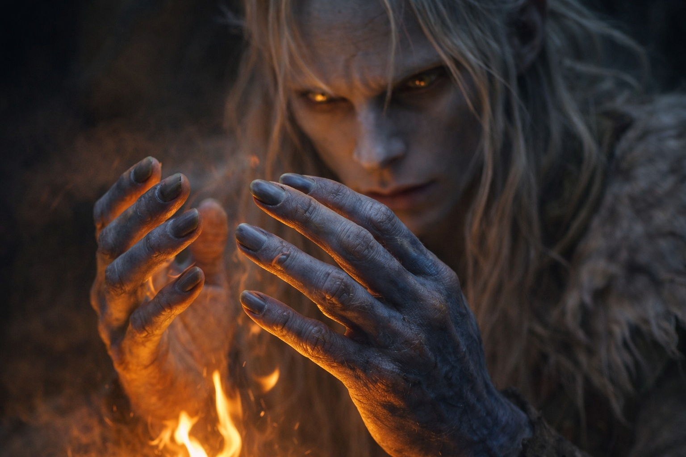
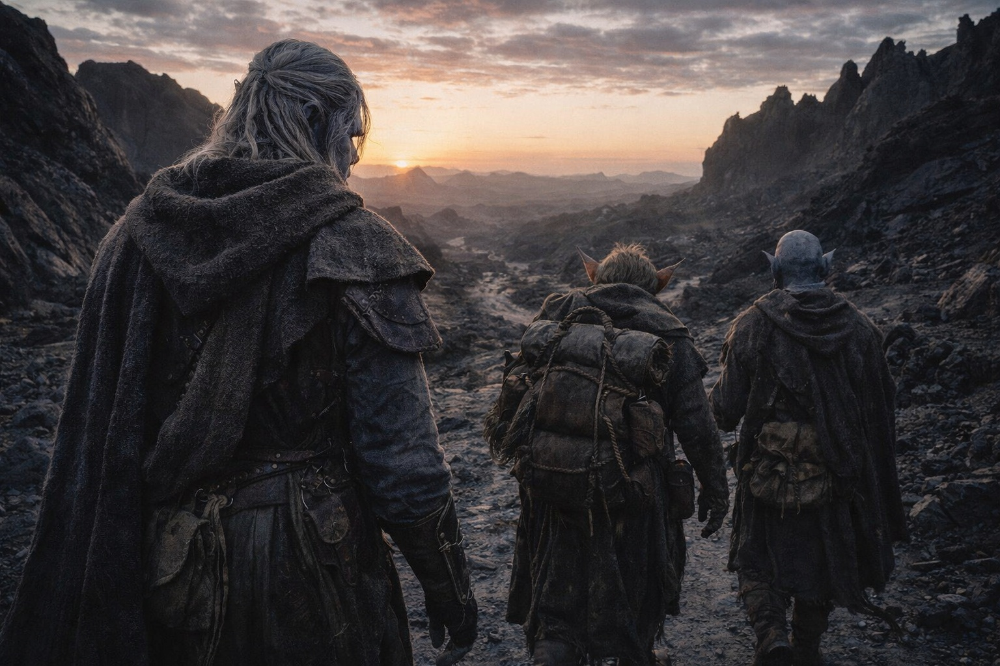

---
order: 282
title: "The Departure: The Weight"
description: "Drusniel checked his pack again, though he knew nothing was missing."
date: 2024-09-25
language: en
chapter: 31
subchapter: 5
storyline: drusniel
canon_phase: main
canon_sequence: D-031-005
narrative_weight: high
category: Wyrmreach
author: Drusniel
type: Main
tags: ['#the departure', '#drusniel', '#wyrmreach']
thumbnail: image.jpg
featured: false
counterpart_path: site/content/posts/es/wyrmreach/la-partida-el-peso/index.mdx
counterpart_title: "La Partida: El Peso"
---

## Chapter 31 | Part 5 | The Weight

---

Drusniel checked his pack again, though he knew nothing was missing.

By the second evening, they had crossed Thornfield at the gap marked on Szoravel's map. They'd seen no patrol. Drusniel didn't know whether to credit the map or Nyxara's permission.

Srietz chose a gap between rocks with a view of both approaches. He built a small fire from dry stems that burned with little smoke.

Srietz had spoken directly to him twice since their argument, once about water and once about a root he'd found. Drusniel hadn't tried to extend either conversation.

Elion lay still with his eyes closed.

Drusniel sat against the rock and tried to decide what needed checking first.

Two debts. The first on the Nightmare Sea; the second for a route through the caves. He'd survived the mountain without another offer. That hadn't cancelled either acceptance.

Nyxara still wanted an audience. He'd agreed to passage through her territory, not future service. Whether she respected that distinction remained to be seen.

He touched the Null beneath his shirt. Erase. Its name told him what it removed, not what would be left afterward.

Szoravel had called him compatible. Drusniel still didn't know enough to risk activating it.

He remembered a black ridge, a river running backward and a half-buried tower. Three paths, one silent. Seven minutes in the Dreamlands had cost him blood from his ear. He'd slept badly afterward and still felt dizzy when he turned his head too fast.

Szoravel had returned the three calibrated crystals. Tomorrow night he would use them to check the route again. He needed to find the landmarks that stayed in place when the rest of the dream changed.

He was different than when he'd started.

He tried to remember a night in Umbra'kor when sleep had required this much effort.

He could breathe here with the crystals close. That didn't make the next step safe. He looked at his companions, remembering how little he'd asked before taking them to Szoravel.

He'd wanted to learn what had been done to him. Now he had to decide how much more he would allow.

The Voice stirred.

Cold tightened beneath his breastbone. He stopped moving.

The Voice spoke.

*Almost ready.*

He waited, holding his breath.

*Almost there.*

He didn't ask where. He was afraid he already knew.

He looked toward Srietz, asleep beside the far wall. Elion hadn't moved. Neither seemed to have heard.

The cold remained after the words stopped. He held a hand against the Null through his shirt until his breathing steadied.

Each time he closed his eyes, he saw the branching paths again. He couldn't tell whether he was remembering or beginning to dream.

In the morning, they would walk.

They walked.

---

**End of Chapter 31.5 —> 32.1: [The Last Safe Place: The Arrival](/the-last-safe-place-the-arrival/)**

