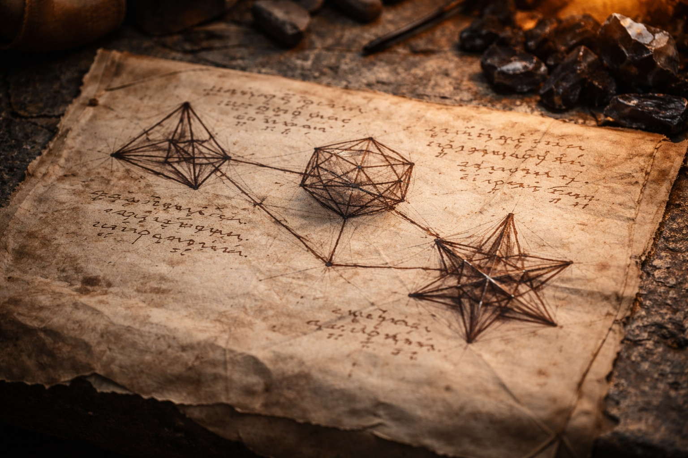

## Chapter 29 | Part 2 | The Exchange

---

Every answer Szoravel gave cost a question in return.

"How long have you been in Wyrmreach?" Szoravel asked. He'd laid the seventh crystal apart from the others and was drawing lines between them on the workbench with a fine brush dipped in something that looked like diluted ink but smelled like ozone.

"About fourteen weeks." Drusniel watched the brush connect the crystals. "My turn. How do you know Zaelar?"

"We worked together. A long time ago. On the same systems. Different conclusions." The brush paused. "Who sent you to the mountain?"

"No one. I was trying to cross the volcanic fields. I saw your tower inside the mountain." He met Szoravel's eyes. "What systems?"

"Barrier maintenance." Szoravel put down the brush. "The first debt. Location and circumstances."

Szoravel had written down the debts without reacting. Drusniel decided to give him the circumstances and see what he made of them.

"The Nightmare Sea. I was drowning."

"And you accepted."

"The second was in the caves. I needed a way through. When Srietz fell later, the Voice didn't answer. Elion brought him back."

"Two acceptances. No third contact." Szoravel marked the page.

"None," Drusniel confirmed.

"The debts remain outstanding." He set the brush aside. "Prior disclosure from Zaelar?"

"No."

"Recorded. State what you know about the artifact."

"The Null. Zaelar gave it to me as a courier tool. He said it needed to reach Wyrmreach. That it was part of something larger."

"He told you that much." Szoravel extended one hand. "May I?"

Drusniel drew the Null from beneath his shirt. It was cold against his hand. He passed it across the bench without letting go until Szoravel had taken its weight.

Szoravel turned the inert plate toward the fire and examined its seams.

"Phase II. Erase. The Null." He pressed a seam; a panel slid aside, exposing an empty socket.

"Elemental support goes here."

"Which stone?"

"Water or Air. No activation without support: lethal. With support: survivable, not safe." He closed the panel. "No trials against the barrier."

Drusniel looked from the closed panel to Szoravel.

"Erase is one phase." Szoravel placed the Null beside the crystals. "The chassis is separate. Assembly remains incomplete."

"What does a complete assembly do?"

Szoravel unrolled a cloth of diagrams. Drusniel could read the old drow labels: Sense, Erase, Alter. Lines continued beyond the cloth's torn edge. "Read what survives. Treat the missing sections as unknown."

Every answer created two new questions. Szoravel knew more than he said. That was obvious. Why he withheld was the question that mattered.

"Why did Zaelar send me to you?"

"I hold Alter. Forty-seven years." Szoravel tapped the corresponding drawing. "Assessment before transfer."

"And what should we do with it?"

"Maintenance is the assigned task. No dismantling. No activation without a complete reading."

Srietz, who had been silent and still by the door, spoke.

"Srietz has a question about the part where Drusniel has been carrying a world-breaking artifact without knowing it. Srietz would like to know how many other things Drusniel does not know that Srietz should be worried about."

Szoravel looked at Srietz.

"All of them," he said. "Every single one."

---

**End of Chapter 29.2 —> 29.3: [The Drow in the Tower: The Certainty](/the-drow-in-the-tower-the-certainty/)**
