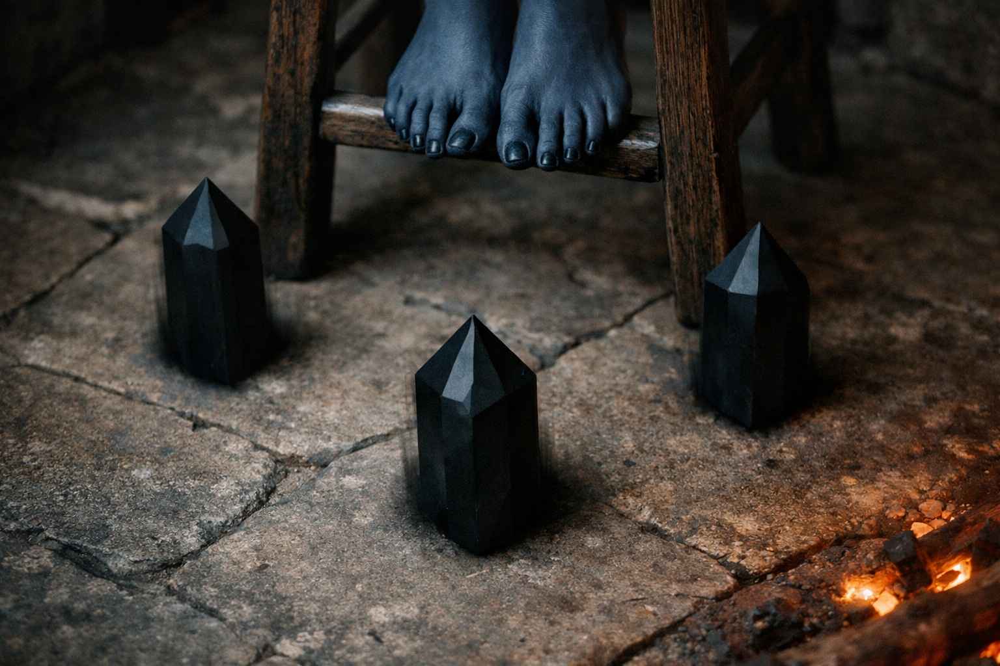

## Chapter 29 | Part 6 | The Fractures

---

Drusniel woke to Szoravel standing over him.

Szoravel held a crystal near Drusniel's forehead. His other hand shook as he traced a line in the air. Srietz watched from the door. Elion lay in his corner with his eyes closed.

"How long have you been standing there?"

"Assessment complete." Szoravel put the crystal away. "Projection detected during sleep."

Drusniel sat up. His neck ached. "Projecting what?"

"Images. Locations. Fragments of thought. No control recorded." He placed the crystal beside the disc. "Further testing required."

"Slipping through into what?"

"The Dreamlands. Record only what you observe there."

"And I've been going there. In my sleep."

"Uncontrolled contact. No verified route."

The fire had burned to embers. The tower was cold. Drusniel's hands were steady but his jaw was tight.

"Can it be controlled?"

"Demonstrate it." Szoravel placed three crystals around an empty stool. "Sit."

Drusniel looked at Srietz. The goblin hadn't moved from the door.

"Srietz does not like this," the goblin said.

"Noted." Szoravel kept his eyes on Drusniel.

Drusniel sat on the stool.

"Close your eyes. Find a fracture. Follow it. Remember the branches."

The crystals hummed as Drusniel closed his eyes. His hands went cold on his knees. He tried to lift a finger and couldn't.

"Observe. No forced entry."

The darkness behind his eyelids changed.

Darkness broke into overlapping shapes. He could no longer feel the stool beneath him.

Thoughts pressed against his own, too many to separate. He tried to find one he recognized.

The fractures appeared.

He recognized the branching pattern before he understood what he was seeing. Some lines ended abruptly. One continued beyond the shapes around him.

He followed one.

It pulled him sideways. Not physically. The sensation was closer to remembering a place he'd never been. The fracture line led through layers of tangled thought, past impressions that weren't his: a woman counting coins in a city he'd never visited, a child watching snow fall on water, something vast and patient turning in a space that had no floor. He passed through them the way light passes through glass. Unchanged, but not unnoticed.

The fracture branched. He chose the one that felt like stone, that carried the resonance of mineral and pressure and deep earth. His instinct, translated into a medium that should have rejected it.

Something coalesced.

A ridge of black stone appeared beneath a copper-colored sky. Below it, a river ran uphill. A half-buried tower stood at a junction of three paths. Something breathing blocked one. Light burned across another. The third was empty.

The silent one. That was the direction.

He tried to hold the image. It blurred, and the harder he concentrated, the less he could see.

Something noticed.

He felt the pressure he'd known in the crystal chamber. It was coming closer.

He pulled back.

The return was worse than the entry. The stool materialized beneath him with the violence of a fall from height. His body remembered gravity all at once. The tower rushed in: stone walls, cold air, the smell of dead fire and old books. His right ear was wet. When he touched it, his fingers came away red.

Szoravel was writing.

Not looking at Drusniel. Writing in a leather-bound book with a speed that suggested he'd been recording since the projection began. His handwriting was small and precise. The crystals on the floor had gone dark.

"How long?"

"Seven minutes. Longer than I expected for a first controlled attempt. Shorter than useful." Szoravel finished his notation and looked up. "What did you see?"

Drusniel described it. The ridge. The river. The tower. The three paths. Szoravel listened without interruption, then turned to a fresh page and sketched what Drusniel described. The sketches were quick and accurate, the work of someone who had done this before.

"Ridge confirmed. River and tower unverified." Szoravel tapped the sketch. "You selected the empty path."

"It felt right."

"Insufficient. Verify against a second reading."

He closed the book. "Repeat from another entry point. Record which lines persist."

"And the cost?"

Szoravel looked at Drusniel's ear. The blood had reached his collar. "You noticed the entity."

"It noticed me."

"Increased exposure with each projection. Bleeding recorded. Recovery unverified."

"And if it doesn't?"

"Then record the loss of function." Szoravel moved the stool aside.

Drusniel wiped his ear with his sleeve. The blood was already slowing. Seven minutes in the Dreamlands. A ridge, a river, a tower. Three paths. Directions that might be real or might be the distorted echo of a thousand other minds that had looked at the same territory and dreamed their own paths through it.

He couldn't lead Srietz and Elion along a path just because it had looked empty.

He looked at Szoravel's closed book. At the sketches he couldn't see.

"When do we go again?"

"You go. Tomorrow night. Repeat until the readings agree." Szoravel shelved the book. "Rest now. Report any change in hearing."

Drusniel lay back on the pallet. The tower ceiling was high and dark and did not move, which was something he confirmed twice before trusting it. His right ear throbbed. His thoughts felt loose, as if they'd been taken apart and reassembled in approximately the right order but with small errors he'd only notice later.

Srietz watched from the doorway. He hadn't spoken since his single protest. His ears had not relaxed.

"Srietz." Drusniel's voice came out rougher than expected. "Still here?"

"Srietz does not sleep near people who leave their bodies while sleeping." He said it the way he said everything: as practical assessment. "Srietz will sleep in the corridor."

He left. The door stayed open.

Elion watched him from the corner. He'd been awake throughout, Drusniel realized.

"You know what that was," Drusniel said. Not a question.

Elion didn't answer. He closed his eyes. His stillness wasn't sleep.

Drusniel pressed his sleeve against his bleeding ear. He'd go again tomorrow. He needed a route he could trust.

He closed his eyes. This time, he felt nothing beyond the cold pallet.

---

**End of Chapter 29.6 —> 30.1: [The Convergence Seeds: The Direction](/the-convergence-seeds-the-direction/)**
