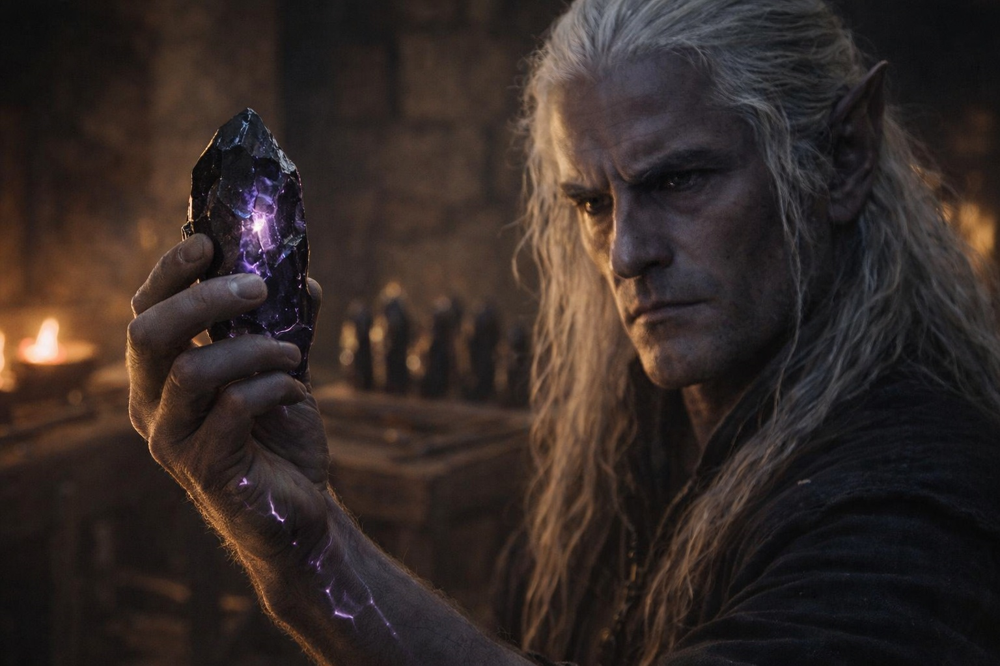
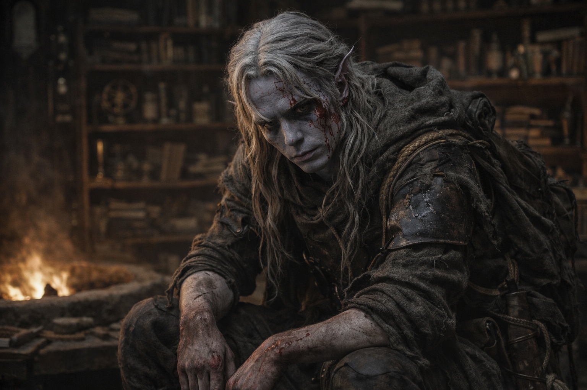
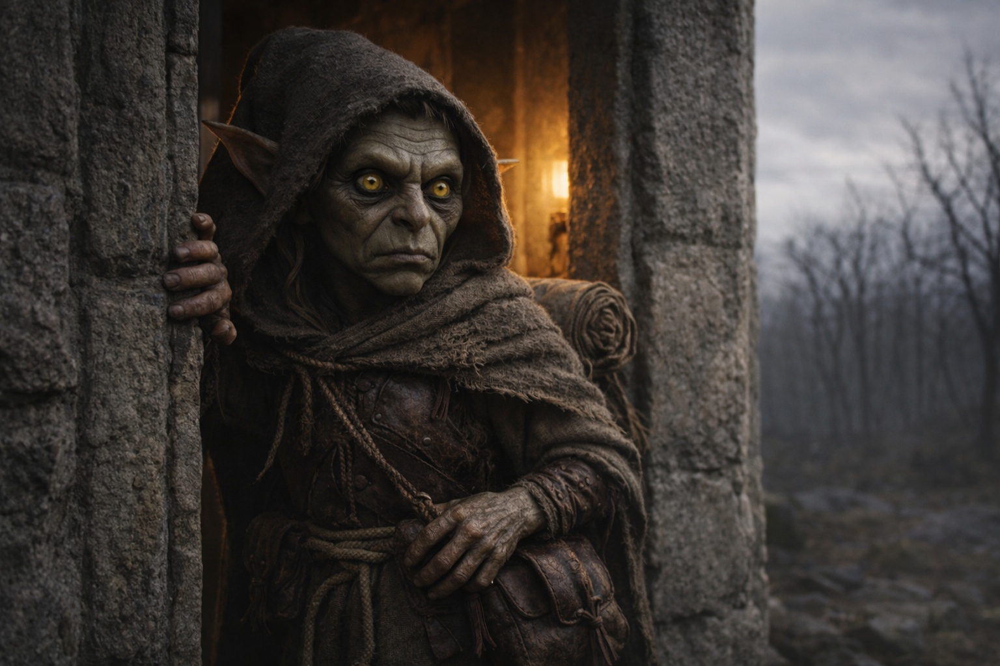

## Chapter 29 | Part 1 | The Lesson

---

Szoravel didn't look up when Drusniel entered.

Shelves climbed the tower walls, crowded with books, jars and instruments. The stone floor was swept clean. An amber flame burned in the central pit without smoke or visible fuel. Drusniel kept his distance from it.

Szoravel worked at the far bench with his back to the door. He hadn't turned when Drusniel's pack struck the frame.

Not much, apparently.

"Put the pack down. Against the west wall. Don't touch anything between here and there."

Drusniel crossed the room. The floor was warm underfoot, heat rising from somewhere below, geothermal or magical or both. He set his pack against the wall where indicated. The crystals inside shifted and hummed against the stone, and something on the workbench responded, a faint vibration that made the glass jars on the nearest shelf chatter against one another.

Szoravel's hands stopped moving.

"You brought them." Not surprise. Confirmation. He turned, and for the first time Drusniel saw what he'd been working on: a flat disc of dark stone with geometric channels carved into its surface, filled with a liquid that caught the firelight like mercury. The disc sat in a cradle of iron that was older than the table. Older than the tower, probably. "The crystals from the core chamber. How many?"

"Seven."

"Harvested or found?"

"Harvested. The chamber floor was covered in them. These were the ones I could carry."

Szoravel crossed to the pack. He didn't ask permission. His hands were large, the fingers long and thick-knuckled, the hands of someone who'd worked stone and magic in equal measure for longer than Drusniel had been alive. He opened the pack, lifted the first crystal, and held it at arm's length.

Violet light pulsed through the crystal. Szoravel's fingers stiffened around it; he set it down and flexed them once.

"Intact." He set it on the workbench. Took the next one. Repeated the process. His expression didn't change as he examined each crystal, but Drusniel could see the minute shifts in his attention, the way his obsidian eyes tracked details invisible to anyone who hadn't spent centuries cataloging the properties of resonant stone.

Six crystals examined and placed. The seventh Szoravel held longer.

"This one is different." He rotated it in his fingers. "Something used it. Recently. The frequency has been compressed." He looked at Drusniel for the second time. The assessment was clinical and complete and lasted approximately two seconds. "The entity in the chamber. It touched you through this one."

Not a question.

"Something looked at me."

"The signal is coming from you." Szoravel set the crystal apart. "Stay within the tower until I measure it."

Drusniel glanced at the open door. He'd thought the crystals were guiding him. Had he been drawing attention all the way here?

Szoravel had heard him coming.

"Sit." Szoravel pushed a stool toward him with his foot. His gaze stopped on the shape beneath Drusniel's shirt. "Zaelar's delivery. Put it on the bench."

"I'm not Zaelar's anything."

"Then state your terms." Szoravel took the other stool.

"It stays mine until I know what you intend to do with it." Drusniel kept his hand over the Null.

"Assessment first. Transfer afterward." Szoravel looked at the dried blood on his face. "The chamber encounter: brief contact or sustained?"

"I couldn't tell. How would I measure it?"

"Insufficient record." Szoravel laid his hands on the bench. "The Voice. How many debts?"

"Two." Drusniel watched for a reaction.

Szoravel wrote the number down. "Recorded."

Srietz stood in the doorway, one hand on his belt pouch. He checked the room before entering.

"Srietz will wait outside," he announced.

"Your goblin may enter," Szoravel said without turning. "The door stays open. The shapeshifter as well, when he decides to stop pretending he's a tree."

At Drusniel's nod, Srietz sat near the door with his pack beside him.

Elion came in last. He paused to smell the air, then chose a corner.

Szoravel checked where each of them had settled.

"We have work to do," he said. "And you have questions. Let's see which of those things matters more."

From somewhere below the tower, stone answered with a single knock.

---

**End of Chapter 29.1 —> 29.2: [The Drow in the Tower: The Exchange](/the-drow-in-the-tower-the-exchange/)**
