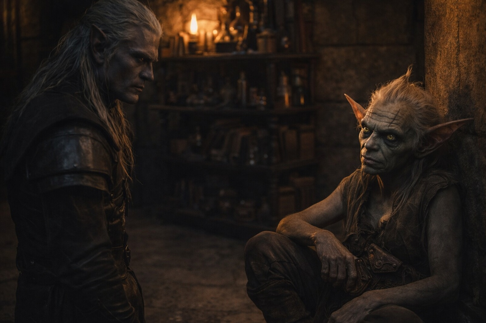

## Chapter 29 | Part 4 | The Measure

---

Szoravel examined Srietz the way a mason examines a foundation.

"Alchemist. Self-taught, judging by the acid burns on your left hand. Right-hand dominant, which means you compensate for the damage instead of adapting your technique. Vexrath's tower, based on the scarring pattern." He was standing three paces from where Srietz sat, and he hadn't moved closer. Hadn't needed to. His assessment operated at a distance that didn't require contact and didn't invite it. "How long?"

Srietz's ears were rigid. Not flat against her skull but upright and locked, the posture of a goblin whose fight-or-flight calculations had returned a third option: wait.

"Three years," she said.

"Three years in Vexrath's service and you came out with your mind intact. That's unusual. Most of his subjects deteriorate after eighteen months." Szoravel turned his attention to her belt pouch. Not reaching for it. Just looking. "What's in the pouch?"

"Srietz's business."

"Compounds. At least four distinct types, based on the staining. Something volatile, something acidic, something that smells of sulfur, and something I can't identify from here." He tilted his head. "The fourth one. What is it?"

"Srietz said it was Srietz's business."

Szoravel paused. The pause was brief, calibrated, and served a purpose Drusniel recognized: he was testing whether insistence would yield information or resistance. He chose to move on. That, too, was data.

"You're the survival component," he said to Srietz. "Not combat. Not magic. Logistics, networking, chemical problem-solving. The one who ensures the group eats and doesn't walk into something that kills them before the enemy does." He said it without condescension. Szoravel didn't condescend. He classified. "Useful. Don't die."

Srietz's ears relaxed one degree. "Srietz will take that under advisement."

Then Szoravel turned to Elion.

The change was immediate. Not in Szoravel's body, which maintained the same controlled stillness, but in the quality of his attention. With Srietz, the assessment had been professional. Quick. The cataloging of a known quantity. With Elion, something else engaged. Something behind the obsidian eyes that had been dormant during the previous examination.

Elion stood in his corner. He'd been still since entering, the particular stillness of someone whose body could be anything and had chosen, for the moment, to be this. Grey skin like weathered stone. Amber-orange eyes that watched Szoravel watching him. Red markings across his face, paint or something else, Szoravel's gaze tracked them.

The older drow crossed the room. He stopped two paces from Elion. Then he stopped moving entirely, in a way that went beyond physical stillness into something that Drusniel could only describe as perceptual. Szoravel was looking at Elion with something more than eyes.

A silence stretched. The amber fire hummed. The crystals on the workbench vibrated at a frequency that had been constant since Drusniel entered and now shifted, rising in pitch like a string being tightened.

Szoravel stepped back. Actually stepped back. A single pace, deliberate, and the deliberateness of it was more telling than the movement itself. Szoravel did not retreat from things. He repositioned. The distinction mattered.

"Where did you find this one?"

The question was addressed to Drusniel but his eyes remained on Elion.

"He found me," Drusniel said. "On the eastern coast, three weeks in. He was caged."

"Caged." Szoravel repeated the word as if tasting it. "Do you have any idea what's inside him?"

Elion went still. Not the stillness he'd been maintaining. A deeper stillness, the kind that came before a decision about whether to fight or change shape and run.

"What's inside me?" His voice was quiet. Concrete. The voice of someone who had spent a lifetime being told he was something and never being told what.

Szoravel looked at Elion for three more seconds. Then he turned away. The motion was precise and final. "Later. Or never. I haven't decided how much truth you can survive." He returned to his workbench and began gathering the crystals. "Your shapeshifter is carrying a passenger. The passenger is sleeping. The passenger has been sleeping a long time, and it is not asleep by accident."

"A passenger," Drusniel said.

"A term I'm using because the accurate term would create questions I'm not willing to answer in front of the subject." He glanced at Elion. "No offense meant. But the knowledge would change your behavior, and your current behavior is keeping the passenger dormant. Better to leave it."

Elion's amber eyes had not left Szoravel. His hands were at his sides. His jaw was tight. Drusniel could see the tension traveling through his body like a current, the effort of someone whose instinct was to run being overridden by the need to understand.

"Interesting." Szoravel said the word to his workbench, not to anyone in the room. "Zaelar sent me a carrier with debts, a goblin alchemist, and a vessel whose contents could complicate everything." He placed the crystals in a wooden box lined with cloth. "He always did have a talent for understatement."

Srietz spoke from the door. "Srietz would like to point out that Srietz has been traveling with both of these individuals for weeks and has received no warning about passengers, vessels, or complications."

"That's because you were watching for the wrong things." Szoravel closed the box. "You were watching for lies. The dangerous things are the truths nobody knows they're carrying."

The fire burned. The crystals, now boxed, went quiet. Elion stood in his corner and said nothing, and the silence around him had changed from comfortable to the particular quiet of someone reassessing every assumption they'd ever held about their own body.

Drusniel looked at Szoravel. The older drow met his gaze with the flat patience of someone who'd revealed exactly as much as he intended and would reveal no more regardless of the quality of the questions.

"Interesting" was all he'd said about Elion. No explanation. No follow-up. And Drusniel saw Elion carry that single word the way a man carries a stone he's been told is either a gem or a grenade.

---

**End of Chapter 29.4 —> 29.5: [The Drow in the Tower: The Shape](/the-drow-in-the-tower-the-shape/)**
