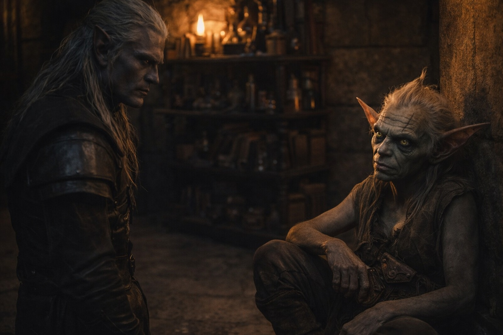
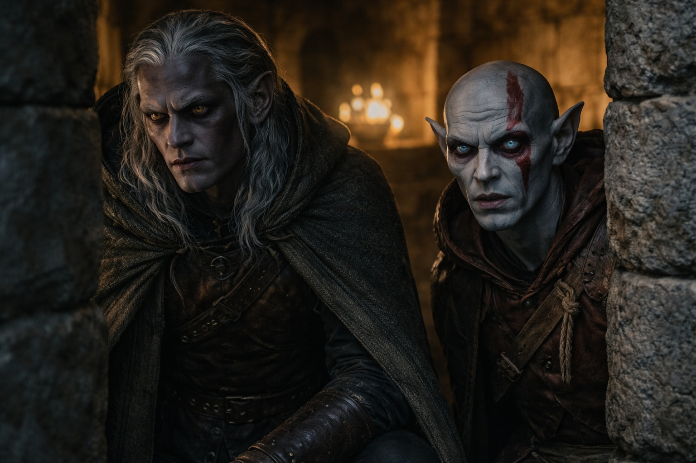
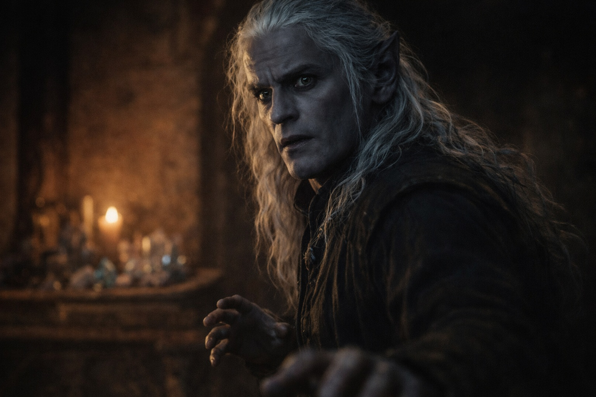

## Chapter 29 | Part 4 | The Measure

---

Szoravel examined Srietz the way a mason examines a foundation.

"Alchemist. Left-hand burns. Vexrath's tower." Szoravel stopped three paces from Srietz. "Duration of service?"

Srietz's ears stood rigid. He kept his hands on his knees.

"Three years," he said.

"Recorded." Szoravel looked at his belt pouch. "Contents?"

"Srietz's business."

"Compounds. At least four distinct types, based on the staining. Something volatile, something acidic, something that smells of sulfur, and something I can't identify from here." He tilted his head. "The fourth one. What is it?"

"Srietz said it was Srietz's business."

Szoravel waited. Srietz kept his hand over the pouch.

"Keep the volatile compounds away from the bench. Inventory your supplies before departure."

Srietz's ears relaxed one degree. "Srietz will take that under advisement."

Then Szoravel turned to Elion.

He took longer over Elion. His gaze stopped at the markings on the elf's face.

Elion stood in the corner, red markings clear against his pale bluish-white skin. His amber-orange eyes followed Szoravel.

Szoravel stopped two paces away and raised his hand. His fingers trembled as he held them there. Elion drew back against the wall.

A silence stretched. The amber fire hummed. The crystals on the workbench vibrated at a frequency that had been constant since Drusniel entered and now shifted, rising in pitch like a string being tightened.

Szoravel lowered his hand and stepped back.

"Where did you find this one?"

The question was addressed to Drusniel but his eyes remained on Elion.

"He found me," Drusniel said. "On the eastern coast, three weeks in. He was caged."

"Caged." Szoravel repeated the word as if tasting it. "Do you have any idea what's inside him?"

Elion shifted his weight toward the door.

"What's inside me?"

"A dormant presence." Szoravel returned to the bench. "No further examination today."

"A presence," Drusniel repeated.

"Unclassified. No attempts to wake it."

Elion stayed by the wall. He watched Szoravel begin to pack the crystals.

"Carrier. Alchemist. Shapeshifter." Szoravel placed the last crystal in a cloth-lined box. "Group assessment incomplete."

Srietz spoke from the door. "Srietz would like to point out that Srietz has been traveling with both of these individuals for weeks and has received no warning about passengers, vessels, or complications."

"Now you have the record." Szoravel closed the box.

The hum stopped when the lid closed. Elion touched one of the marks on his face.

Drusniel looked at Szoravel. The older drow met his gaze with the flat patience of someone who'd revealed exactly as much as he intended and would reveal no more regardless of the quality of the questions.

Drusniel waited for another question from Elion. None came.

---

**End of Chapter 29.4 —> 29.5: [The Drow in the Tower: The Shape](/the-drow-in-the-tower-the-shape/)**
