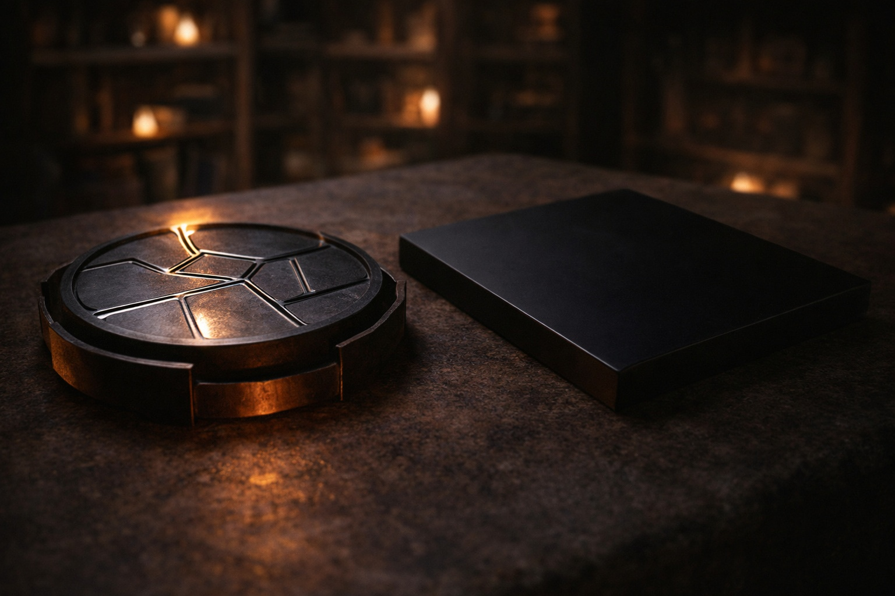
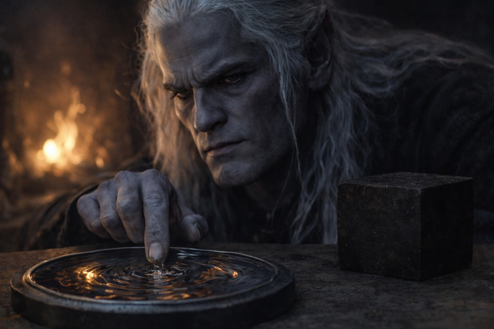
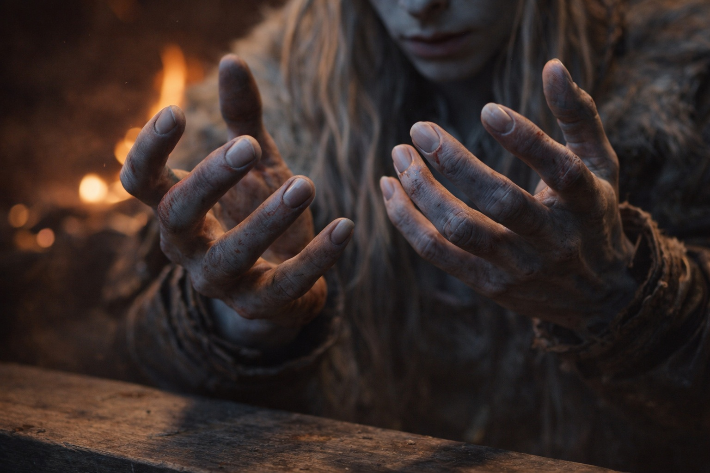

# Chapter 29.5 | The Drow in the Tower: The Shape

---

The barrier was failing the way mountains fail: so slowly that only stone noticed.

Szoravel explained it the way he explained everything: with precision, without warmth, and with a visible contempt for the complexity of the subject that suggested he'd reduced it to its components so many times the reduction had become reflexive.

"The barrier is a containment structure. It separates Wyrmreach from the surface world and has done so for longer than any record I can verify. It was built, or it grew, or it was an accident of planar mechanics. The texts disagree. What they don't disagree on is that it requires maintenance."

He'd cleared the workbench of everything except the mercury-filled disc and the Null. The disc hummed at a frequency that resonated in Drusniel's molars. The Null sat beside it, inert, its surface absorbing the amber firelight without reflection.

"The Chassis is the maintenance tool. Three phases. Sense detects the barrier's state, reads its frequencies, finds its weak points. Erase removes corrupted sections, clears interference, strips accumulated distortion. Alter rewrites the barrier's parameters, repairs what Erase cleared, adjusts for drift." He touched the disc. "This is a crude model. The actual Chassis operates at a scale I can observe but not fully replicate."

"You said the barrier is failing. How?"

"Degradation. Cumulative. The barrier was not designed for permanent operation. It was designed for a duration that its builders considered sufficient. They were wrong, or they didn't care. Either way, the barrier has exceeded its operational life by a factor I can't calculate because I don't know when it was made. The symptoms are the things you've already noticed. Wyrmreach's wrongness. The disorientation. The way distances feel unreliable and colors shift at the edges of perception. Those aren't features of the landscape. They're leakage from a failing containment."

Drusniel thought about the volcano. The entity in the crystal chamber. The sense of something vast and ancient and patient, existing in a direction that wasn't any of the directions he knew.

"What's being contained?"

Szoravel looked at him with the flat patience of someone deciding how much answer would create clarity rather than panic. "Things that don't belong in the material plane. That's the simplest version. The complete version would take longer than you have and require context that doesn't exist yet. The barrier keeps them here. When it fails, they spread. The consequences of that are predictable but not something I need to detail for you to understand the urgency."

"And Zaelar wants the barrier to come down."

"Zaelar believes the barrier has caused more harm by existing than it would by failing. He believes the things it contains can be managed without containment. He believes the containment itself is a system of control that was never legitimate." Szoravel's voice was perfectly level. "He may not be wrong about all of it. He is wrong about enough of it."

"And your role."

"I receive the Null. I hold Alter. When the three phases of the Chassis are brought together, calibrated, and activated at the barrier's primary resonance point, the system can extend the barrier's operational life. By how long, I don't know. Decades. Centuries. Possibly longer. The mathematics are beyond my ability to model without the actual activation data." He paused. "You were chosen because you can cross. Your dual affinity, air and water, is the rarest combination among the drow. The barrier's resonance point is located in a place that requires that affinity to reach. Not strength. Not knowledge. Compatibility."

Drusniel sat with that. He was a carrier. Chosen because he could cross where others couldn't. Not because he was special. Because he was compatible. A key that fit a specific lock, not because the key was remarkable but because the lock was particular.

He should have found that comforting. He didn't.

"The barrier is failing," Szoravel said, the way someone discusses weather. "Has been for centuries. Your artifact, the Null, is one of the pieces that might slow it down. Or speed it up." He paused again. The pause was theatrical, which meant it was deliberate. "Zaelar never told you which, did he? That's because he doesn't know. Neither do I. The Chassis maintains or dismantles depending on the parameters entered at activation. We won't know which until we try."

"You're telling me I've been carrying something that could either repair the barrier or destroy it, and nobody knows which."

"I'm telling you the distinction depends on execution, not design. A scalpel is a scalpel. What it does depends on who holds it and what they cut." He stood and crossed to the shelf where he'd stored the crystal box. "You are the compatible interface. You carry the Null. I hold Alter. Zaelar holds Sense. The three of us, together, at the resonance point, can activate the Chassis. What happens next depends on alignment. Zaelar and I disagree on that alignment. That disagreement is the reason you're here instead of wherever Zaelar intended you to be."

"He intended me to be here."

"He intended you to reach me and then continue east, carrying the Null, toward the resonance point. He did not intend for me to have this conversation with you. He intended you to arrive, collect Alter from me, and proceed. I chose otherwise." Szoravel turned from the shelf. "Because you deserve to know what you're walking toward. Because Zaelar won't tell you. And because the system requires informed activation, and misinformed activation is how civilizations end."

The fire burned. The mercury disc hummed. The Null sat on the workbench, dark and featureless and carrying a purpose that its maker and its holders could not agree on.

Drusniel looked at his hands. The hands of a carrier. Long, precise, trained to kill and to read stone, now enlisted in a project whose scope exceeded anything he'd been told and whose outcome depended on people who disagreed about fundamental questions.

He closed his hands. Opened them. Looked at Szoravel.

"What do you need from me?"

"Time. And the willingness to listen before acting. Both of which Zaelar assumes you lack." The older drow almost smiled. It died before reaching his eyes. "Prove him wrong."

---

*Next: The Drow in the Tower: The Fractures*

**End of Chapter 29.5 — continues in Chapter 29.6: [The Drow in the Tower: The Fractures](/the-drow-in-the-tower-the-fractures/)**
