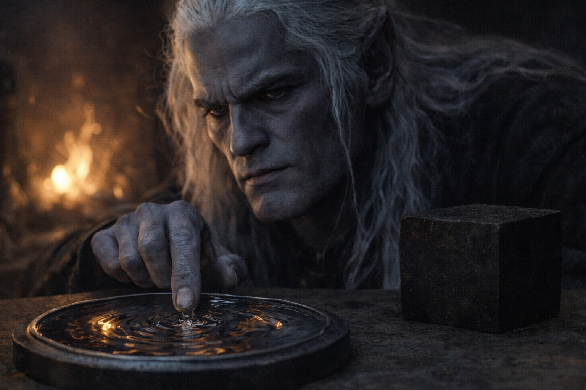
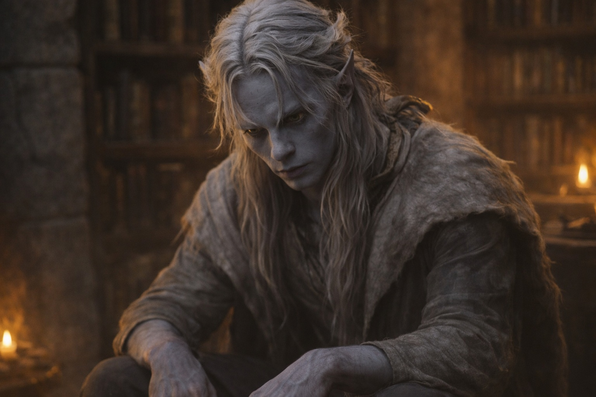
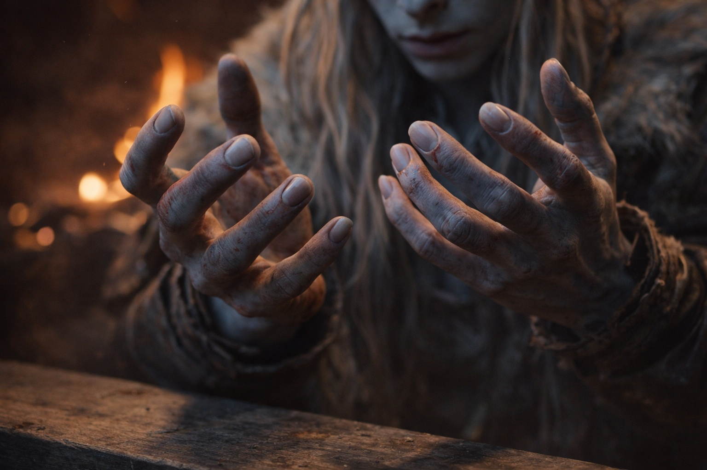

## Chapter 29 | Part 5 | The Shape

---

The barrier was failing the way mountains fail: so slowly that only stone noticed.

Szoravel cleared the diagrams from the bench.

"Barrier maintenance. That is the task. Its origin is outside this assessment."

He'd cleared the workbench of everything except the mercury-filled disc and the Null. The disc hummed at a frequency that resonated in Drusniel's molars. The Null sat beside it, inert, its surface absorbing the amber firelight without reflection.

"Required sequence: Sense for a reading. Erase for removal. Alter for access." He touched the disc. "This model proves no repair. Stabilization remains unresolved."

"You said the barrier is failing. How?"

"Increasing distortion. Unreliable distances. Displaced colors. Record each occurrence."

Drusniel thought about the volcano. The entity in the crystal chamber. The sense of something vast and ancient and patient, existing in a direction that wasn't any of the directions he knew.

"What's being contained?"

"No containment inventory available. Work with the readings."

"What did Zaelar authorize?"

"Delivery. Assessment. No activation."

"And your role."

"Receive the Null. Assess compatibility. Retain Alter until the requirements are met." He looked at Drusniel. "Air and Water. Both must be tested."

Drusniel looked at the diagrams. Zaelar had sent him for training. Szoravel was testing whether he could be used.

Neither had asked what he wanted from the journey.

"Outcome unverified," Szoravel said. "No repair claim. No dismantling trial."

"You're telling me I've been carrying something that could either repair the barrier or destroy it, and nobody knows which."

"Correct. No activation on an assumption." Szoravel stood. "Erase and Alter are insufficient. Locate the remaining components."

"Zaelar intended me to collect Alter here."

"Transfer withheld pending assessment." Szoravel took down the crystal box. "Your arrival satisfies no other requirement."

The Null lay beside the humming disc. Drusniel kept it within reach.

He'd crossed the mountain to get answers. Szoravel had handed him another set of conditions.

He closed his hands. Opened them. Looked at Szoravel.

"What do you need from me?"

"Time. Complete readings. No unsupervised trials."

---

**End of Chapter 29.5 —> 29.6: [The Drow in the Tower: The Fractures](/the-drow-in-the-tower-the-fractures/)**
