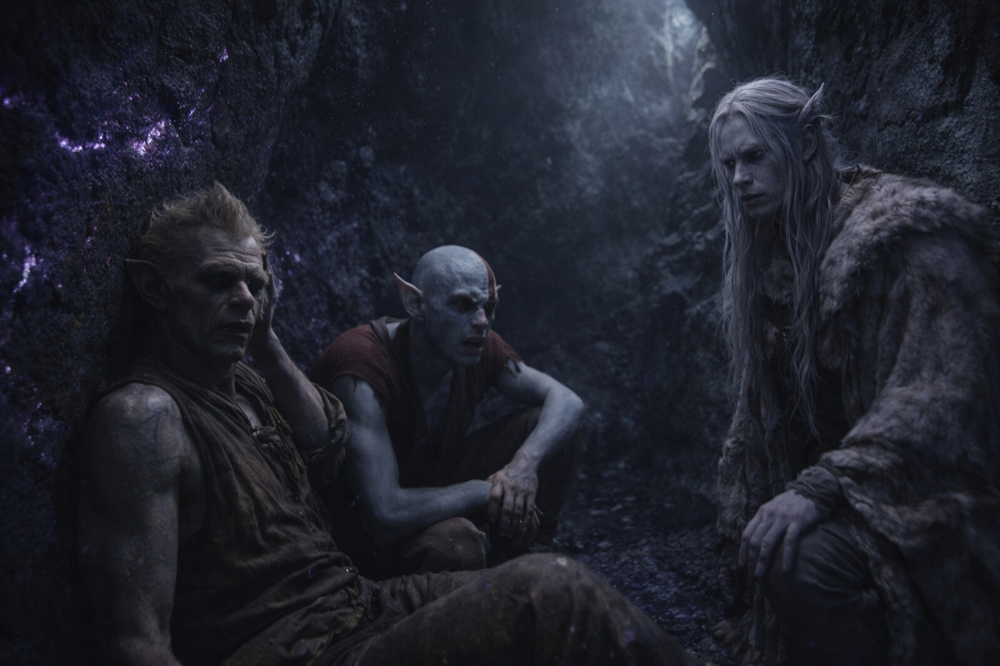

## Chapter 15 | Part 4

---

They stopped in a cavern where something else lived.

A scrape passed through the stone beneath his boots. Elion turned toward it, nostrils widening. The Coatly had fallen silent behind them.

"Rest." Srietz sank against the wall, breathing hard. "They won't come past whatever lives here. It leaves at dawn. We leave before it does."

Elion crouched beside the entrance and eased his shoulder back into place. He kept his good arm clear of the wall.

Drusniel remained standing, close enough to the entrance to see past Elion.

"You led us well," he admitted. "You know this territory."

"Srietz knows enough to stay alive here." The goblin's eyes gleamed in the darkness. "Alone is becoming expensive. You are potential allies."

"Potential."

"You still won't sit." Srietz showed his teeth. "Good. Someone should watch that entrance while Srietz catches his breath."

"What do you want?" Elion asked from his crouch.

"A room where Srietz can work and no one owns the door. Far from Vexrath." He glanced toward the scraping in the wall. "Far from this, too. What do you want?"

"To reach a mage named Szoravel," Drusniel said. "East, past the disputed lands."

"Szoravel. People used to pay well for news of him." Srietz rubbed a stained thumb against his palm. "Powerful hermit in the waste. Dangerous, if he's still alive. The road east crosses several territories; Srietz knows some of them."

"In exchange for?"

"Keep Srietz alive until we are clear of Vexrath. Beyond that, we discuss a new price."

Drusniel considered. Srietz needed them alive. For now. Merrik had needed him alive too, until the price changed.

"You tell us before the terms change," Drusniel said. "We decide whether to go farther."

"Srietz remembers who pays fair," the goblin added quietly. "Srietz also remembers who doesn't."

"We have a deal," Drusniel said.

Srietz leaned back against the stone. "Good. Wake Srietz for the next watch. If he complains, wake him again."

---

**End of Chapter 15.4 —> 15.5: [The Goblin Who Counts Costs: The Memory](/the-goblin-who-counts-costs-the-memory/)**
