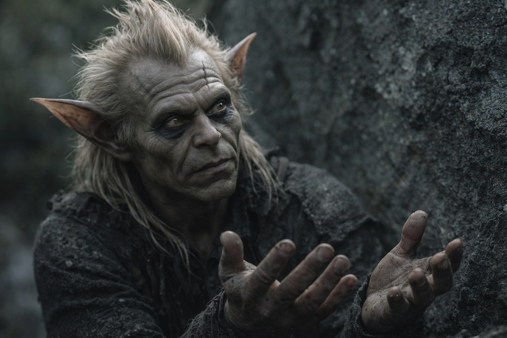
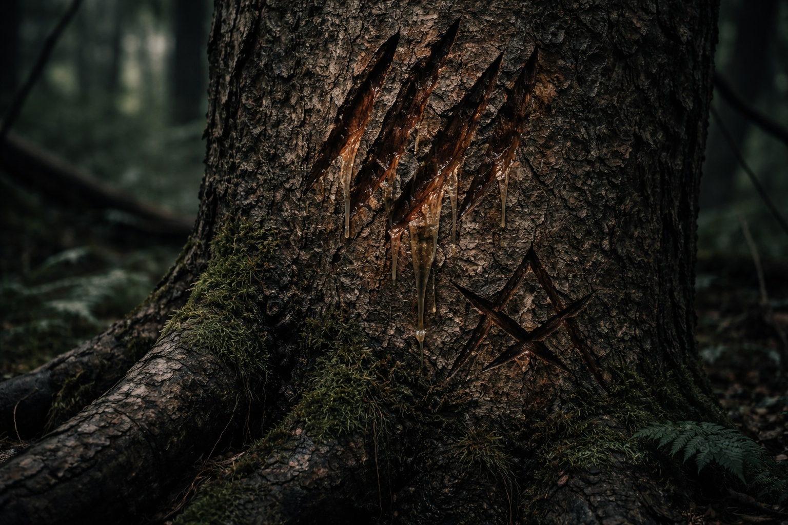
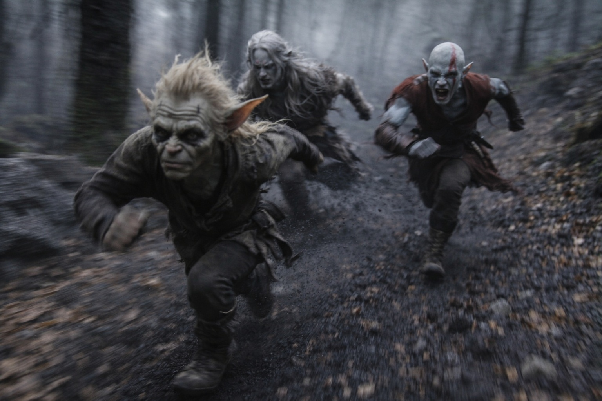

## Chapter 15 | Part 2

---

The goblin appeared from nowhere.

One moment the treeline was empty except for the shapes moving through it. The next, a small green-grey figure was crouching beside a rock formation, eyes wide and calculating.

"Srietz sees you are lost," it said. "Srietz sees you are also hunted. These things, they are related."

Drusniel's hand moved toward his magic, that thin trickle of power. Elion moved between them, stance shifting into something ready for violence.

"Wait." The goblin's hands went up, palms out. "Srietz is not threat. Srietz is also hunted. Srietz is also lost. Srietz thinks maybe lost people work together better than alone."

"Why should we trust you?" Drusniel asked.

"Trust?" The goblin—Srietz—made a dry, rasping laugh. "Srietz does not ask for trust. Trust is expensive. Srietz asks for trade.

Srietz knows where you are. Srietz knows what hunts you. Srietz knows how to not die here." He pointed at Drusniel, then Elion. "You are strong. You are fast. You can protect while Srietz guides."

Another shriek echoed through the trees, closer now.

"What hunts us?" Elion demanded.

"Coatly." Srietz's voice dropped. "Vexrath's creatures. Sound first. Strange signatures when they get close." He pointed at Drusniel. "Your magic leaves one." Then at Elion. "You leave another. Srietz does not know what yours is."

"How close?"

"Close enough that running matters. Casting is worse. Cast, and they do not need to search."

"You know Vexrath?"

Something flickered across the goblin's face. Fear, quickly suppressed. "Srietz knows Vexrath. Srietz worked for Vexrath. Srietz left Vexrath's service without permission." He gestured at the markers on the trees. "This is Vexrath's territory. Srietz should not be here. You should not be here. But here we all are."

The shrieks were multiplying. Three. Five. More.

"What's your offer?" Drusniel asked. The shrieks had already made delay more expensive than choosing badly.

"Simple trade. Srietz guides. You protect. We leave Vexrath's territory together. After that—" he shrugged "—we separate. No debt."

Elion looked at Drusniel. His expression said nothing, but somehow Drusniel understood: *Your call.*

Fight alone. Run blind. Or let the fugitive who knew the terrain choose the route.

Drusniel disliked all three. Only one improved their odds.

"Take me with you." The calculation in Srietz's face did not disappear, but fear finally showed through it. "That is the price. Srietz does not die here."

"Lead," Drusniel said. "But if you betray us—"

"Betrayal is bad business." Srietz was already moving. "Srietz is good at business. Now run. They're coming."

---

**End of Chapter 15.2 —> 15.3: [The Goblin Who Counts Costs: The Hunters](/the-goblin-who-counts-costs-the-hunters/)**