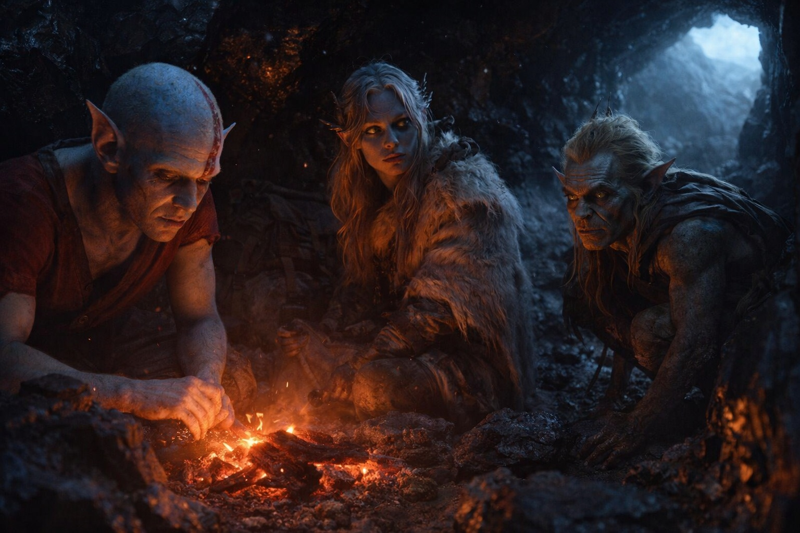
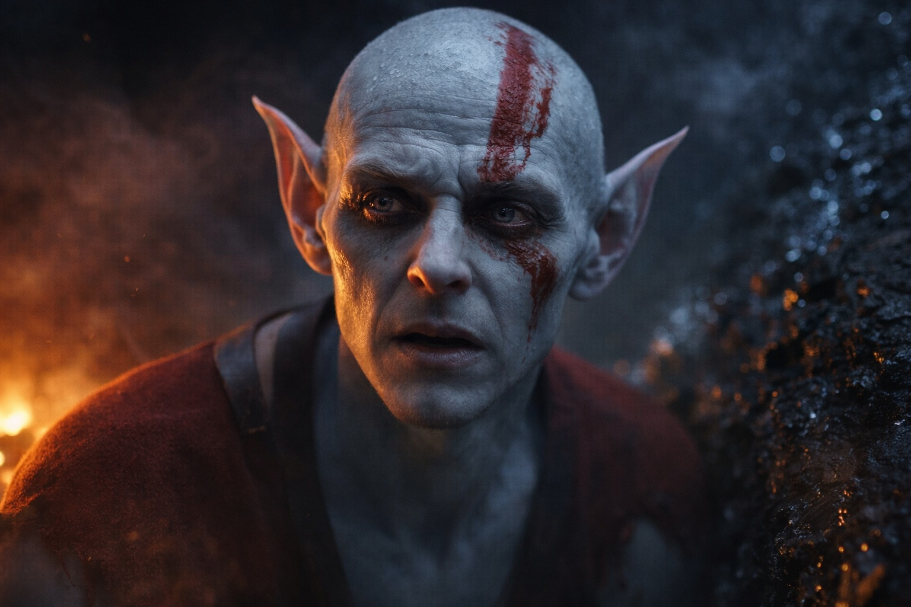

## Chapter 15 | Part 5

--- 

"I know where we need to go."

Elion's voice broke the predawn silence. Drusniel woke instantly, his mind cataloging: *four hours of sleep, approximate. Location unchanged. No immediate threats detected.*

"What?" Srietz was awake too, small form tensing.

"Obsidian caves. Northeast." Elion's eyes were distant, unfocused, seeing something that wasn't in front of him. "Three days, maybe. I remember shelter there."

"How do you know this?" Drusniel asked carefully.

Elion's brow furrowed. "I... don't know. It's like remembering something I never learned. The caves were there."

"Were?"

Elion swallowed. "I don't know when the memory is from."

"Things come to you." Drusniel repeated words Elion had said before. "Things you shouldn't know."

"Yes." Elion's voice was soft. "It's happening more often now. Since we escaped the caravan. Since you opened my cage." He looked at Drusniel directly. "I don't understand it. I can't control what comes back. And I don't know what the memory leaves out."

Srietz made a sound—part curiosity, part suspicion. "This one knows things he should not. This one moves in ways that are wrong. This one is..." He trailed off, unable or unwilling to finish.

"Does it matter?" Drusniel asked. "If the information is accurate?"

"Knowledge comes from somewhere." Srietz's voice was practical. "Srietz wants to know where before trusting it. Wyrmreach does not give useful things cheaply."

Drusniel had thought the same thing. Elion's knowledge had been useful. Useful was not the same as safe; Merrik had cured him of that confusion.

"I don't know what it wants," Elion admitted. "I don't even know if it's a 'what' or a 'who.' It just... comes. And I follow it."

"Like instinct," Srietz muttered. "Or an old order remembered after the master is gone." He was quiet for a moment. "We use it. We do not trust it."

"Then we adjust," Drusniel said. "That's all we can do."

The thing in the cavern walls shifted, its presence receding as dawn approached outside.

Time to move.

"Northeast," Elion said. "Three days, maybe. If what I remember is still true."

"You've been right so far," Drusniel said.

Elion's smile was small and sad. "That's what terrifies me."

---

**End of Chapter 15.5 —> 15.6: [The Goblin Who Counts Costs: The Smoke](/the-goblin-who-counts-costs-the-smoke/)**