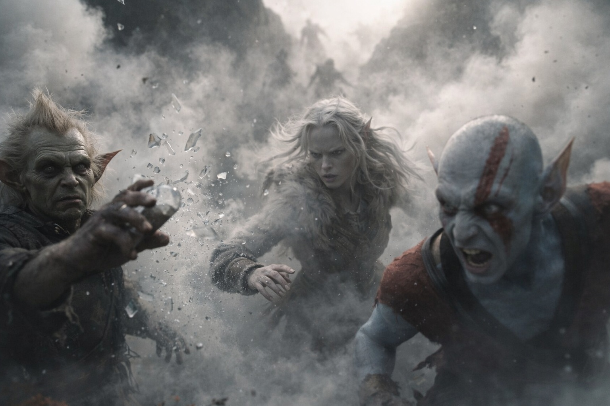
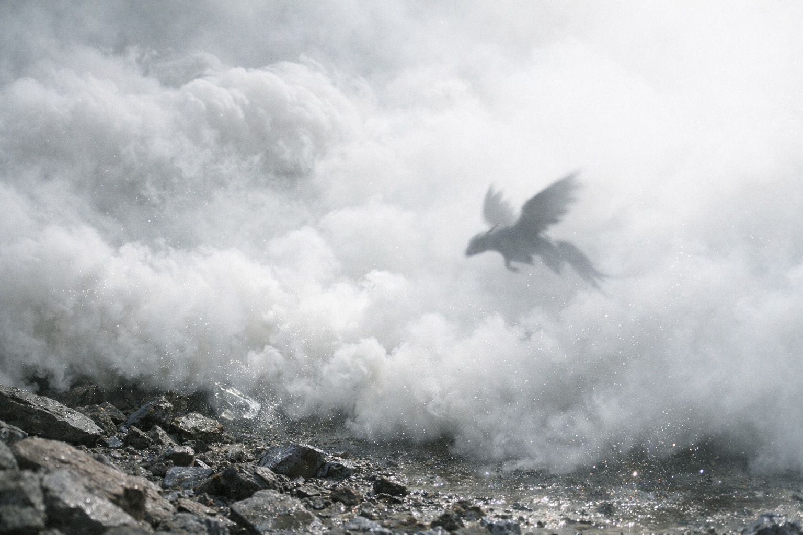

## Chapter 15 | Part 6

--- 

The Coatly found them late on the third day.

Drusniel heard the shrieks first—that hunting cry that had become terrifyingly familiar. Elion's head snapped toward the sound, body already shifting into combat readiness. Srietz made a small, desperate sound.

"They found us." The goblin's voice was tight.

Drusniel's magic surged instinctively, ready to defend—

"NO." Srietz grabbed his arm with surprising strength. "Cast and every Coatly for leagues gets a direction."

"Then what do you suggest?"

Srietz was already digging in his pack—a small, battered thing that seemed to hold far more than its size suggested. "Alchemy. Not magic. Different signature. Harder to track."

He pulled out a vial. Clear liquid that caught the dim light strangely.

"What is that?" Elion asked, eyes still fixed on the approaching shapes.

"The compound scatters their echo-sense. Smoke carries it." Srietz's hands shook around the vial. "Last one. Three weeks to replace."

"Use it."

"Three weeks—"

"Use it."

Srietz threw the vial.

It shattered against a rock formation, and smoke exploded outward—thick, white, swallowing everything. The Coatly's shrieks turned confused, disoriented. Drusniel heard them crashing into each other, into trees, into stone.

"RUN!" Srietz was already moving, smaller form disappearing into the chaos.

They ran. Through the smoke that stung their eyes and caught in their throats. Through the confusion of hunters that couldn't find prey. Through territory that wanted to kill them and a sky full of creatures that couldn't see.

The obsidian caves appeared as a darker shadow in the landscape—a wound in the earth that promised shelter.

They dove inside.

<video controls playsInline preload="metadata" poster="./obsidian-cave-after-flight_sora.jpg" width="100%">
	<source src="./Caves.mp4" type="video/mp4" />
</video>

The Coatly didn't follow.

For a long moment, there was only breathing. Harsh, ragged breathing from three exhausted survivors.

Srietz stared at the empty place in his vial case.

"That wasn't part of the terms," Drusniel said.

The goblin closed the case. "Terms change."

The obsidian caves glittered around them exactly where Elion had remembered them.

Srietz looked into the dark. "Where now?"

"East," Drusniel said.

---

**End of Chapter 15.6 —> 16.1: [The Seer's Warning: The Weight](/the-seers-warning-the-weight/)**