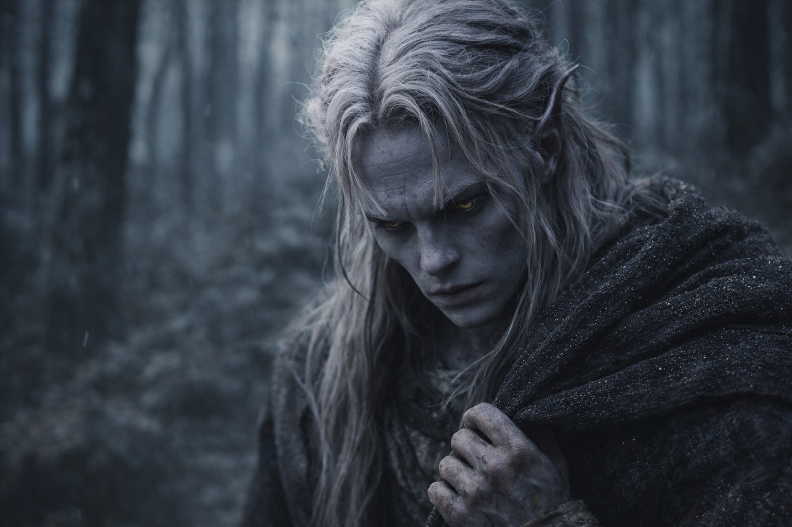
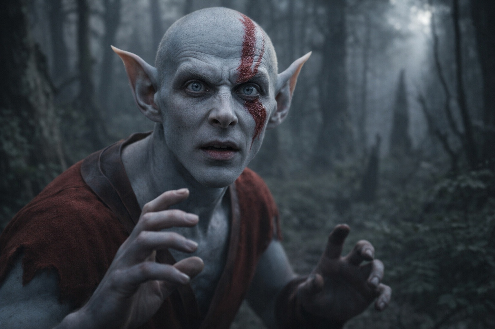
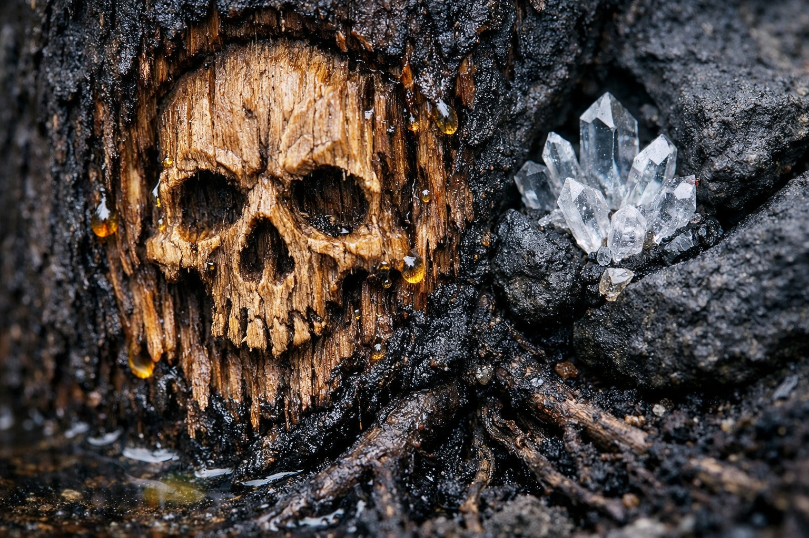
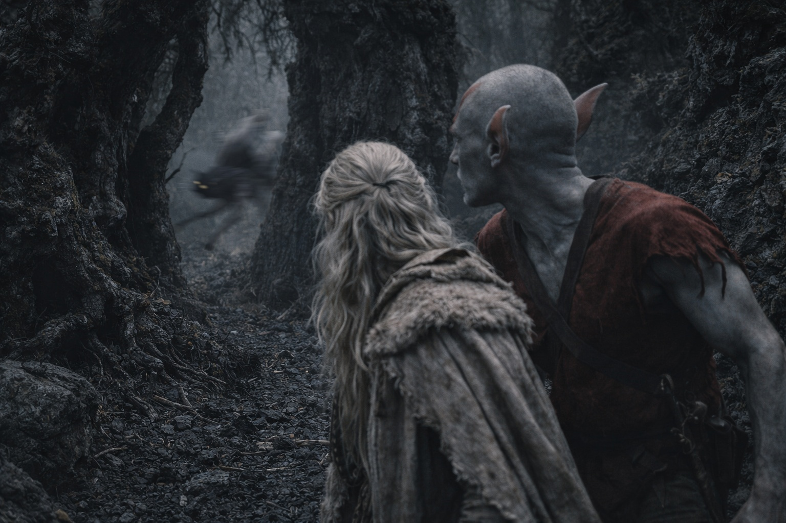

## Chapter 15 | Part 1

---

They were lost.

They had passed the same forked black trunk twice. Drusniel could see his own bootprint beside it, pressed into dust he remembered leaving behind.

Three days since the cages. He tried to retrace the last turn, but the sloping rock beyond the tree had no passage beside it now.

"Something's watching us," Elion said.

Elion had been stopping to listen for hours. His pale bluish-white skin looked bloodless, and he kept rubbing the place beneath his ear as if he could silence it.

"I know." Drusniel kept walking. There was nothing else to do. "Can you tell what?"

"No. It moves when we move. Stops when we stop. It's not attacking, just... observing."

For two days they had been finding skulls cut into tree bark. At the latest one, someone had pushed shards of crystal into the mouth.

Drusniel had tried to take them away from the marks. Each new path brought them to another.

"More of them here," he said. "We're going the wrong way."

He could feel a weak draft between the trunks. When he reached for it, the familiar ache returned behind his eyes. He left it alone.

"The air tastes metallic," Elion said. "And the plants keep moving."

Drusniel had noticed. The twisted stone formations cast shadows in directions that didn't match the dim light. Broad leaves turned in slow sequence despite the still air, one after another, as if following something passing between the trees.

Then he heard it.

The shriek was so high that his teeth hurt before he could place its direction.

Elion's head snapped toward the sound. "That's what's been watching. And it just called for others."

"What is it?"

"I don't know." Elion's voice was flat, honest. "But there's more than one now. And they're getting closer."

Something moved in the treeline. Small and fast, watching from the undergrowth.

Drusniel counted three separate movements in the undergrowth.

Then a fourth answered from behind them.

---

**End of Chapter 15.1 —> 15.2: [The Goblin Who Counts Costs: The Goblin](/the-goblin-who-counts-costs-the-goblin/)**
