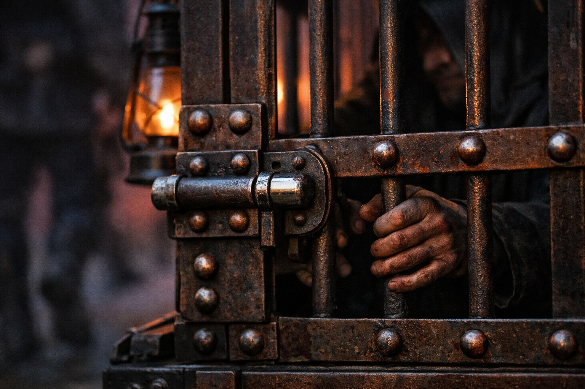
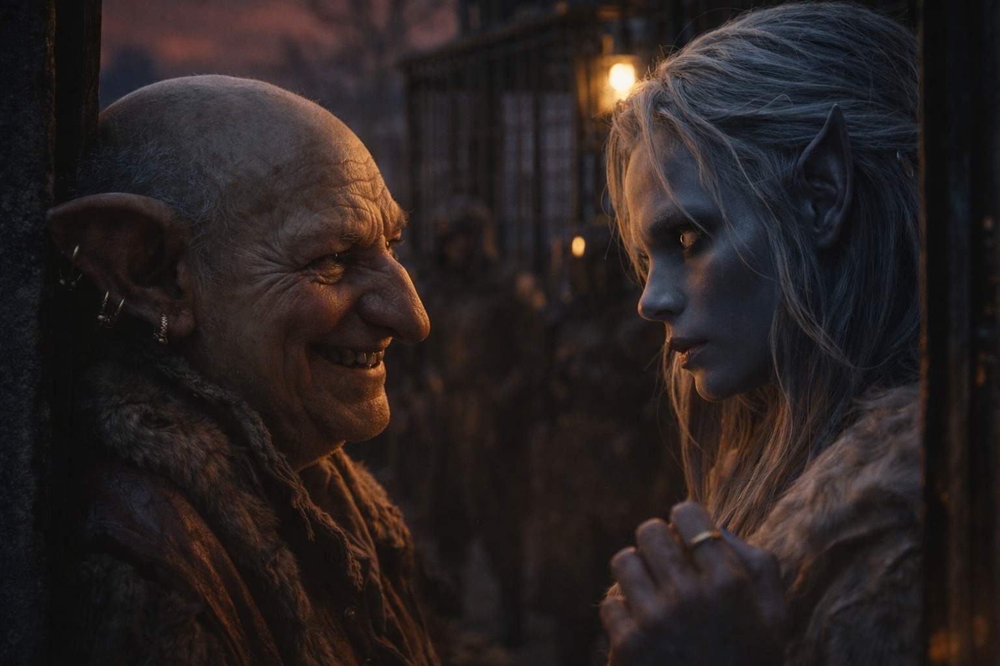
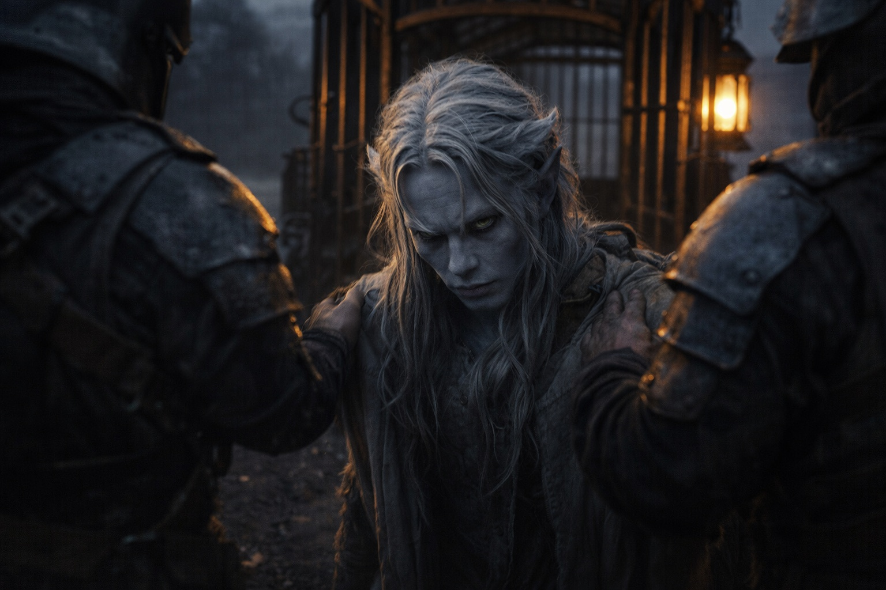

## Chapter 11 | Part 4

---

Three wagons stood outside Merrik's house.

Heavy frames.

Reinforced axles.

Iron cages bolted to two beds.

One cage already occupied.

Drusniel stopped in the doorway.

Seven guards visible.

An eighth behind the lead wagon.

Merrik beside him.

Nine if Merrik counted.

He counted Merrik.

"The caravan was three days away," Drusniel said.

"It was."

"You sent for them."

"After you decided to leave."

"When?"

"Last night."

Truth again.

Drusniel looked at the cages.

"Buyers. Brokers. Collectors."

"Different territories prefer different words."

"Slavers works."

Merrik shrugged.

"Also accurate."

No smile.

No apology.

"You helped me recover."

"Yes."

"Why?"

Merrik looked at him as if the answer were simple.

"Healthy cargo sells better."

There it was.

Not cruelty.

Accounting.

"You never lied to me."

"I never had to." Merrik adjusted one cuff. "You asked questions. I answered them. You needed food and shelter. I provided both."

"The purpose of the recovery was the only thing you didn't mention."

"Yes."

The guards spread around the house.

Professional spacing.

Two near the road.

One behind Drusniel's left shoulder.

Three around the wagons.

Two farther out.

No clear route.

"I could fight."

"You could try."

Merrik's tone did not change.

"I've watched you recover for five days. Your magic isn't back. They handle mages for a living."

Drusniel knew.

He hated that knowing did not alter the numbers.

A guard approached.

"Hands."

Drusniel gave him his wrists.

Iron closed around them.

Another guard reached toward the pouch beneath Drusniel's shirt.

"Leave the metal," Merrik said.

The guard looked at him.

"He came through with it. Eastern buyers pay more when crossing survivors arrive with what they carried."

The guard withdrew his hand.

Drusniel filed that away.

"The second cage," Merrik told the lead guard. "Feed him. He's worth less sick."

The lead guard nodded.

Drusniel walked to the wagon without resisting.

Eight professionals plus Merrik.

Depleted magic.

Unknown route.

Known cage.

Resistance now bought pain, not escape.

He climbed inside.

The door locked.

Merrik remained beside the road as the caravan started east.

Drusniel watched him until the house disappeared behind black stone.

Five days of questions.

None of them had been the right one.

---

**End of Chapter 11.4 —> 12.1: [The Grass Where She Fell: The Aftermath](/the-grass-where-she-fell-the-aftermath/)**
