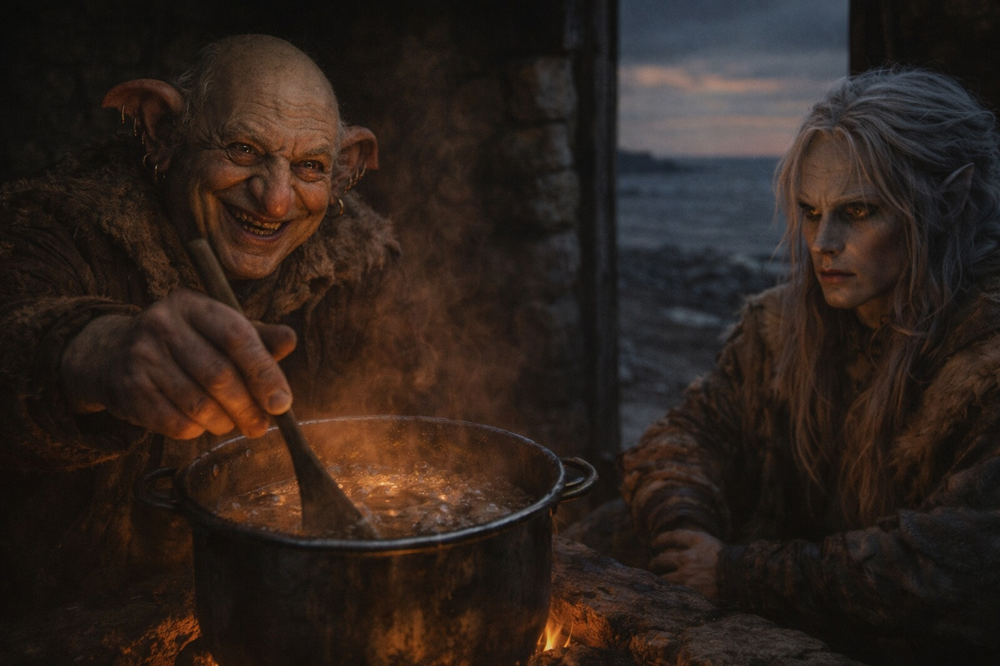
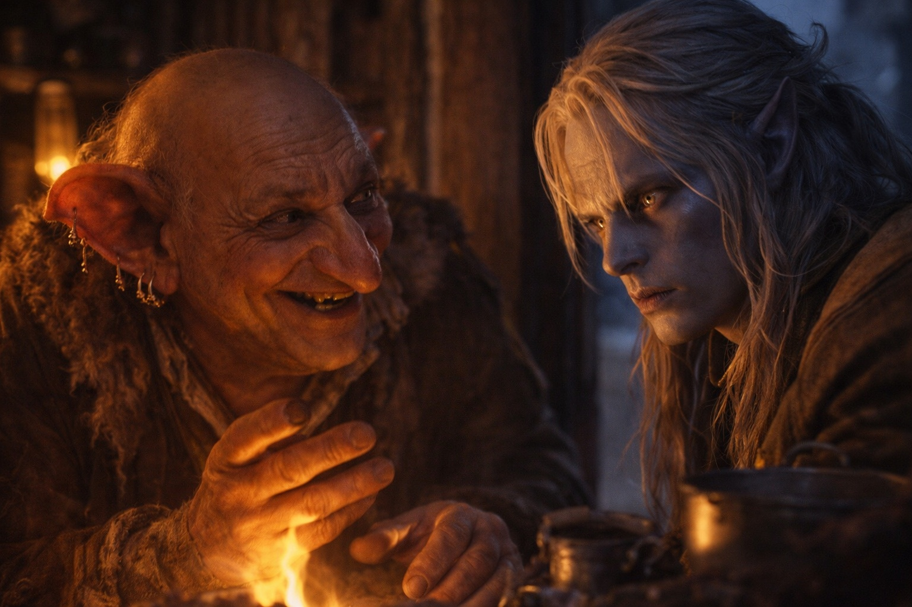
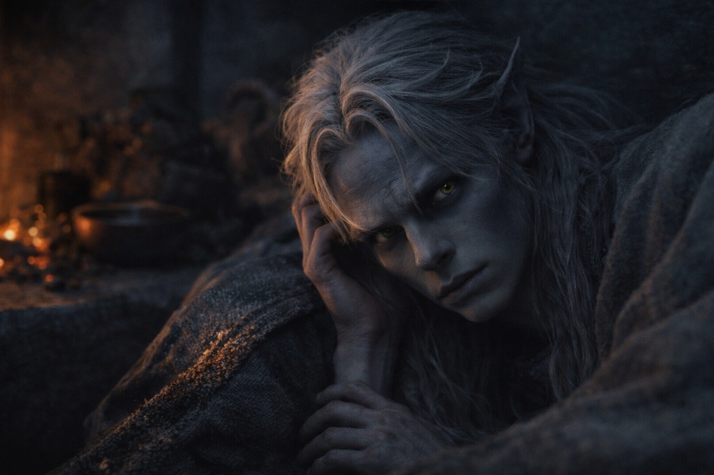

## Chapter 11 | Part 3

---

By the fourth day, Drusniel could cross the house without touching the wall.

Merrik watched him set the bowl down without spilling.

"Where did you learn air and water together?" he asked while cutting dried meat.

Drusniel watched the knife.

"Umbra'kor."

"One teacher?"

"Mostly."

"Family involved?"

"No."

Drusniel remembered being asked about the trial while he lay half awake. He did not remember answering.

He had begun turning the questions back, but Merrik always found another one.

The Null questions were the most careful.

*Does the metal bother you when you sleep?*

*Did you have it before the crossing?*

*Does it respond to magic?*

Drusniel had said it was only metal against his skin, that Zaelar had given it to him, that he had not tested it here. Merrik had stopped asking.

"You're stronger," Merrik said.

"Enough to travel."

"Maybe."

"Not maybe."

Merrik set the knife down.

"There's a caravan heading east."

Drusniel waited.

"They're expected in three days. Maybe four."

"Convenient."

"They run the coast."

"You said routes change."

"They do."

"You said the coast is watched."

"It is."

"You said survivors are valuable."

"Also true."

Merrik picked up the knife and cut another strip of meat for him.

Drusniel left it on the board.

"I'll leave tomorrow," Drusniel said.

Merrik looked at him for two breaths.

"Alone?"

"If necessary."

"Bad idea."

"Mine."

Merrik nodded.

"You'll be on the road by first light."

That night he lay awake, facing the doorway.

Merrik's footsteps crossed the main room. Another tread joined them, heavier, with a scrape at the end of each step.

Someone spoke too softly for Drusniel to catch the words. Then the heavier steps went outside.

Drusniel waited until the hearth went quiet.

He took the Null from his pack, wrapped the pouch beneath his shirt, and crossed to the side door.

His hand stopped an inch from the latch.

A shadow moved across the narrow line of light beneath it.

Merrik was still in the main room; Drusniel could hear him setting down a cup.

Drusniel waited.

The shadow remained.

He moved to the rear window instead.

Another silhouette crossed outside.

He crouched below the window and waited for the figure to pass again. It stopped beneath the shutters.

He could lift the latch, but the man outside would hear the shutters. His legs had barely carried him across the room.

He returned to the pallet and lay down fully dressed.

The Null pressed against his ribs.

He kept one hand on the pouch.

Sleep came anyway.

Wheels woke him before the light changed.

The caravan had come before he could leave.

---

**End of Chapter 11.3 —> 11.4: [The Kind Man: The Caravan](/the-kind-man-the-caravan/)**
