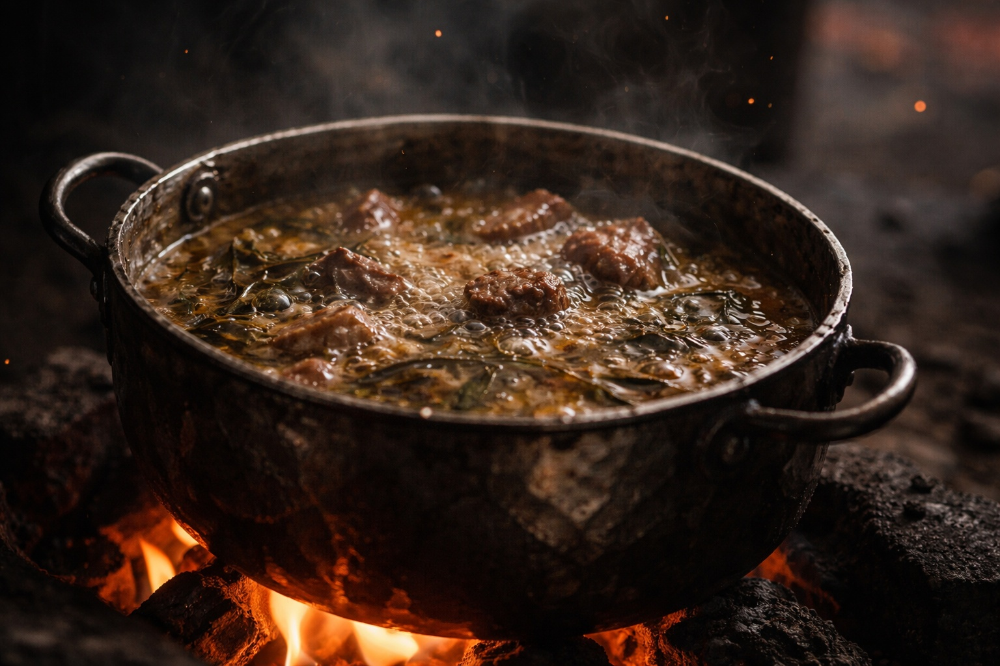

## Chapter 11 | Part 1

---

Drusniel woke on a thin pallet in Merrik's stone house. The blanket scratched the raw places on his palms.

"Two days since the beach," Merrik said when he saw him looking toward the shutters.

Drusniel pushed himself up on one elbow and had to stop.

Standing was not yet possible.

The room was small: one bed pallet, one table, one hearth, two shuttered windows, one door. His pack rested against the wall within sight. The Null lay inside it, cold and inert.

Merrik stirred a pot over the fire.

"You asked about Szoravel on the beach," he said.

Drusniel looked at him.

"You remember?"

"Enough."

"Good."

Merrik poured broth into a bowl and set it beside the pallet.

"Szoravel is east. Protected. Difficult to approach without an introduction."

"How difficult?"

"Enough that people who walk up to his door uninvited often don't get to complain about the result."

Drusniel drew the bowl closer.

"Who protects him?"

"Depends who you ask."

"Who have you asked?"

Merrik glanced at him.

"People who like being paid for answers."

"And what did you pay?"

Merrik sat on the other side of the table without answering.

"What can you do when your magic returns?"

On the beach Merrik had asked where he came from and why he had crossed. Now he wanted to know what Drusniel could do.

Drusniel could not remember what he had told him while the fever held.

"Air. Water."

"Both?"

"Yes."

"Combat?"

"Sometimes."

"Training?"

"Enough."

Merrik nodded as if each answer belonged somewhere.

Drusniel blew on the broth before answering.

"You ask a lot."

"I work with what washes ashore. Information keeps me alive."

"People wash ashore."

"Sometimes."

"And information about them keeps you alive."

Merrik met his eyes.

"Often."

No apology.

No denial.

Drusniel ate.

The debt beneath his ribs pulsed once.

He ignored it.

"When can I travel?"

"When you can cross this room without using the wall."

"Tomorrow."

"If your legs agree."

Drusniel tried his feet against the floor. One leg started shaking before he put weight on it.

He reached for the bowl again, keeping his eyes off Merrik.

---

**End of Chapter 11.1 —> 11.2: [The Kind Man: The Strange Land](/the-kind-man-the-strange-land/)**
