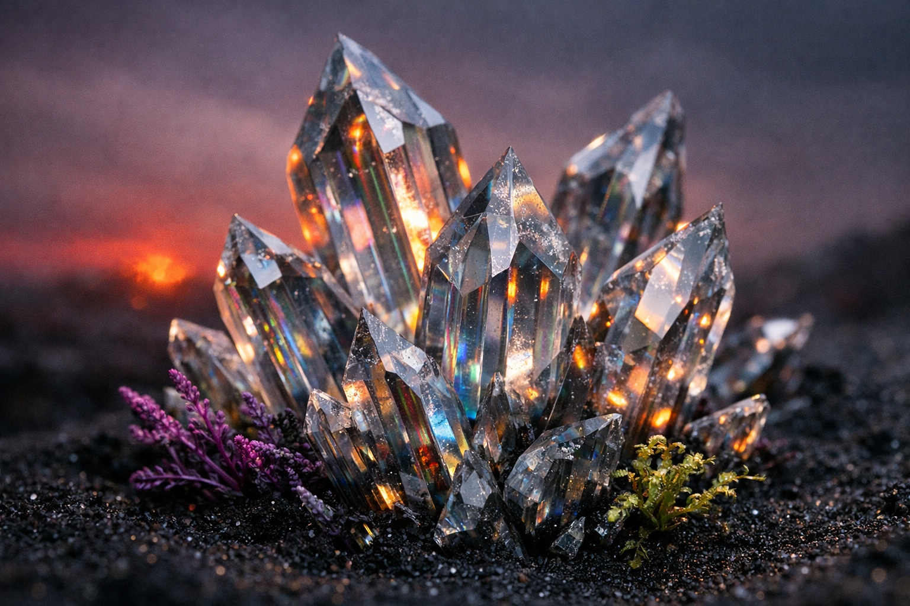
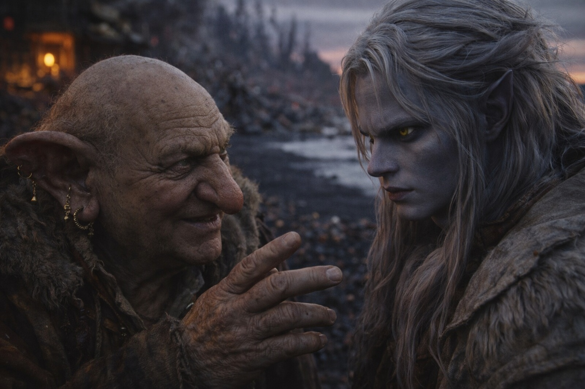

## Chapter 11 | Part 2

---

On the third day, Drusniel stood in Merrik's doorway with a hand against the warm stone.

The black crystal formations did not remain exactly where he remembered them when he looked away.

He chose a split crystal beside a low ridge, looked east, then back.

The split crystal now appeared three feet closer to the ridge.

Either the formation moved or distance did.

He kept his hand on the doorframe and tried again. The gap changed while the stone beneath his palm stayed firm.

"Don't navigate by the crystals," Merrik said.

"What do I use?"

"Someone who knows the roads. Until you learn them yourself."

Drusniel could stand. He could walk perhaps thirty paces before his legs shook. His magic remained depleted enough that reaching for air produced only pressure behind his eyes.

Merrik pointed east.

Beyond the black sand, volcanic light stained the horizon.

"Szoravel is somewhere beyond the contested territories."

"Controlled by?"

"Three powers. Borders change."

"Roads?"

"Some."

"Safe roads?"

Merrik looked amused.

"No."

<video controls playsInline preload="metadata" poster="./merrik-points-east_sora.jpg" width="100%">
	<source src="./MerrikStory.mp4" type="video/mp4" />
</video>

"How do people cross them?"

"Pay an escort. Or pay whoever holds the road. Sometimes both."

"You have contacts."

"I have people who answer when I ask the right question."

Drusniel turned enough to watch his face.

"Who watches the coast?"

Merrik looked toward the sea.

"Buyers, mostly. Brokers. Collectors. Different territories prefer different words."

"For what?"

"What arrives."

"Cargo?"

"Sometimes."

"People?"

Merrik did not hesitate.

"Sometimes."

Drusniel looked at him.

"Drow?"

"Rare here."

"Mages?"

"Useful almost everywhere."

"Valuable."

"Yes."

The word had appeared before.

Merrik had never hidden it.

"Why tell me?"

"You'll last longer if you know who to avoid."

Merrik glanced at his shaking legs. Drusniel took his hand off the wall.

"Can they identify survivors?"

"People talk. A stranger appears on an empty coast, someone notices."

"You noticed."

"I live here."

"Who did you tell?"

Merrik turned back toward the house.

"Today? No one."

Today.

Drusniel followed him inside.

Drusniel stopped beside his pack. He had been leaving it where Merrik could reach it from his chair.

He moved it beside the pallet.

---

**End of Chapter 11.2 —> 11.3: [The Kind Man: The Questions](/the-kind-man-the-questions/)**
