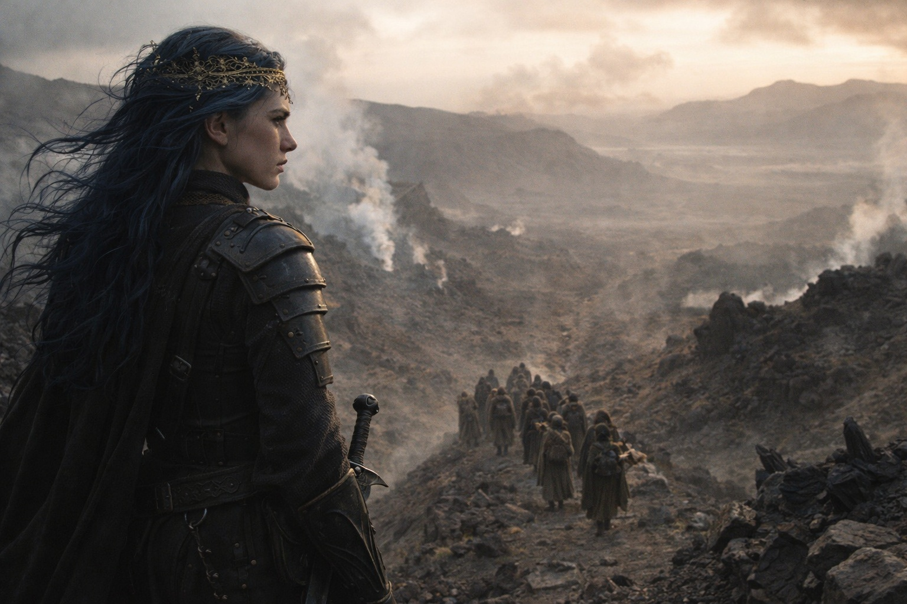
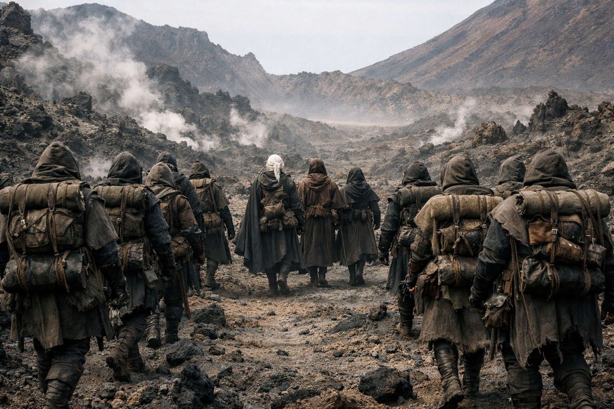

## Chapter 32 | Part 1 | The Arrival

---

She came from the east, not from behind them.

Drusniel understood the implication before his mind put words to it: she hadn't chased. She'd anticipated. Whatever routes Szoravel's map had offered, whatever gaps in patrol schedules he'd been certain about, Nyxara had positioned herself ahead of them with the precision of someone who'd known where they were going before they left.

She came with retinue. A dozen figures in dark, functional armor, organized into a formation that suggested caravan guard rather than raiding party. Drow and non-Drow mixed, moving with the quiet of people who'd been walking together long enough that communication happened in glances and spacing rather than words. They spread across the ridgeline like they'd measured it first.

Srietz saw them first. He stopped, ears rotating forward, and made a sound in the back of his throat that Drusniel had learned to translate as trouble, armed, ahead.

"Twelve," Srietz said. "Formation. Not combat. Escort." He looked at Drusniel directly, which was itself still new enough to register. "She's been waiting."

Elion came level with them, his amber-orange eyes reading the ridgeline with the measured attention of someone assessing odds he didn't plan to share. "The one in front," he said. "Tall. Dark armor. The others move around her."

Nyxara.

She stood at the ridge's highest point, watching them approach. Her armor was worn in, not ceremonial. A blade at her hip, hilted for use. Her face held the kind of patience that came from never having been forced to wait for anything that wasn't worth the time.

When they were close enough, she spoke.

"You owe me a conversation." Her voice carried without raising. No anger. No warmth either. "Szoravel gave you what he had. Now I collect what I'm owed."

Drusniel stopped. Srietz was already motionless behind him, coiled and calculating. Elion stood between them, his expression the controlled blank of someone who would not commit to a position until the positions were clearer.

"We ran," Drusniel said.

"You did." Nyxara didn't smile. "I didn't follow. Not immediately. You needed distance, and I needed to deal with what Szoravel's information exchange would attract." She gestured behind them, southwest, toward the territory they'd crossed. "Two groups moved on the tower within hours of your departure. Szoravel handled one. The other is still tracking the ridgelines."

"Tracking us."

"Tracking what you carry." She looked at his pack. At the shape pressing against the leather from inside. "The artifact draws attention. Szoravel's wards masked it. Out here, you're visible to anyone who knows what to look for."

Srietz's ears went flat. "She knows about the Null."

"She knows everything Szoravel knows," Drusniel said. He watched Nyxara's face for confirmation. She didn't provide it. She didn't need to.

"I'm offering escort," she said. "My domain sits between here and the barrier approach. Walk through it, and you walk with protection. Provisioned routes. Maintained paths. My people." She paused to let it settle. "The alternative is you continue alone through territory where at least one faction is actively looking for what's in your pack. I give you four days before they find you."

"And the conversation?"

"Happens during the walk. You tell me what Szoravel told you. I tell you about the route ahead. We arrive at the barrier approach with you still breathing." She lifted one hand, a gesture that encompassed the retinue, the landscape, the threat she'd described. "This is a transaction. I'm not disguising it as charity."

Drusniel looked at Srietz. The goblin's expression was something between recognition and calculation.

"She's a collector," Srietz said. Quiet. To Drusniel directly. "We're being collected."

"Srietz is not wrong," Nyxara said. She'd heard. She didn't pretend otherwise. "I collect what interests me. You interest me. But I also keep what I collect breathing, which is more than the groups behind you will promise."

Elion spoke. "How long through your domain?"

"Five days. Six if the weather turns."

"And after?"

"After is your concern. I'll get you through mine."

Drusniel felt the calculations running. The landscape behind them held exposed ridgelines, diminishing supplies, and an artifact that apparently announced itself to anyone with the right senses. The landscape ahead held Nyxara's offer, her domain, her protection, and the narrowing of options that acceptance always brought.

He'd been collected before. By Zaelar. The memory should have made him refuse.

But Zaelar had offered knowledge and hidden cost. Nyxara was offering safety and naming the price. The difference was the honesty of the transaction, and Drusniel had learned enough about transactions to know that stated costs were the ones you could survive.

"We walk with you," he said.

Nyxara nodded once. Confirmed, not satisfied. As if the outcome had been certain and the formality had been for his benefit.

She turned and signaled the retinue. The formation shifted, opening a space in the center where three additional travelers could move without disrupting the whole. Smooth. Practiced. They'd absorbed people before.

As they fell into the group's pace, Srietz dropped beside Elion. Drusniel caught the murmur, low and fast, meant to be said before the situation made it useless.

"When a lord offers escort, it means the escort needs the cargo. Not the other way around."

Elion said nothing. Ahead, Nyxara walked the open edge of the path where the sky was wide, passing under a rock overhang with a brief upward glance at its underside before moving on. Nobody remarked on it.

The route bent east. The retinue moved around them like a current around stones. Drusniel's pack pressed against his spine, the Null's weight familiar and suddenly relevant in ways it hadn't been an hour ago.

He was being collected. Srietz was right about that.

The question was what the collector intended to do with the collection.

---

**End of Chapter 32.1 —> 32.2: [The Last Safe Place: The Safety](/the-last-safe-place-the-safety/)**