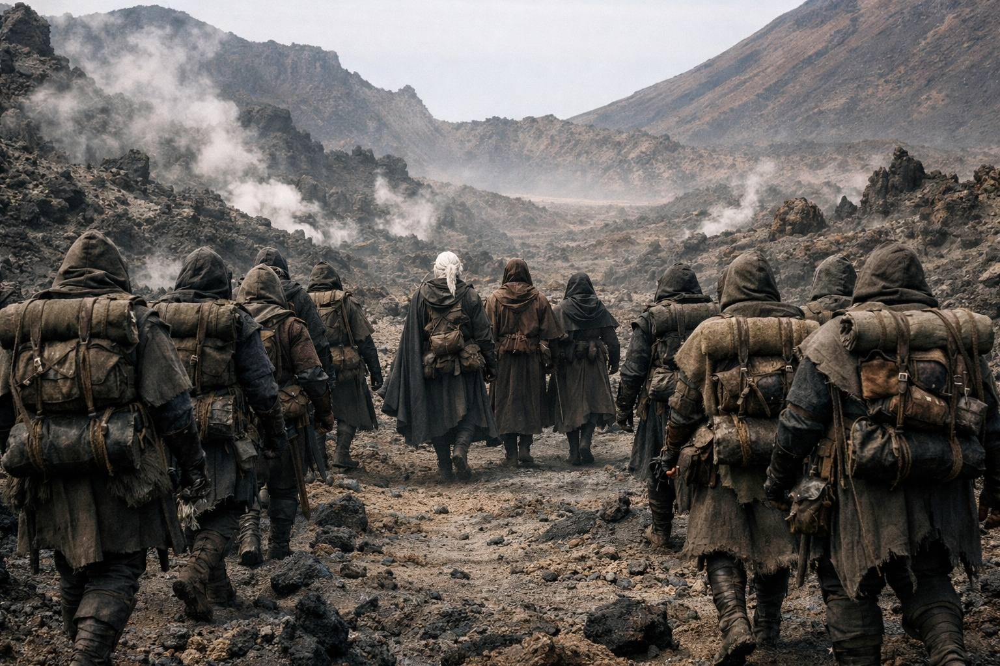

## Chapter 32 | Part 1 | The Arrival

---

She came from the east, not from behind them.

Nyxara had reached the road ahead of them. Szoravel's border had stopped nothing.

A dozen guards came with her, Drow and non-Drow in worn dark armor. They spread across the ridge without waiting for an order.

Srietz saw them first. He stopped, ears rotating forward, and made a sound in the back of his throat that Drusniel had learned to translate as trouble, armed, ahead.

"Twelve," Srietz said. "Formation. Not combat. Escort." He looked at Drusniel directly, which was itself still new enough to register. "She's been waiting."

Elion came level with them. "The one in front. The others move around her."

Nyxara.

She stood at the highest point with one hand beside the blade at her hip. Drusniel couldn't tell how long she'd been watching them.

When they were close enough, she spoke.

"You avoided my summons." Nyxara's voice carried along the ridge. "We will speak now."

Drusniel stopped. Srietz halted behind him, and Elion moved to one side so he could watch the guards.

"Our agreement ended at the border," Drusniel said.

"And you kept running." Nyxara pointed southwest. "Two groups moved on the tower within hours of your departure. Szoravel handled one. The other is still searching the ridgelines."

"Tracking us."

"Tracking what you carry." She looked at his chest. "Whatever left the mountain with you has drawn attention. The tower gave you cover. Out here, they can watch the roads."

Srietz's ears went flat. "She knows about the Null."

"She knew about it before we reached the tower," Drusniel said. He watched Nyxara.

"I'm offering escort. My domain lies between here and the barrier approach. My people maintain the routes and stock the waypoints." She glanced at the exposed ridge. "Alone, you have four days before that faction finds you."

"And the conversation?"

"Happens during the walk. You tell me what Szoravel told you. I tell you about the route ahead. We arrive at the barrier approach with you still breathing." She lifted one hand, a gesture that encompassed the retinue, the landscape, the threat she'd described. "This is a transaction. I'm not disguising it as charity."

Drusniel looked at Srietz. The goblin shook his head slightly.

"She's a collector," Srietz said. Quiet. To Drusniel directly. "We're being collected."

"Srietz is not wrong," Nyxara said. She'd heard. She didn't pretend otherwise. "I collect what interests me. You interest me. But I also keep what I collect breathing, which is more than the groups behind you will promise."

Elion spoke. "How long through your domain?"

"Five days. Six if the weather turns."

"And after?"

"After is your concern. I'll get you through mine."

He looked at the retinue, then back along the exposed ridge. He had food for the crossing. What he lacked was a route beyond the map.

He'd been collected before. By Zaelar. The memory should have made him refuse.

He would have to set the limit before they moved.

"Passage and information. No service afterward. My companions speak for themselves." He looked at Srietz and Elion. Both nodded before he turned back. "We walk."

"Keep pace," Nyxara said.

She signaled the retinue. The guards opened a space between them for the three travelers.

As they fell into the group's pace, Srietz dropped beside Elion. Drusniel caught the murmur, low and fast, meant to be said before the situation made it useless.

"When a lord offers escort, it means the escort needs the cargo. Not the other way around."

Elion said nothing. Ahead, Nyxara walked the open edge of the path where the sky was wide, passing under a rock overhang with a brief upward glance at its underside before moving on. Nobody remarked on it.

The route bent east. Drusniel checked the Null beneath his shirt as the guards took their places around them.

He was being collected. Srietz was right about that.

He would keep his own pack and watch where she took them.

---

**End of Chapter 32.1 —> 32.2: [The Last Safe Place: The Safety](/the-last-safe-place-the-safety/)**
