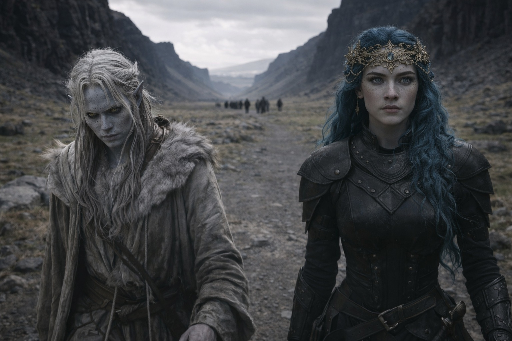
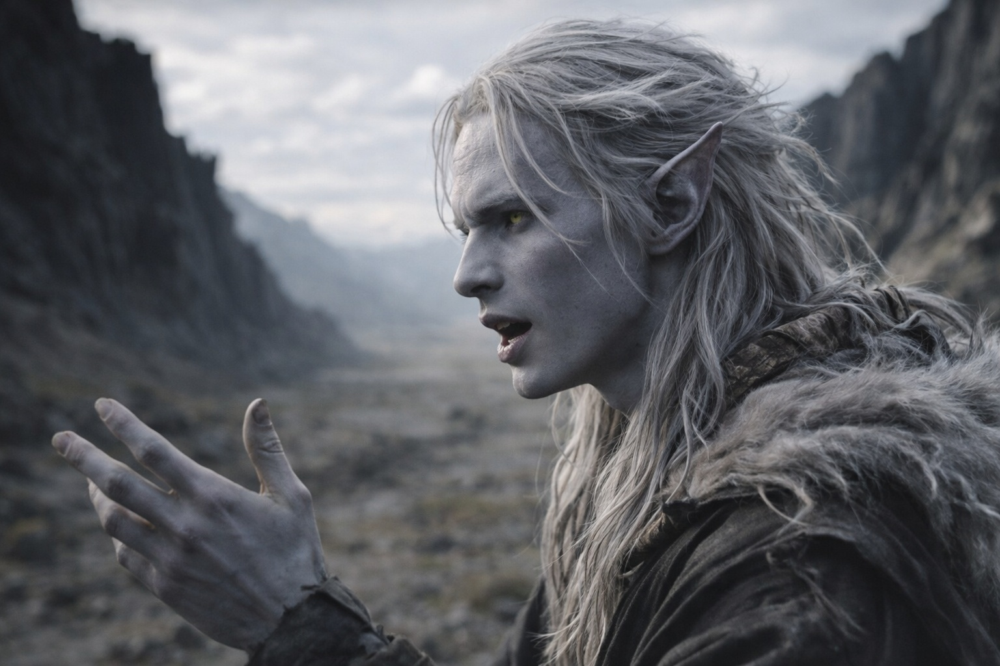
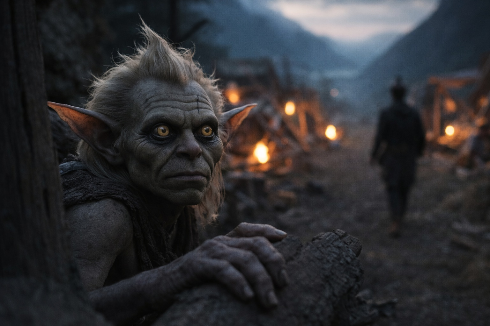

## Chapter 32 | Part 3 | The Conversation

---

She didn't ask what he knew. She asked what he believed.

The conversation happened on the fourth day, on a stretch of path where the terrain opened into a long valley floor between ridges of black basalt. Nyxara's guide had taken the retinue and the other two ahead, leaving a gap that might have been accidental if anything Nyxara did was accidental. Drusniel walked beside her. The valley was wide. The sky was visible. She walked the open side.

"The barrier," she said. Not a question. A subject, placed on the ground between them like a stone for examination. "Szoravel told you what it is. What it requires. I want to know what it means to you."

"It's failing. It needs renewal. I'm compatible with the renewal mechanism."

"That's what Szoravel told you. I asked what it means to you."

Drusniel looked at the landscape. Twisted black stone under a sky that was always slightly wrong, the light too angular, the color shifted toward frequencies that didn't belong in any sky he'd grown up under. A place that should have been hostile and felt, now, like the inside of a machine he was beginning to understand.

"The barrier is the Drow's purpose," he said. "It's why we exist in relation to this place. Umbra'kor, the nation, the culture, all of it was built around the understanding that the barrier must be maintained. That maintenance is sacred."

"Sacred." She repeated the word without inflection.

"Foundational. The thing that justifies everything else. The hierarchies. The trials. The way we organize power around duty rather than ambition. The barrier is the reason."

"And you believe this."

"I've always believed it."

She walked. Ten steps. Twenty. Her pace didn't change. She processed the way she moved: steadily, without visible effort, arriving at conclusions as if they'd been waiting for her.

"What would you do if the barrier weakened beyond renewal? If maintenance became impossible?"

"Maintain it anyway."

"Even knowing it would fail?"

"The act of maintaining matters. Even if the result is failure."

"Why?"

"Because the alternative is deciding that duty only counts when it succeeds. And once you decide that, every duty becomes negotiable."

She looked at him then. Directly. The intelligence in her eyes wasn't assessment anymore. It was recognition. The look of someone encountering a structure of thought that aligned with their own.

"Who decides when renewal is necessary?" she asked.

"The ones who can feel it degrading. Szoravel. Others with his training. The barrier communicates its state to those who know how to listen."

"And if those listeners disagree?"

"Then the one who's compatible acts on the best information available."

"Even if the information is incomplete."

"Information is always incomplete. You act anyway."

"Yes," she said. Something settled in her voice. Agreement, or something adjacent to it. "You do."

They walked in silence for several steps. Then she said something he didn't expect.

"I've carried that." Her voice was quieter. Not softer. Quieter, the way a voice gets when it drops below performance. "The duty that doesn't care whether it succeeds. I know what that weight is. I've paid it."

She didn't elaborate. She didn't explain which duty or which cost or when. The words were bare, offered without context, and for that reason they felt less like strategy and more like something that had slipped through a door she usually kept shut. A sentence that served no extraction purpose. A sentence that was hers.

Then the conversation moved, and whatever had opened closed again, and Drusniel filed the moment in the place where things that didn't fit the pattern went. It stayed there. It would stay there for a long time.

They walked. The valley stretched ahead of them, the retinue visible as distant figures at the far end. The guide had set a pace that kept them well ahead. The privacy was structural.

"You felt something in the mountain," she said. The transition came without preamble. Not a question.

Drusniel's stride didn't break. The memory lived in a place he'd walled off with deliberate architecture, brick by brick, every night since the volcano crossing. The thing in the mountain. The vastness he'd sensed in the heat and the dark, the presence that had no name because names implied boundaries and this had none.

"Yes."

"Tell me what you felt."

"Scale. Something that existed on a scale I couldn't process. Not malevolent. Not benevolent. Just vast. Like standing next to a river that was also a continent."

"Did it notice you?"

"I think so."

"And the barrier. What relationship does it have to what's in the mountain?"

"The barrier is between them and everything else. If the barrier fails, whatever's in there comes through."

"Comes through," she repeated. Tasting the words. Not correcting them. Not expanding. Filing.

She knew what it was. The certainty arrived in Drusniel's mind with the quiet inevitability of water finding level. She knew, and she wasn't telling him, and the not-telling wasn't cruelty or manipulation but the particular restraint of someone who understood that certain knowledge, delivered at certain moments, destroyed the capacity to act. She was protecting his ability to function by controlling what he knew.

He couldn't prove this. But he felt it the way he felt fractures in stone, the structural instinct that had served him since Umbra'kor and now operated at levels he hadn't trained for.

"One last question," she said. She stopped walking. The retinue was far ahead. The valley held only the two of them and the wind and the wrong sky. "If the barrier had to be renewed, and the cost was everything you hold sacred. Your nation's purpose. Your understanding of duty. The framework that makes you who you are. Would you do it?"

He didn't hesitate.

"Yes."

She nodded. Something in her eyes shifted. Not satisfaction. Certainty. The look of someone who has tested a load-bearing wall and found it sound.

"Good," she said. "Then we understand each other."

She started walking again. Her pace was the same. Her posture was the same. Nothing visible had changed. But the space between them felt different, reorganized, as if the conversation had been a survey and the map it produced would be used for purposes she hadn't disclosed.

Drusniel stood still for three steps before following. The valley was wide and empty and wrong, and he'd just answered every question honestly, and honesty had never felt more like handing someone a key to a door he couldn't see.

He followed. The wind moved through the valley. Ahead, Nyxara walked a clearing where the ridges pulled back and the sky was open, choosing the widest path the terrain offered while the rocks on either side rose tall and close enough to shelter anyone who preferred shelter.

She didn't.

By the time they reached the retinue, the guide had the camp half-built. Srietz was watching from the edge, yellow eyes tracking Drusniel's face for damage, reading the aftermath of a conversation whose content he could guess and whose cost he'd been warning about for three days.

Drusniel said nothing. Srietz's ears told him everything the goblin thought about that silence.

She'd asked the right questions. Not what he knew. What he believed. And he'd told her, because she'd listened the way no one had listened since the mental link he'd thought was real, and the listening had felt like recognition, and recognition was the thing he'd been starving for since Umbra'kor, and hunger made you generous with exactly the people who understood your appetite.

He didn't know what he'd agreed to. He was becoming certain he'd find out.

---

**End of Chapter 32.3 —> 32.4: [The Last Safe Place: The Escort](/the-last-safe-place-the-escort/)**