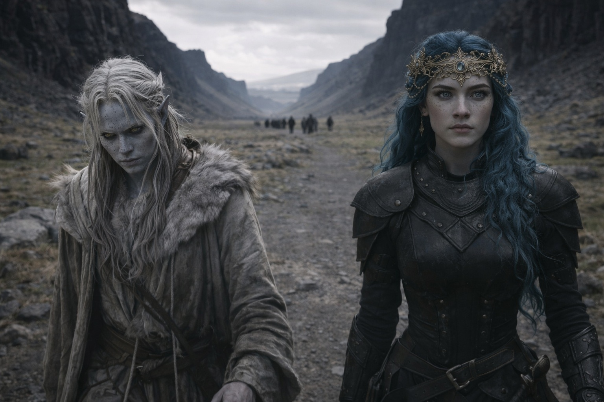
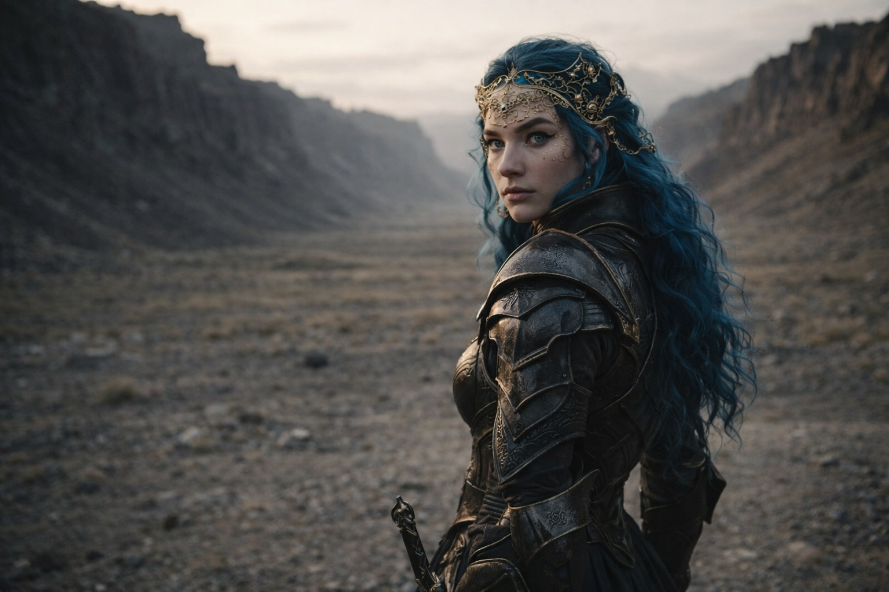
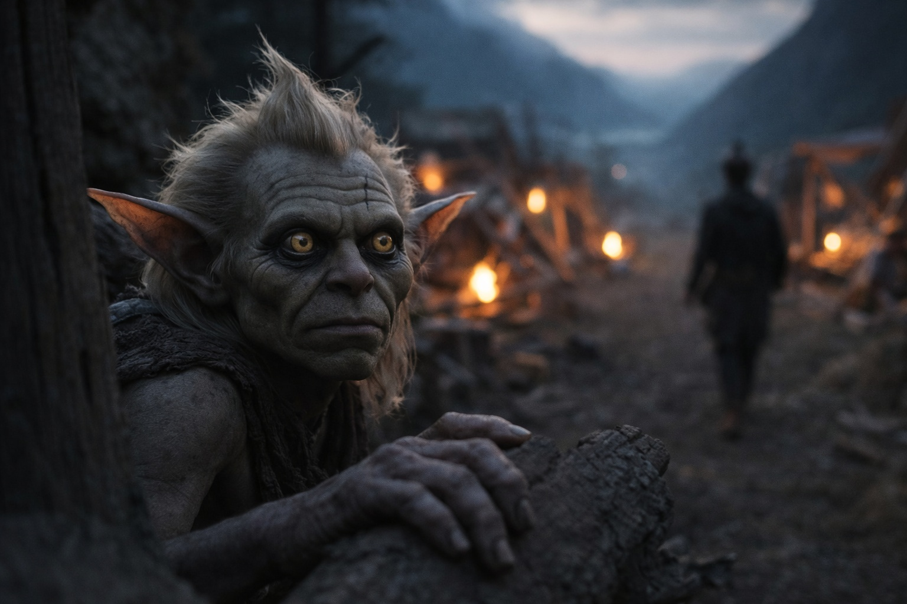

## Chapter 32 | Part 3 | The Conversation

---

She didn't ask what he knew. She asked what he believed.

The conversation happened on the fourth day, on a stretch of path where the terrain opened into a long valley floor between ridges of black basalt. Nyxara's guide had taken the retinue and the other two ahead, leaving a gap that might have been accidental if anything Nyxara did was accidental. Drusniel walked beside her. The valley was wide. The sky was visible. She walked the open side.

"The barrier," she said. "Szoravel gave you a task. Tell me why you accepted it."

"He says it's failing. I agreed to an assessment. He hasn't shown me a repair."

"That's what Szoravel told you. I asked what it means to you."

Drusniel watched the ground as they walked. He could cross it more easily now. He still didn't know what the crystals had changed in him.

"They taught us that maintaining it was sacred. Every trial, every rank, all of it justified by what we owed the barrier."

"Sacred." She repeated the word without inflection.

"Necessary. That was the claim. Refuse the duty and you lost any say in how it was done."

"And you believe this."

"I believed them. Now I want to see the cost for myself."

Nyxara let twenty paces pass before her next question.

"What would you do if the barrier weakened beyond renewal? If maintenance became impossible?"

"Find out what could still be held."

"Even knowing it would fail?"

"Slowing the failure could buy time to get people clear."

"Why?"

"There are people on both sides. If we leave it alone, they pay for that decision too."

She looked at him, then at the path ahead.

"Who decides when renewal is necessary?" she asked.

"The ones who can feel it degrading. Szoravel. Others with his training. The barrier communicates its state to those who know how to listen."

"And if those listeners disagree?"

"Then the one who's compatible acts on the best information available."

"Even if the information is incomplete."

"Information is always incomplete. You act anyway."

"Yes," she said. "You do."

They walked in silence for several steps. Then she said something he didn't expect.

"A failed defense still costs troops," she said. "So does abandoning it."

He waited for an example. She gave him none.

He wondered which defense she was thinking of.

The retinue was far ahead now. Drusniel would have had to shout to make Srietz hear him.

"You felt something in the mountain," she said. The transition came without preamble. Not a question.

Drusniel kept walking. He remembered the crystal wall under his hand and the blood on his lip.

"Yes."

"Tell me what you felt."

"Pressure. Everywhere I turned, it was there. I couldn't find its edge."

"Did it notice you?"

"I think so."

"And the barrier. What relationship does it have to what's in the mountain?"

"I don't know. Szoravel won't identify what it contains. If that thing could cross, I wouldn't know how to stop it."

"Could cross," she repeated.

She seemed to know more. He watched for a correction, but she offered none.

He couldn't tell what she gained by letting him keep guessing.

"One last question." She stopped. "If renewal cost your nation its purpose, would you still do it?"

He thought of the trials and the people who had declared their cost necessary.

"If it prevented the greater loss. I'd need more than someone's assurance."

Nyxara nodded once.

"Good," she said. "Then we understand each other."

She resumed walking. Drusniel stayed where he was until she had taken three steps.

She now knew what evidence he would ask for. He wished he'd considered that before answering.

He followed. She took the open side of the path, leaving the shelter of the ridge to him.

By the time they caught up, the guide had the camp half-built. Srietz looked from Drusniel to Nyxara.

Drusniel said nothing. Srietz's ears told him everything the goblin thought about that silence.

She hadn't told him what she intended. He'd told her what could make him agree.

He checked the distance to the nearest guard before sitting down.

---

**End of Chapter 32.3 —> 32.4: [The Last Safe Place: The Escort](/the-last-safe-place-the-escort/)**
