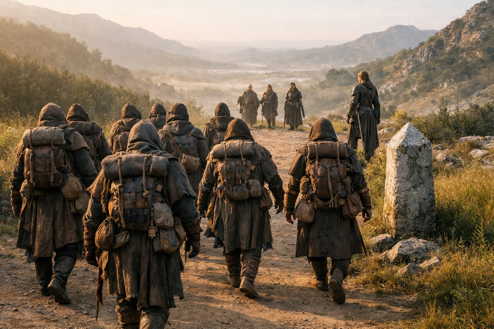

## Chapter 32 | Part 4 | The Escort

---

On the fifth morning, at the eastern edge of her domain, Nyxara dismissed the retinue.

Nyxara spoke quietly to the guide. The guards turned west in pairs and left them beside the marker.

Drusniel watched them go.

"You're not going with them," he said.

Nyxara adjusted the pack she'd taken from the guide before dismissing him.

"The territory ahead is contested. Multiple claims, no resolution. My presence ensures passage."

"Your presence ensures your presence."

"Those are the same thing." She pointed beyond the marker, where the path broke up among crystals. "Three days east to the barrier approach. The factions know better than to obstruct me."

Srietz watched the last pair of guards disappear, then leaned toward Elion.

"She's leaving her domain," he said. Low. To Elion, but pitched for Drusniel to catch. "Lords don't leave domains. Not in contested lands. Her territory is vulnerable without her."

Elion watched her. "She doesn't seem concerned."

"That's the point." Srietz's ears were flat. "A lord who leaves her domain either has nothing left to protect or doesn't need to be present to protect it. The first is desperation. The second is something else."

"What?"

Srietz shouldered his pack and crossed the boundary without answering.

Drusniel joined Nyxara beyond the marker. Loose stones shifted under his boots where the maintained path ended.

Nyxara walked it like she owned it.

She crossed the broken ground without slowing or checking the map.

"You've been here before," Drusniel said.

"Several times."

"As a lord?"

"As someone who needed to know what lay beyond her borders." She sidestepped a fissure in the basalt without looking down. "The barrier approach is not in anyone's domain. It exists in a space that predates the current territorial claims. Older than the factions. Older than the lords. The land itself changes character near the barrier."

"How?"

"You'll feel the change. Your adaptation will help you endure the approach." She glanced at him. "Keep the crystals close. They won't make you immune."

"He wanted more time to assess me."

"Szoravel and I agree on more than either of us would admit."

Crystal formations grew closer together as they climbed. Drusniel felt patches of warmth through his boots and stepped around them.

Drusniel's crystals hummed louder at his belt.

"You don't need to come with us," he said. He'd been holding the words since the retinue left. They came out simpler than he'd planned.

Nyxara kept walking. "I know."

She didn't explain. She didn't need to. Whatever was ahead, she intended to see it herself.

From the ridge, they could see black crystal lattices filling the low ground. The hum reached Drusniel's teeth before he started down.

"The barrier approach," Nyxara said, pointing to the gap between two formations.

Three days across that ground. He checked the water at his belt and looked for a path between the crystals.

Srietz reached the edge beside Elion and searched the slopes below.

"The last time a lord left her domain," he said to no one, "was a hundred years ago. The northern holds burned. That lord didn't walk. She arrived."

He looked at Nyxara, standing near the drop with nothing above her but open sky.

"Lords don't walk," Srietz said. "They arrive."

Nyxara raised her head into the wind. She stayed there until the others were ready to descend.

"We should move," she said. "Light's wasting."

They descended in single file. Behind them, the marker still showed where the maintained road ended.

They left it without ceremony.

---

**End of Chapter 32.4 —> 33.1: [What the Beacon Lost: The Stutter](/what-the-beacon-lost-the-stutter/)**
