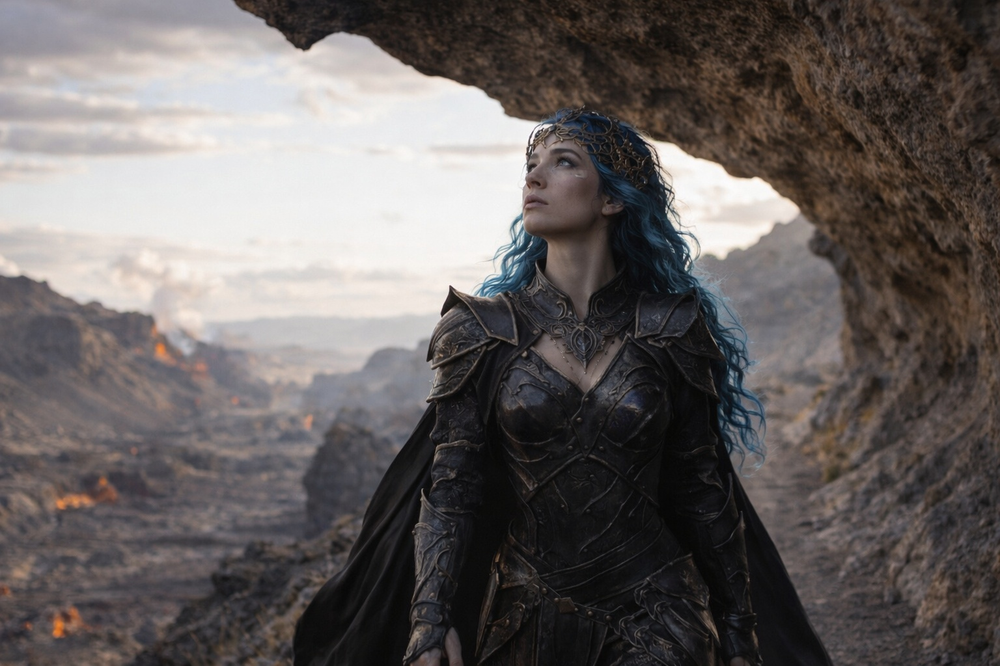

# Chapter 32.2 | The Last Safe Place: The Safety

---

The food was warm. The route was clear. The company was intelligent.

It was the first time in weeks that danger wasn't the immediate concern. Nyxara's retinue moved through her domain with the familiarity of people walking maintained roads in maintained territory, and within those roads, within that territory, the constant pressure that had defined every day since Szoravel's tower simply lifted. Not gone. Redistributed. Held by other people's hands.

They ate provisions from Nyxara's supply line, cooked at established waypoints, served on stone surfaces that had been cleared and leveled for the purpose. The terrain was still Wyrmreach, still hostile in its geology, still wrong in the way that Wyrmreach was always wrong. But the paths were marked. The water sources were mapped. The shelters existed where the retinue expected them to exist. It was, Drusniel realized on the second day, what conquest looked like from inside: not domination but infrastructure. Not tyranny but a road that went where you needed it to go.

His body didn't fight the environment anymore. That was the part he'd been avoiding for days, the observation he'd filed in the place where uncomfortable truths waited until they became unavoidable. The air that should have scraped his lungs felt normal. The volcanic heat that should have drained him felt like warmth. The black crystal formations that studded the landscape, frequent here, thick veins of dark mineral threading through basalt and obsidian, hummed at a frequency his body recognized rather than resisted. The crystals at his belt hummed with them. A resonance. A sympathy.

He was adapted. The crystals had reduced the friction between his body and this place until the friction disappeared, and now Wyrmreach felt less like a hostile realm and more like the environment he'd been built for. The comfort should have been welcome. Instead it sat in him like a diagnosis.

Nyxara noticed.

"Your body doesn't fight this place anymore," she said on the second evening, watching him eat near a formation of black crystal that jutted from the ground like a displaced rib. She was standing, as she always stood during meals, attending to the route or the retinue or some logistics that apparently required her attention at precisely the times food was served. Drusniel had never seen her eat. "How long have you used the crystals?"

He considered lying. The consideration lasted about two seconds. She already knew enough to make lying pointless and insulting.

"Weeks. Since a chamber under the tunnels."

"Used them how?"

"Carrying them. The adaptation wasn't deliberate."

"It rarely is." She traced a finger along the crystal formation beside her, the way someone might touch a familiar surface while thinking about something else. "Adaptation is what crystals do to compatible bodies. They reduce resistance. Make you fit the environment instead of fighting it." Her eyes returned to him. Direct. Interested. The interest of someone cataloguing a fact they'd suspected and now confirmed. "You're adapted. That changes what you can do here. And what this place can do to you."

"Meaning?"

"Meaning the barrier responds to what belongs. You belong now. Whether you wanted to or not."

She moved on. Attended to something with the retinue. Left the observation sitting where she'd placed it, heavy and precise.

Drusniel sat with it. The crystals at his belt hummed.

The days accumulated. Nyxara walked with them, not beside her retinue but among the three travelers, and she did more than question. At each halt she taught him working words in an old draconic register, short spell forms for airflow control and water-sense, then corrected his stance, wrist angle, and breathing until the pattern held. She tracked his errors without comment and adjusted him again. It was instruction, not comfort, but the precision in it left no doubt: she intended him to improve.

That stopped him.

"What do you know about the Voice?"

"I know it exists. I know it intervened. I know you carry obligations from those interventions." She said it the way she said everything: as established fact, not as revelation. "Szoravel's networks are extensive but they leak. What interests me is what it wants."

"I don't know what it wants."

"Then tell me what it's done."

He told her. More than he intended. Not because she pressed, but because she listened, and the listening was a thing he hadn't experienced since Annariel, since the mental link he'd believed was real and wasn't, since the conversations that had shaped his understanding of himself and turned out to be architecture designed by someone else. Nyxara listened the way Annariel had listened: completely. Attentively. As if what he said mattered not because it served her but because she found it genuinely worth hearing.

The difference, he told himself, was that Nyxara was real. Present. Her questions came from her own mouth, not from a fabricated link. Her magic felt pure and clean in a way Zaelar's never had. Zaelar had taught in layers and obscurities, answers wrapped around motives he never named. Nyxara gave a word and a form, then corrected him until the current answered. He caught himself thinking words he should have resisted: true teacher, master, strategic equal.

He told her about the Nightmare Sea. About the first debt. About the Voice's silence during the volcano crossing and what that silence had meant. About the second debt, when his companions would have starved. About the stirring he'd felt at the Thornfield camp, the two words pressed into his awareness with the weight of an approaching season.

He told her too much. He knew it while he was doing it.

On the third evening, Srietz pulled him aside.

They were at a waypoint, a sheltered formation where the retinue made camp with the efficiency of people who'd done it hundreds of times. Srietz appeared at Drusniel's side while the others were occupied, moving with the quiet that was his natural state and his most reliable weapon.

"She's learning everything." His voice was low. Fast. The cadence of someone who'd been holding words for three days. "You're teaching her."

"She already knew most of it."

"She knew. Now she's confirmed." Srietz's yellow eyes were steady, which on him meant the urgency was real. "Those are different things. Knowing is a guess. Confirming is a weapon. You're handing her weapons and she's thanking you for them."

"She's helping us."

"She's helping herself. We happen to be inside the help." He glanced toward where Nyxara stood with two members of her retinue, reviewing something Drusniel couldn't see. "She never eats with us. She never eats at all. She asks questions when you're comfortable. She answers just enough to keep you talking. This is extraction, not friendship."

Drusniel looked at the goblin. Srietz looked back. The anger that had defined his face for days was still there, banked, but this wasn't anger. This was the operational assessment of someone who'd spent three years learning what it looked like when someone collected what they needed from you while making it feel like generosity.

"I know what she's doing," Drusniel said.

"Then stop giving her what she wants."

"What she wants is information I need her to have if she's going to get us to the barrier approach alive."

Srietz's ears flicked. "That's her logic. You're repeating it. That's how you know it's working."

He left. Returned to Elion's side at the far edge of the camp, where the grey humanoid sat with his legs folded and his amber-orange eyes tracking nothing and everything.

Drusniel watched Nyxara. She stood in the center of the waypoint clearing, away from the walls of the rock formation, away from the overhanging stone that would have provided shelter from the thin rain that had started. Her retinue sheltered. She didn't. She stood where the space was widest and the sky was open.

He noted the choice without understanding why it unsettled him.

The food was warm. The route was clear. The company was intelligent.

He caught himself relaxing in her orbit, and the catching felt like a warning he didn't want to hear.

---

*Next: The Last Safe Place: The Conversation*

**End of Chapter 32.2 — continues in Chapter 32.3: [The Last Safe Place: The Conversation](/the-last-safe-place-the-conversation/)**
