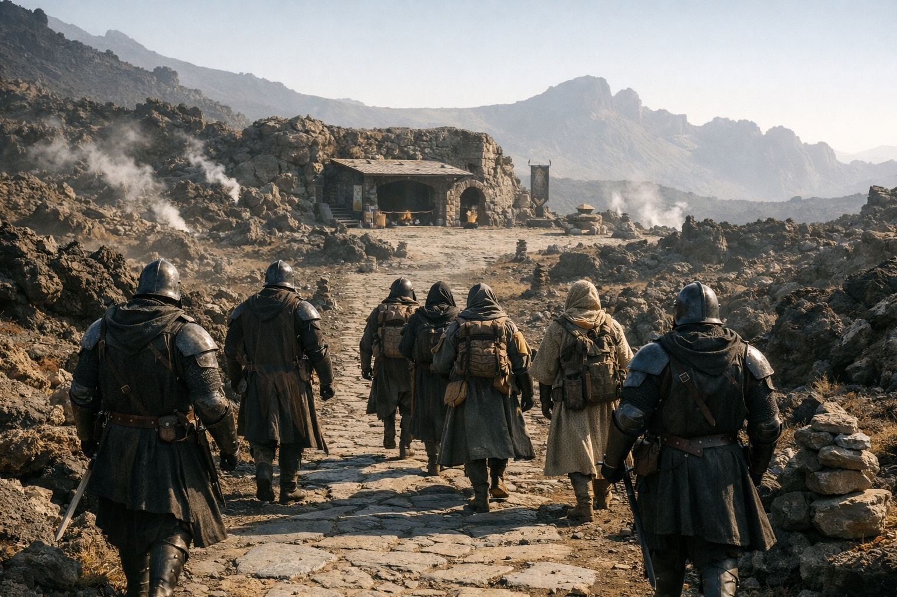

## Chapter 32 | Part 2 | The Safety

---

At the first waypoint, Drusniel ate a hot meal without having to watch the path.

The guards watched the approaches while the travelers ate. Drusniel finished before he realized he hadn't once checked behind him.

Nyxara's people knew where to find water and shelter. Meals waited at the waypoints. On the second day, Drusniel realized he hadn't unfolded Szoravel's map since joining them.

Breathing had become easier. He no longer needed to stop at every rise, though the heat still left him thirsty. The crystals at his belt hummed when they passed the larger formations.

With the crystals close, he could judge distances without the usual dizziness. He dreaded finding out whether that would last without them.

Nyxara noticed.

On the second evening, Nyxara watched him eat beside a crystal formation. "Your body doesn't fight this place anymore. How long have you used the crystals?" She remained standing. He had yet to see her take a meal.

He considered lying. The consideration lasted about two seconds. She already knew enough to make lying pointless and insulting.

"These since the mountain. I handled others before that."

"Used them how?"

"Carrying them. The adaptation wasn't deliberate."

"It rarely is." She ran a finger along the formation. "They make a compatible body tolerate the environment. You've felt the difference."

"Meaning?"

"Meaning the barrier responds to what belongs. You belong now. Whether you wanted to or not."

She left him beside the formation and went to speak to her guide.

Drusniel stayed beside the formation, listening to the crystals at his belt.

At each halt, Nyxara drilled him in short spell forms for air and water. She corrected his wrist and made him repeat the movement until the current held. By the end his fingers shook and his throat was dry. She stopped the exercise when his aim began to slip.

After one exercise, she said, "You can control that current. The Voice is another matter."

"What do you know about the Voice?"

"It intervened twice. You carry the obligations." She waited until he met her eyes. "Szoravel's networks leak. What does it want?"

"I don't know what it wants."

"Then tell me what it's done."

He told her more than he intended. She let him finish each answer before asking the next question. He'd missed being listened to, even when the listener wanted something.

At least he could test what she taught. A change in his grip held the current steady; a missed breath broke it. He began saving questions for the next halt.

He described the Nightmare Sea and the route through the caves, then the unanswered calls in the mountain. He repeated the Voice's words at Thornfield: almost ready; almost there.

He told her too much. He knew it while he was doing it.

On the third evening, Srietz pulled him aside.

The guards were pitching camp at a sheltered waypoint. Srietz caught Drusniel alone while he refilled his waterskin.

"She's learning everything." His voice was low. Fast. The cadence of someone who'd been holding words for three days. "You're teaching her."

"She already knew most of it."

"She suspected. Now you've confirmed it." Srietz kept his voice low. "Srietz has seen this before. She asks, you answer, and she decides what to do with it."

"She's helping us."

"She's helping herself. We happen to be inside the help." He glanced toward where Nyxara stood with two members of her retinue, reviewing something Drusniel couldn't see. "She never eats with us. She never eats at all. She asks questions when you're comfortable. She answers just enough to keep you talking. This is extraction, not friendship."

Srietz waited for an answer. Drusniel looked away first.

"I know what she's doing," Drusniel said.

"Then stop giving her what she wants."

"What she wants is information I need her to have if she's going to get us to the barrier approach alive."

Srietz's ears flicked. "That's her logic. You're repeating it. That's how you know it's working."

Srietz returned to Elion at the edge of camp. The elf made room beside him.

Rain began to fall. Nyxara stayed in the clearing while her guards sheltered beneath the overhang. Drusniel watched her standing in the open and couldn't explain why the choice unsettled him.

Someone offered him another serving. He accepted it.

He'd stopped checking how far the nearest guard stood.

---

**End of Chapter 32.2 —> 32.3: [The Last Safe Place: The Conversation](/the-last-safe-place-the-conversation/)**
