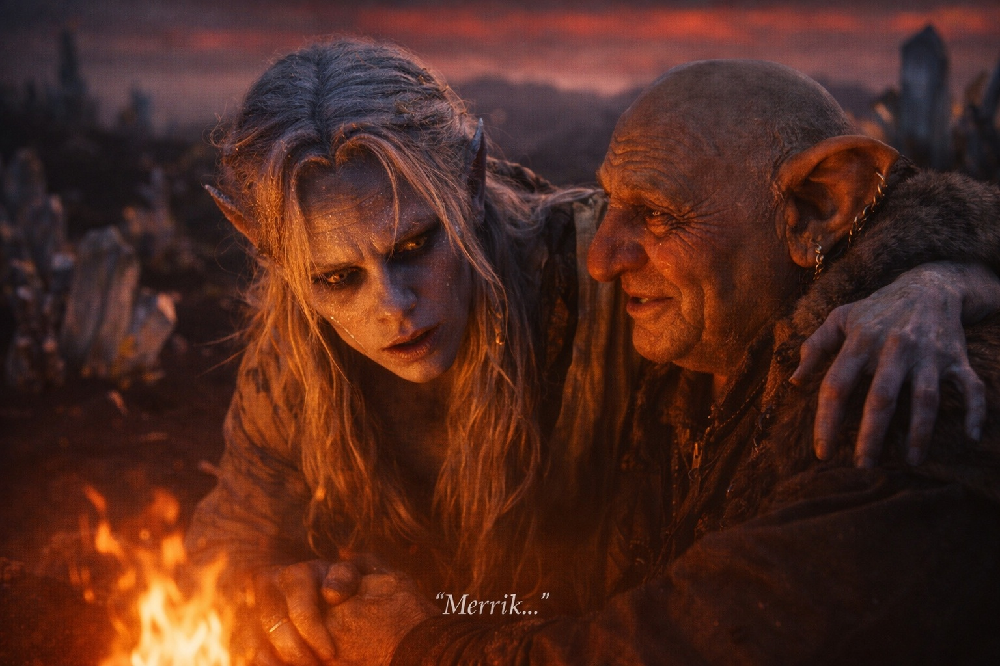
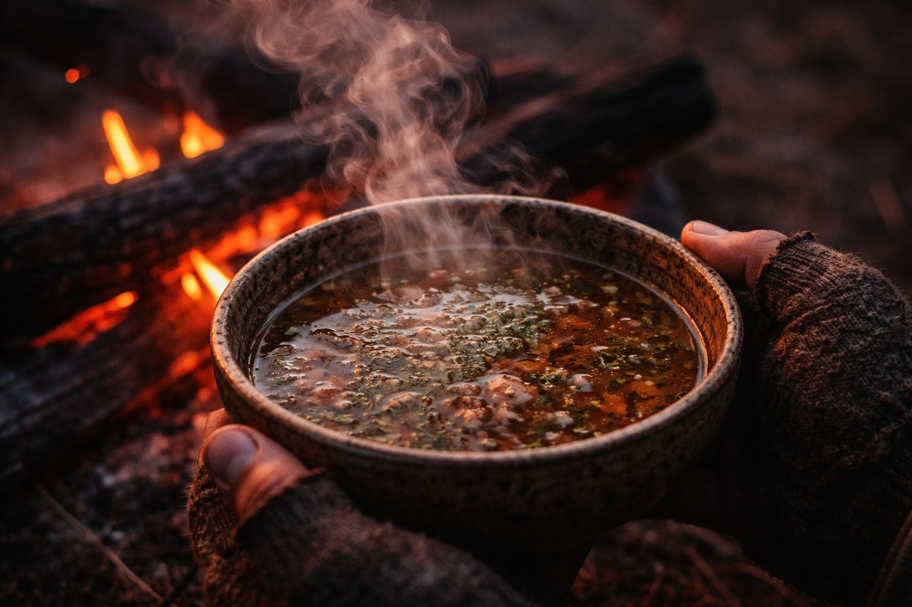

## Chapter 9 | Part 5

---

Heat reached his face before he could open his eyes. Something gritty pressed into his cheek.

He smelled burning driftwood, with a sulfurous edge that outlasted each breath.

Someone moved beside the fire. Behind him, water lapped against the boat.

Drusniel opened his eyes.

The red-grey sky had not changed.

A man crouched beside the fire.

"Don't try to move yet."

The man's voice was practical.

Drusniel tried anyway.

His arms shook.

"There. That's why I said it."

Drusniel let himself fall back.

"The crossing takes most of what people bring into it," the man said. "The ones who survive usually need a day before they can walk properly."

He glanced toward the reinforced boat.

"Boat was smart."

"Water," Drusniel managed.

His throat was raw from hours of metallic air, desperate breathing, and exertion.

The man raised an eyebrow.

"After crossing that?"

Drusniel stared at him.

"Right."

He brought over a waterskin and let Drusniel drink in small amounts.

"You're not from here."

Drusniel drank again.

"Drow?"

A nod.

"Haven't seen one of you in a while."

Drusniel tested his fingers.

They moved.

Slowly.

"Where?"

"Wyrmreach. Coast. Scavenger's stretch."

The man pointed with his chin toward the dark shoreline.

"Things wash up here."

"People."

"Sometimes."

Drusniel looked inland.

Black crystal formations rose between low plants whose colors he could not name. Farther away, volcanic light stained the horizon.

"Don't go toward the glow until you know what you're doing," the man said.

Drusniel let his head sink back against his pack.

"Where were you trying to go?"

Drusniel searched his exhausted memory.

"Szoravel."

The man paused with a piece of driftwood in his hand.

"The mage?"

"Yes."

"You know him?"

"No. I was sent."

"Long crossing for someone you've never met."

Drusniel closed his eyes for a second.

"Zaelar said Szoravel would recognize the Null's signal."

"Hm."

The man turned the driftwood over in his hand without looking at the pack.

The man added the wood to the fire.

"Szoravel isn't easy to find. Protected, from what I've heard."

No one had come for him except this man.

He had expected someone who knew his name.

He tried to sit up.

The man put out a hand, not touching him, only ready in case he fell.

"Rest. Whatever you did out there emptied you."

"Who are you?"

"Merrik."

"Why are you here?"

"I work the shore. Salvage. Wreckage. Occasionally people."

He poured broth into a bowl and handed it over.

Drusniel smelled the broth before drinking. Meat and unfamiliar herbs; he could not tell much else.

Merrik noticed.

"Good habit."

Drusniel took a cautious sip.

Warm.

"Why help me?"

Merrik shrugged.

"You're alive. That's rare enough to be interesting."

"Interesting."

"Interesting things are valuable here."

Drusniel lowered the bowl.

Merrik gave a short laugh.

"Don't look so offended. Right now your value is mostly that I'd rather not watch someone die beside my fire."

He drank again, holding the bowl where Merrik could see it.

"Sleep," Merrik said. "The fire keeps the coast-runners away. I'll wake you if that changes."

Drusniel lay back.

He turned so he could see the fire and kept one hand on his pack.

The debt pulsed once beneath his ribs.

Drusniel waited for a second pulse.

He was asleep before it came.

---

**End of Chapter 9.5 —> 10.1: [The Knot at Riverhold: The Veteran](/the-knot-at-riverhold-the-veteran/)**
