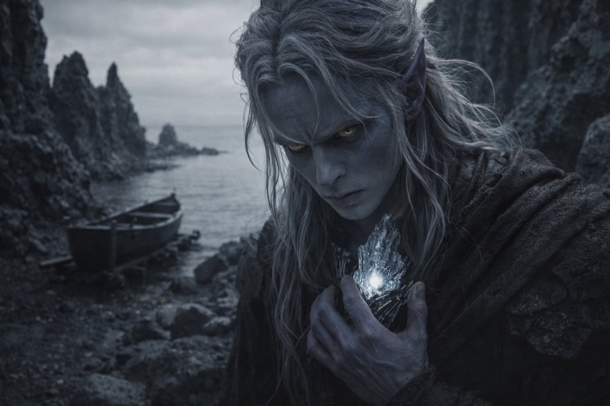

## Chapter 9 | Part 1

---

The water was wrong before he touched it.

Drusniel stood where black stone met black water, the Null cold against his chest.

He tried to measure the far shore.

One estimate put it at two miles.

The next made it five.

On the third, the horizon shifted while he watched.

He stopped trying.

*Three hundred paces north. Black rocks shaped like broken teeth.*

Zaelar's route had been exact. The cove was where it should be, hidden behind the black rocks. The boat waited inside the cave on wooden rollers.

Small. Reinforced. Oars, rope, waterskin.

Enough.

Drusniel ran a hand along the metal-banded hull.

Zaelar had been right about the boat.

That did not make him right about anything else.

He pushed it into the water and climbed aboard.

The hull settled too slowly, then dropped half an inch without warning.

Drusniel gripped the gunwales.

The Null pulsed against his sternum.

His sense of the air dimmed with it.

The rule Zaelar had given him finally made sense in practice: passive, the Null hid his magical presence. The moment he worked magic through it, the mask would tear open—and forcing a working through the suppression would cost more.

Rowing was safer.

Drusniel rowed.

The first ten strokes behaved almost normally.

On the eleventh, the water thickened around one oar and thinned around the other.

The boat yawed sideways.

He corrected.

Twenty strokes later, the shore behind him vanished.

Not into mist.

Gone.

Grey light remained without a visible source. It cast no useful shadow. The horizon expanded and contracted by fractions he could see but not quantify.

Drusniel counted strokes anyway.

Twenty-three.

Twenty-four.

Twenty-three.

He stopped.

Numbers were still numbers. Sequence was becoming unreliable.

The air tasted metallic.

He kept rowing.

A swell rose ahead without wind.

His water affinity reacted before thought did.

Drusniel touched the sea magically.

Something touched back.

Attention closed around the boat from below.

He severed the contact at once.

The wave struck broadside.

The hull climbed, hung at an angle his body insisted should capsize it, then slammed flat again. Heavy black water spilled over the side and pooled around his boots.

The presence below remained.

Drusniel did not reach for water again.

He rowed until his shoulders burned.

Then the density thickened around both oars at once.

The boat nearly stopped.

Drusniel looked at the grey air sliding weakly across the stern.

Existing current.

Enough to use.

He caught it, compressed it, and redirected it backward.

The boat lurched forward.

Pain followed immediately behind his breastbone as the working forced its way through the Null.

The presence below sharpened.

There.

Rule confirmed.

Magic worked.

Magic cost more.

Magic announced him.

The air working collapsed after seconds.

Drusniel returned to the oars.

Something moved under the hull.

Not attacking.

Following.

He did the arithmetic automatically.

Distance to shore: unknowable.

Remaining reserves: reduced faster than expected.

Predator response to active magic: immediate.

Rowing: slow, but quiet.

For once, the numbers gave him a usable answer.

Row.

---

**End of Chapter 9.1 —> 9.2: [The Nightmare Sea: The Count](/the-nightmare-sea-the-count/)**
