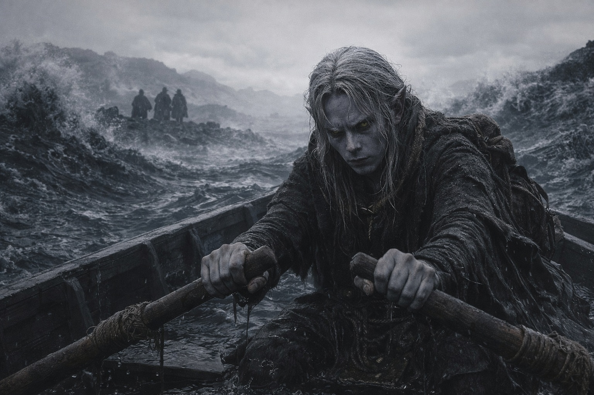
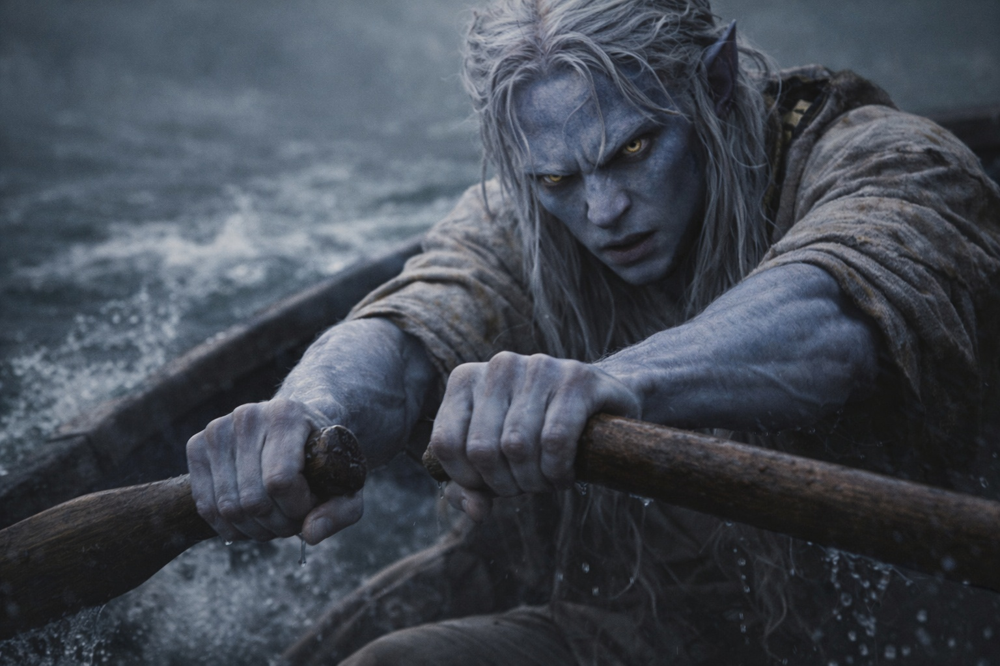

## Chapter 9 | Part 2

---

Twenty strokes. Then one burst of air.

That was the plan.

Rowing was quiet. Air magic bought distance. The Null made each working expensive, and each working told the thing below where he was.

Simple enough to ration.

Drusniel pulled.

One.

Two.

Three.

At seventeen, the left oar sank into resistance like tar.

At eighteen, both oars moved as if through mist.

At nineteen, the boat slid sideways.

Twenty.

He waited for a current.

A weak flow crossed the stern.

Drusniel caught it, narrowed it, and drove it backward.

The boat surged.

The Null bit into the working.

His reserves dropped farther than they should have.

Below, the presence shifted closer.

Drusniel released the air.

Row again.

He began the next count.

One.

Two.

Three.

Five.

Five again.

Then four.

He stopped speaking the numbers aloud.

Time wasn't merely broken here. Time was hostile.

He tried rhythm instead.

Pull. Release.

Pull. Release.

That lasted until one stroke took half the effort of the next, then twice the effort, then none. The sea refused a stable cadence.

Water sloshed around his boots from the earlier wave. He bailed only enough to keep the weight manageable.

No water magic.

Air only when the boat stalled.

Rowing for everything else.

That was the revised plan.

A shadow passed beneath him.

The hull shivered.

Drusniel froze.

Something touched the underside once.

Softly.

A knock.

His water affinity reached for it.

He crushed the impulse.

The boat drifted.

The presence remained directly below.

Drusniel waited until a faint current brushed his cheek.

He could use it.

He should not.

The boat had almost stopped.

He caught the current.

Compressed.

Redirected.

The stern kicked forward.

The response beneath him was immediate.

The hull rose an inch as something followed.

Drusniel released the working.

Too late.

A long shape moved under the boat, too deep for detail, too large for scale.

He rowed.

His hands had started bleeding at the base of the fingers. He adjusted his grip around the torn skin and kept pulling.

No shore.

No stars.

No stable horizon.

He tried one more calculation.

If his next air working cost as much as the last, he had perhaps one left after it.

Perhaps.

The Null pulsed.

The thing below brushed the hull again.

Harder this time.

Drusniel looked at the oars.

"Fine," he told the sea.

He rowed without counting.

---

**End of Chapter 9.2 —> 9.3: [The Nightmare Sea: The Silence](/the-nightmare-sea-the-silence/)**
