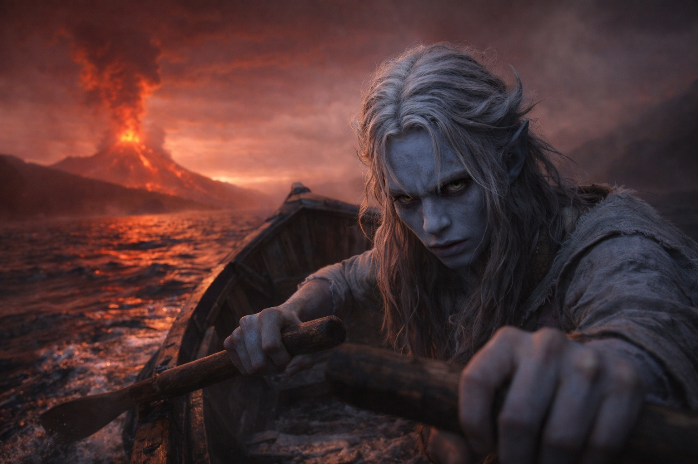
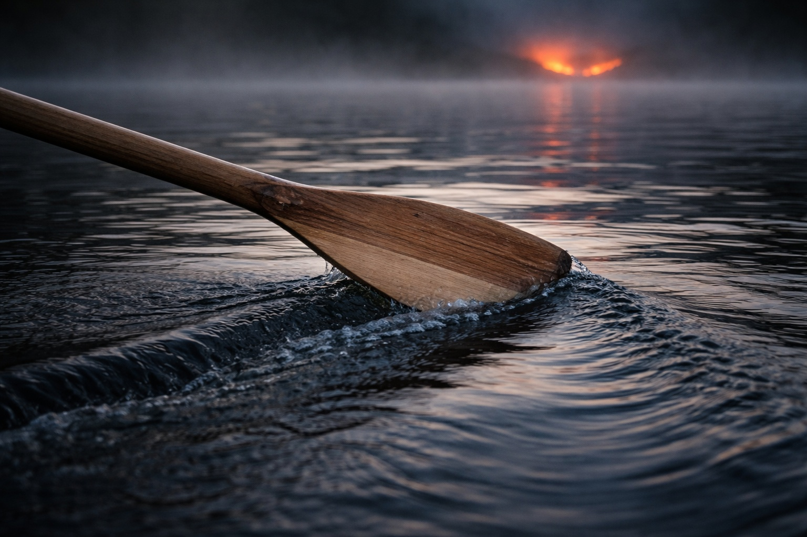
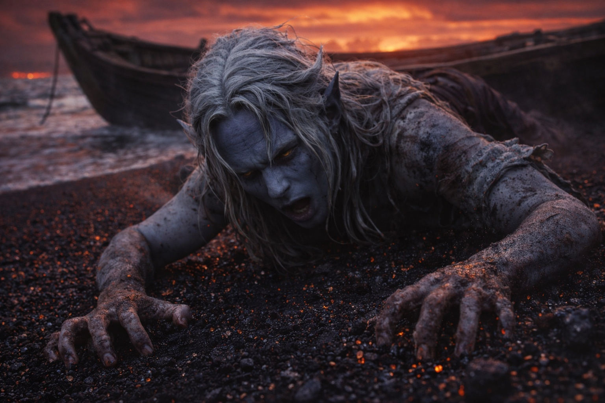
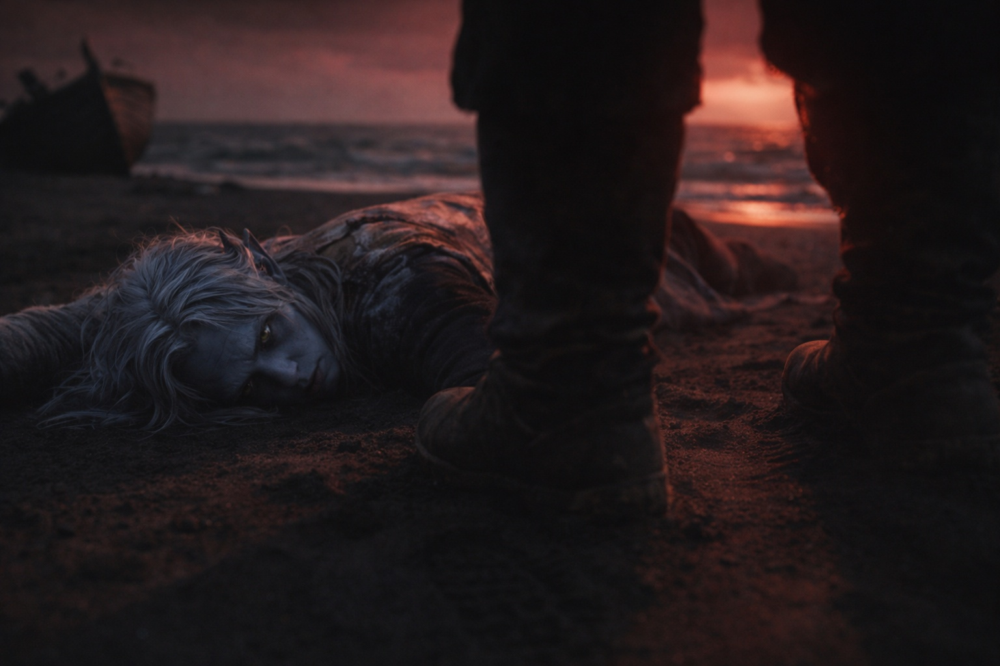

## Chapter 9 | Part 4

---

Real light appeared ahead.

Reddish.

Volcanic.

Drusniel did not trust it.

He rowed toward it anyway.

The predator had not returned.

Everything else remained.

The left oar would bite into thick resistance while the right moved freely. The horizon slipped when he stared too long. A sequence of strokes still refused to remain a sequence.

He stopped trying to measure the crossing.

He measured himself instead.

Grip.

Shoulders.

Breathing.

One more stroke.

Then another.

The light remained ahead.

That was enough.

Gradually, the water began keeping the same density for several strokes at a time.

Then ten.

The horizon held.

Cold became ordinary cold.

Drusniel counted three breaths.

Three remained three.

He counted five strokes.

Five remained five.

Boundary.

He was leaving the part of the sea that refused rules.

The debt pulsed once beneath his ribs.

Drusniel kept rowing.

The volcanic light resolved into coastline.

Black sand.

Dark stone.

A red-grey sky without a visible sun.

No current pulled him toward it.

No force helped.

He rowed until the oars scraped bottom.

The sound was ugly and ordinary.

Beautiful.

Drusniel tried to stand.

His legs failed.

He fell out of the boat into knee-deep water, crawled the last few feet, and collapsed onto warm black sand.

For several breaths he did nothing.

Then he dragged one finger through the sand.

One line.

A second beside it.

A third.

They stayed where he put them.

Time worked.

Space worked.

Enough.

*Find Szoravel.*

Zaelar's next instruction.

Drusniel tried to push himself upright.

Nothing.

He let his forehead touch the sand.

Behind him, the reinforced boat rested half in the shallows, battered but intact.

Zaelar had been right about that too.

Footsteps approached.

Drusniel could not turn.

A shadow crossed the sand and stopped over him.

His last coherent thought was a number.

One.

One debt.

Then he lost consciousness.

---

**End of Chapter 9.4 —> 9.5: [The Nightmare Sea: Black Sand](/the-nightmare-sea-black-sand/)**
