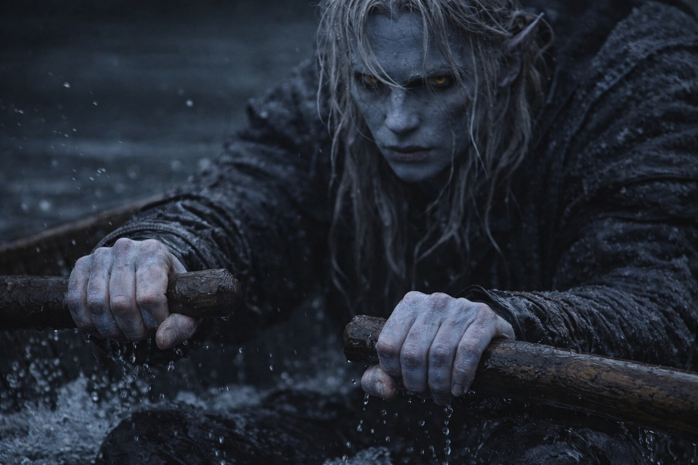

## Chapter 9 | Part 3

---

Drusniel couldn't feel his hands anymore.

He could see them gripping the oars.

That was enough.

The thing beneath the boat was rising.

The pressure reached him through the hull before he saw any change in the water.

Drusniel searched for a current.

Almost nothing.

A thin flow slid over the bow.

He drove it along the hull, trying to turn the bow toward the swell.

The emptiness inside him deepened with the effort.

Pain flared through his chest.

His magic emptied.

The current vanished.

A wall of black water rose ahead.

<video controls playsInline preload="metadata" poster="./wall-of-black-water_sora.jpg" width="100%">
	<source src="./DrusnielToweringWaves.mp4" type="video/mp4" />
</video>

The thing below stopped rising.

Waiting.

Drusniel put both oars into the water.

There was nothing else left to try.

He rowed into the wall.

---

*The boat was gone.*

*Black water filled his lungs.*

*He could not find the surface. Each kick turned him toward a different darkness.*

*Drusniel kicked anyway.*

*Nothing changed.*

*The presence below drew nearer without moving.*

*His body convulsed around a breath that did not exist.*

*He thought of Annariel leaning over their scroll, waiting for him to catch up.*

*The girl in the grove, before the trial took her away.*

*I left without explaining.*

*I should have told you.*

*The dark closed around him.*

*The water stopped against his open eyes. Even the pressure in his lungs held still.*

*The Voice spoke.*

*Live. Owe.*

*The words ended. His chest remained locked around the breath he could not take.*

*He tried once more to kick. His legs did not move.*

*Yes.*

---

Pain struck beneath his ribs.

His eyes opened.

The oar handles were still in his hands. Black water rocked around his calves, but he could breathe.

He looked from his hands to the sea beyond the gunwale. He had never left the boat.

But something new pulsed once beside his heart.

Drusniel went still.

The pressure beneath the hull vanished.

The predator had stopped hunting him.

The sea had not changed.

The boat immediately slewed sideways as the water thickened beneath one side and thinned beneath the other.

Drusniel caught the gunwale before he fell.

He waited for the pressure to return. It did not, though the boat was still taking water.

He looked at the oars.

He tried to lift the left oar. It slipped against his palm; he hooked his thumb over the handle and lifted again.

The horizon still refused measurement.

He rowed.

---

**End of Chapter 9.3 —> 9.4: [The Nightmare Sea: The Depths](/the-nightmare-sea-the-depths/)**
