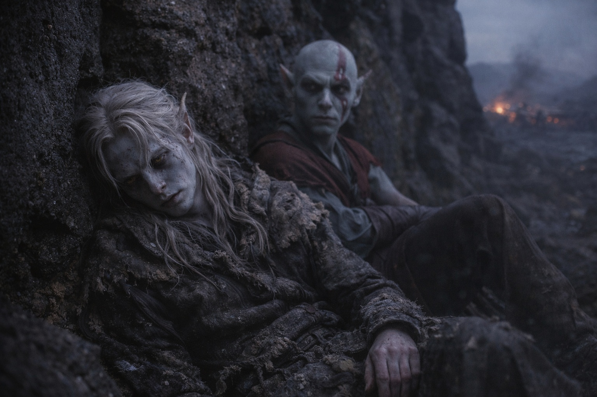
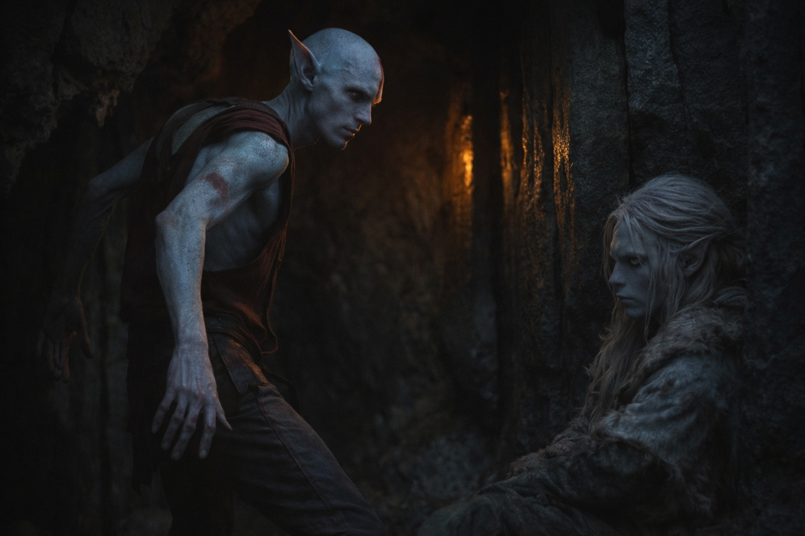
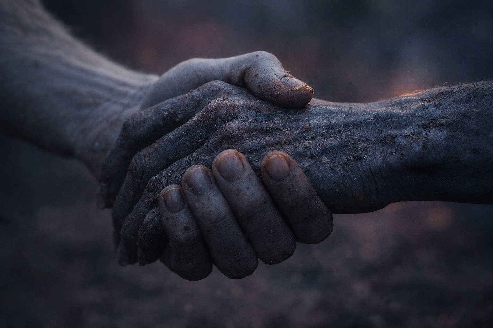

## Chapter 13 | Part 5

---

The light changed without becoming morning.

Drusniel woke against a rock wall.

Everything hurt.

Elion sat nearby.

"You stayed."

"You came back for me."

"No one's done that before?"

Elion shook his head.

Drusniel looked away toward the rocks.

"You treated me like a person."

"You are a person."

Drusniel looked away first.

"What now?" Elion asked.

"Szoravel."

"Who?"

Good.

"A mage. East. Beyond the disputed territories."

"I know parts of east."

"From the memories?"

"Some."

"Do you know Szoravel?"

"No."

Also good.

Drusniel looked at him.

"What are you?"

Elion considered his hands again.

"I don't know."

"What can you do?"

"Change."

"Into what?"

"Things."

"Specific."

"I know."

A small movement at the corner of Elion's mouth.

Then it vanished.

"Sometimes a shape feels familiar before I take it. Sometimes a memory comes with that feeling. A way of moving. A place. A fear." He flexed one hand. "I don't know whether the memory belonged to the shape, to someone I copied, or to something else."

"Can you choose the memories?"

"No."

"Can you trust them?"

"Not completely."

Drusniel nodded.

That was a rule he could use.

Elion stood.

"Why did you open my cage?"

Drusniel answered before he could improve it.

"The numbers said to leave you."

"But you didn't."

"No."

Elion extended a hand.

"Together?"

Drusniel took it.

"East."

Elion pulled him up.

"East," he agreed. "Walking free."

They gathered the waterskin, food and blanket.

Then they started toward the volcanic glow.

---

**End of Chapter 13.5 —> 14.1: [Naming Without Explaining: The Recognition](/naming-without-explaining-the-recognition/)**
