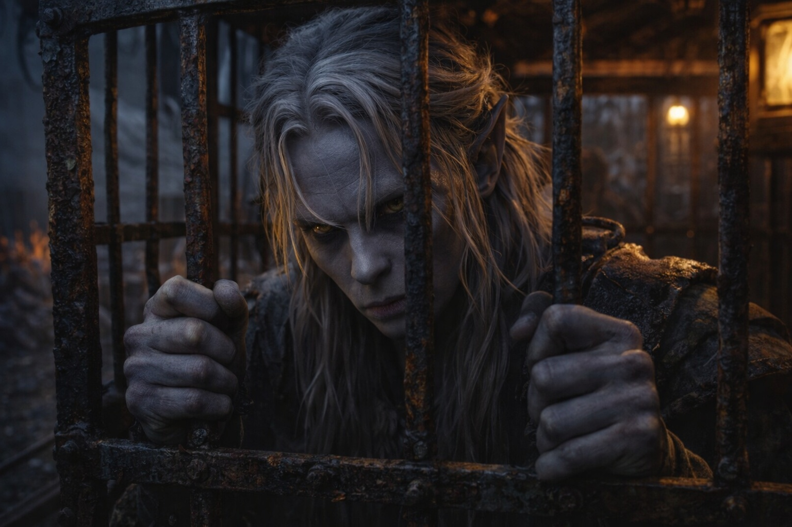
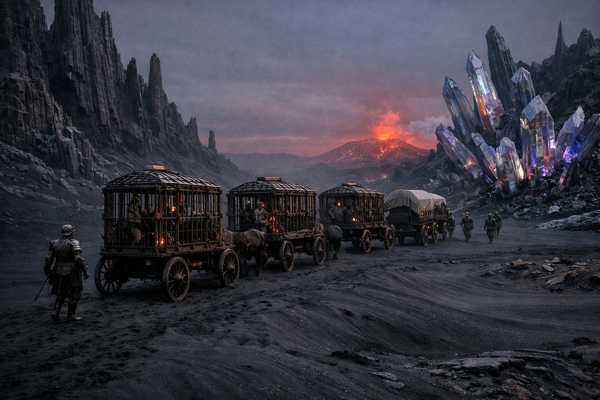
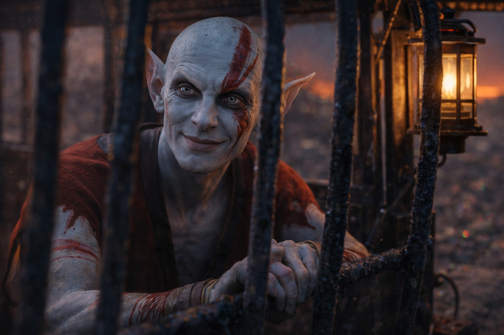
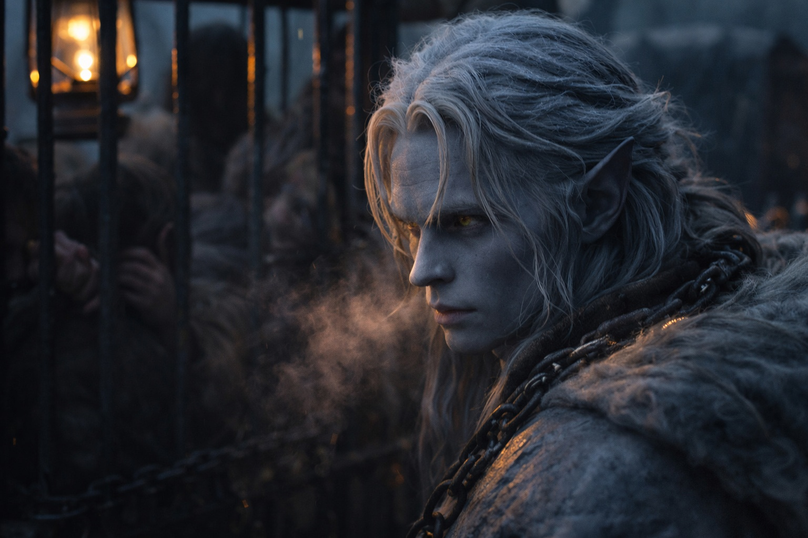

---
order: 187
title: "The One Who Walks Free: The Cage"
description: "The room swayed every time he tried to stand."
date: 2024-06-22
language: en
chapter: 13
subchapter: 1
storyline: drusniel
canon_phase: main
canon_sequence: D-013-001
narrative_weight: high
category: Wyrmreach
author: Drusniel
type: Main
tags: ['#the one who walks free', '#drusniel', '#wyrmreach']
thumbnail: image.jpg
featured: false
counterpart_path: site/content/posts/es/wyrmreach/el-que-camina-libre-la-jaula/index.mdx
counterpart_title: "El Que Camina Libre: La Jaula"
---

## Chapter 13 | Part 1

---

The room swayed every time he tried to stand.

Drusniel had counted the guards seven times now. Seven guards in the yard. Four wagons outside. Eleven prisoners total, spread across three cages. The fourth wagon carried supplies and the slavers' personal effects.

*Seven. Four. Eleven. Three.*

The numbers were solid while everything else had become uncertain.

Three days since Merrik's betrayal. The caravan had stopped at a waypoint outpost along the eastern route—a squat stone building where they kept high-value cargo separated from the other prisoners. Three days in a locked room with rough floorboards, a narrow bed, and food that left his limbs heavy and his thoughts a step behind. His magic remained depleted, a hollow space in his chest where power should have been. The artifact pressed against his skin, cold and silent, offering nothing.

The drowsiness came in waves.

He had noticed it on the first day. Every bowl the slavers brought—Merrik's recipe, no doubt—made the edges of the room blur. Every cup of water dulled his reflexes and pulled him back to the bed. Not enough to knock him out completely, just enough to keep him slow.

Or something to keep contained.

*Healthy stock,* Merrik had said. *The eastern markets pay premium.*

Drusniel filed the information away. Eastern markets meant eastern buyers, which meant the caravan was heading toward civilization of some kind. Civilization meant opportunity. He just needed to survive long enough to find it.

The view beyond the shutter was strange and hostile. Black sand gave way to rock formations that shouldn't exist, twisted spires of stone that looked like frozen screams, crystal growths that caught the dim light and scattered it in wrong directions. The sky remained that constant twilight, neither day nor night, with the volcanic glow pulsing on the horizon like a distant heartbeat.

*One hundred and forty-seven scratches in the wooden doorframe. He'd traced them all twice now.*

His tracing was automatic. A habit born of having nothing else to do, nowhere else to direct his analytical mind. He traced the doorframe, traced the grain of the floorboards, traced the seams in the wall stone beneath the window.

And he watched the creature in the far cage.

It hadn't moved in hours.

The guards called it demon-possessed. The other prisoners called it nothing at all, they refused to look at it, refused to acknowledge its existence, as if ignoring it might make it disappear. But Drusniel watched, because watching was what he did, and because the creature was the most interesting thing in this miserable holding yard.

Grey skin. Not the grey-purple of drow, but a flat, ashen grey that looked like stone come to life. Red markings across its face and arms, war paint or natural coloring, he couldn't tell. Elongated features that suggested elven ancestry but weren't quite right. And eyes that watched him back with an intensity that should have been unsettling.

Should have been. Wasn't.

Drusniel had been watched by things far more dangerous than a caged prisoner. He'd been watched by the Voice in the nightmare sea, by the things that moved in the deep, by Merrik's calculating eyes measuring his value. This creature's attention was different. Curious. Patient.

*Intelligent.*

That was what the guards missed when they called it a demon. Demons didn't watch with that kind of focused interest. Demons didn't wait. This creature was studying him the same way he was studying it, cataloging details, forming conclusions.

A wagon in the yard hit a deep rut as they shifted position, and the far cage swung hard against its restraints. Drusniel steadied himself against the bedframe, vision swimming for a second, and through the blur between shutter slats, the creature's lips twitched.

Almost a smile.

Drusniel didn't smile back. But he filed that away too: the creature was aware, responsive, capable of social cues. Whatever it was, it wasn't mindless.

*Twenty-three prisoners have been sold since the caravan began, according to the guards' conversations. The eastern markets are three more days away. That leaves time.*

Time for what, he wasn't sure. His magic was still recovering, still that hollow ache where power should flow. His body was weak from the crossing and the betrayal and the drugged meals that kept him dulled. He had no weapons, no allies, no plan.

But he had time. And a locked room full of questions.

And below his window, a creature that watched him like it was waiting for something.

The guards came before dawn. Two of them, bored and efficient. They pulled him from the room without explanation, marched him across the yard, and shoved him into the second cage on the nearest wagon. The bed and the stone walls and the door with its hundred and forty-seven scratches disappeared behind canvas and iron bars. The waypoint had served its purpose—fattening and drugging the valuable cargo. Now the caravan was moving again, and Drusniel was cargo once more.

The cage was smaller than the room. Rougher. The floor was splintered wood, the walls were iron bars, and the sky was a strip of red-grey between canvas flaps. But through the gaps, he could still see the creature in the far cage. Still watching. Still waiting.

The cage swayed as the wagon lurched forward. This time, the room really was moving.

---

**End of Chapter 13.1 —> 13.2: [The One Who Walks Free: The Creature](/the-one-who-walks-free-the-creature/)**
