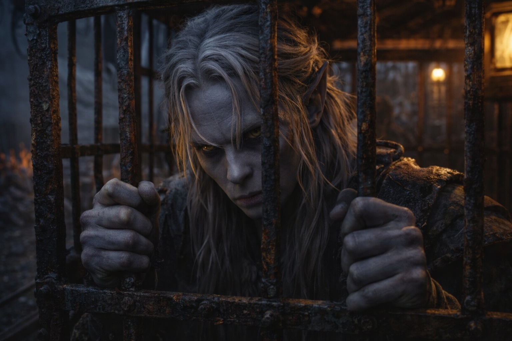
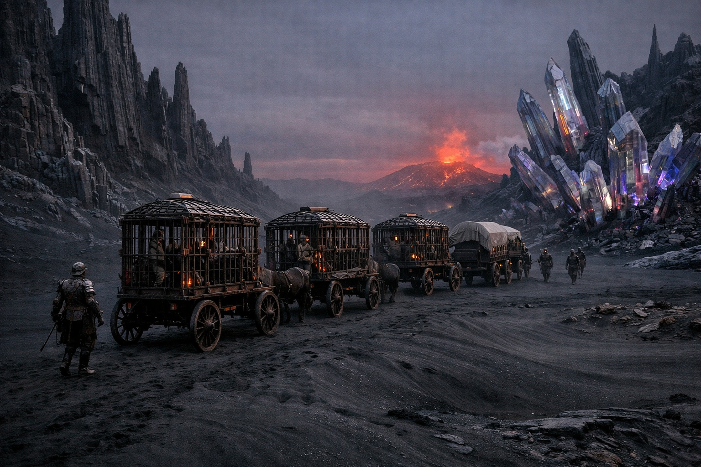
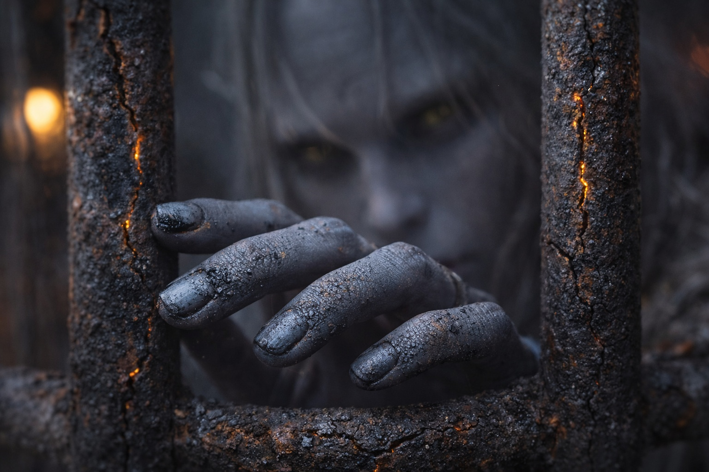
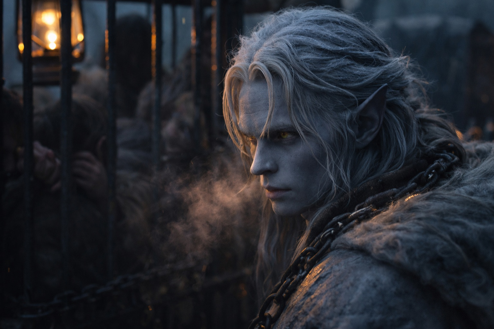

---
order: 187
title: "The One Who Walks Free: The Cage"
description: "Seven guards. Four wagons. Eleven prisoners. Three cages."
date: 2024-06-22
language: en
chapter: 13
subchapter: 1
storyline: drusniel
canon_phase: main
canon_sequence: D-013-001
narrative_weight: high
category: Wyrmreach
author: Drusniel
type: Main
tags: ['#the one who walks free', '#drusniel', '#wyrmreach']
thumbnail: image.jpg
featured: false
counterpart_path: site/content/posts/es/wyrmreach/el-que-camina-libre-la-jaula/index.mdx
counterpart_title: "El Que Camina Libre: La Jaula"
---

## Chapter 13 | Part 1

---

Seven guards now. Drusniel watched them through the shutter, waiting to see whether he had missed the eighth.

The man had stayed at the last stop. A third cage had been loaded there, and a supply wagon had joined them. Four wagons now. Eleven prisoners, including Drusniel.

Three days after Merrik sold him, the caravan halted at a waypoint outpost. The guards kept him in a stone room overlooking the yard. Both meals left a bitter coating on his tongue; even the water made his eyelids heavy.

They had taken off his shackles once the drug began to work. He could stay awake if he sat upright. Standing took more effort.

His magic remained a hollow ache.

The Null rested beneath his shirt.

The guards had searched him twice. One had pulled the pouch free, opened it, weighed the metal in his palm and found nothing worth fearing. Merrik's instruction had followed with the sale: crossing survivors fetched more when they arrived with what they had carried through.

So they left it.

The metal stayed cold when the guard handled it. Drusniel kept his fingers away from the activation mark.

Through the shutter gap he could see the far cage against a ridge of black sand. Red light caught on its bars.

He rose onto his toes to see past the shutter. His legs trembled.

Scratches crowded the inside of the doorframe. Someone had worked hard at that door. It had not opened for them.

Drusniel left the door alone and watched the prisoner in the far cage.

His skin was pale bluish-white, marked with red across the face and arms. His long features suggested an elf until he moved.

The guards called him demon-possessed.

The other prisoners avoided looking at him.

He looked back at Drusniel.

Whenever a guard approached with food, the prisoner watched the man's hands before looking toward Drusniel's window.

Drusniel stopped thinking of the watching as accidental.

A wagon hit a rut while the yard crew repositioned it. The far cage swung hard against its restraints.

The prisoner's lips twitched.

Drusniel felt the beginning of a smile and hid it when a guard looked up.

From guard conversations he had learned that twenty-three prisoners had already been sold.

The eastern markets were three days away.

That left time.

He tried to summon a draft through the shutter. Pressure tightened behind his eyes before the air reached him. He let it go.

Three days might be enough for his strength to return. He pushed the next bowl of food beneath the bed.

Before the light changed, two guards came for him.

They marched him from the room and pushed him into his cage on the second wagon.

As they lifted the step, Drusniel saw his empty window above the yard.

He could not stand straight beneath the canvas. He lowered himself with his back against the bars.

But from it he could still see the prisoner with the red marks in the far cage.

Watching.

The wagon lurched forward.

Drusniel counted the guards again.

Seven.

Still seven.

---

**End of Chapter 13.1 —> 13.2: [The One Who Walks Free: The Creature](/the-one-who-walks-free-the-creature/)**
