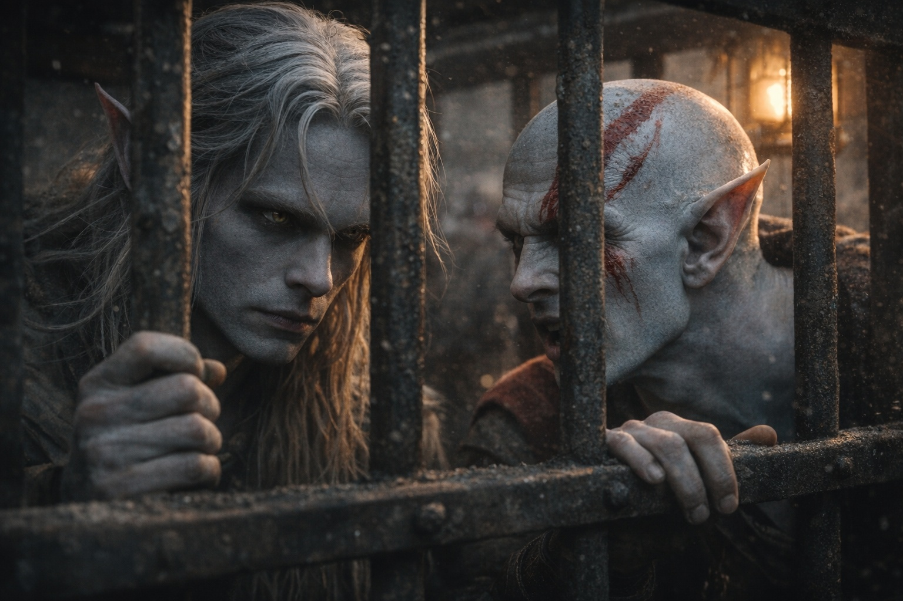

## Chapter 13 | Part 3

---

On the fourth day of captivity, a draft moved through the cage and Drusniel felt it before it touched his skin.

He had eaten little and drunk only enough to keep his mouth from cracking. His head was clearer, though his hands shook.

He waited until the guards looked away, then drew a little of the moving air toward the lock.

He narrowed it into the keyway. A pin shifted against the pressure; pain ran from his wrist to his elbow, and he stopped.

The pin dropped back into place. Drusniel pressed his shaking hand beneath his thigh.

The lock was corroded, but he had felt the pin lift. He could try the others when the pain eased.

Opening it would leave little strength for a second lock. He looked at Elion's cage.

Beyond it, nine prisoners crowded the third cage. The man nearest the door had wrapped a rag around his wrist to stop the chain rubbing.

Drusniel made himself look away. He had not opened even his own lock yet.

He spent the day watching.

The evening guard limped when he turned on his left knee.

Not hidden. Elion had noticed it too.

The driver of the third wagon checked beneath his seat every time another guard approached.

Keys, probably.

The fourth wagon smelled of lamp oil.

Elion caught the same smell. He tipped his head toward the wagon and waited until Drusniel nodded.

Later, Elion closed his eyes and went pale. When he opened them, he described a narrow route through stone formations east of the road.

He remembered running it.

He did not remember whose legs had carried him.

"Can you find it again?" Drusniel asked.

"Maybe."

"You don't sound sure."

"I've run it. Just not in these legs."

Drusniel looked east, fixing the nearest formation in his mind.

When the deepest watch came, two guards remained awake.

Drusniel braced his hand against the lock and drew in the current between the bars.

The first pin lifted. He held it while he reached for the next, the pain returning up his arm.

Click.

The door opened. He caught it before it could strike the side of the wagon, then leaned against the frame until the yard stopped swaying.

Freedom lay away from the wagons.

Elion's cage lay toward them.

He could leave before the guards saw the open door.

Elion was watching him through the bars. He had not called out.

Drusniel stepped down onto the ground.

He ran toward Elion's cage.

---

**End of Chapter 13.3 —> 13.4: [The One Who Walks Free: The Escape](/the-one-who-walks-free-the-escape/)**
