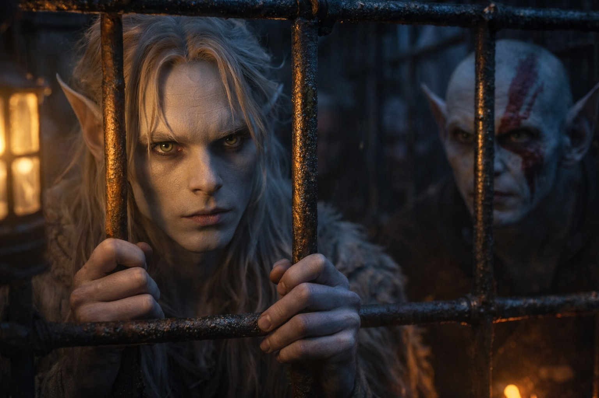
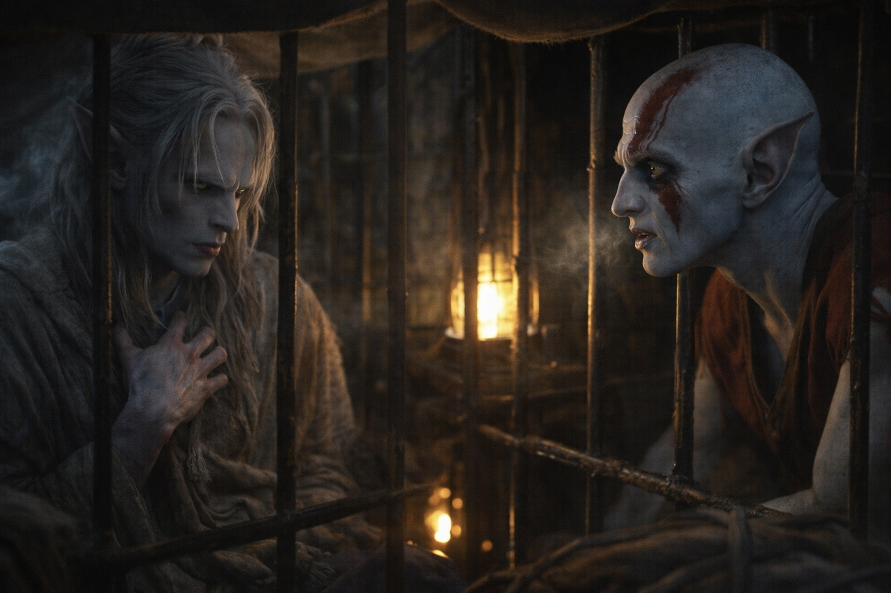
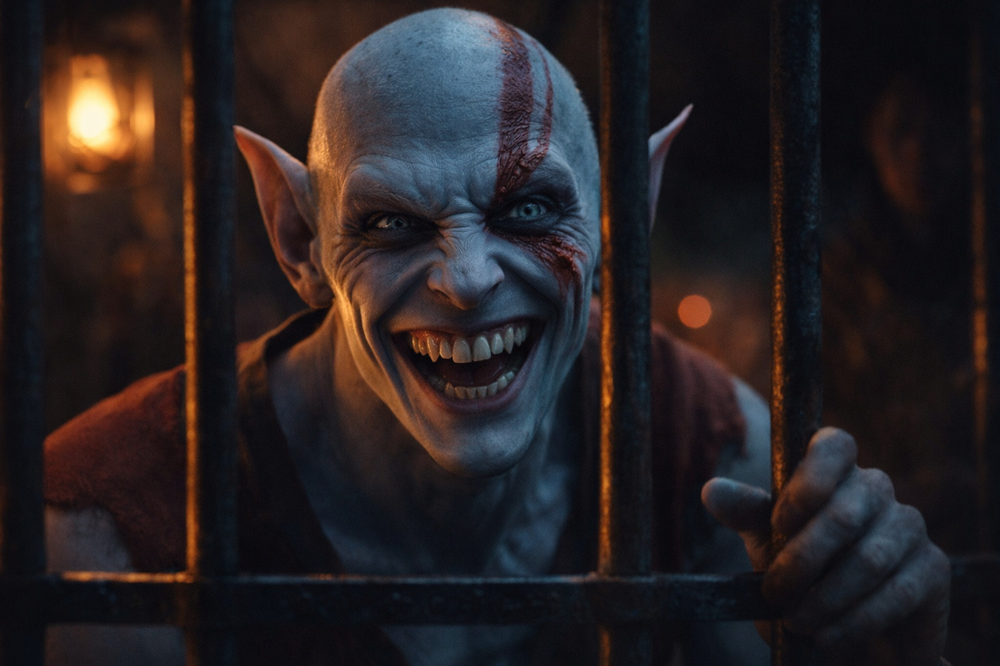

## Chapter 13 | Part 2

---

The prisoner in the far cage spoke first.

"You're not afraid."

Night rest.

Two guards awake.

The rest near the fire.

Drusniel turned toward the voice.

"Should I be?"

"Everyone else is."

The prisoner's head tilted farther than a neck should comfortably allow.

"The guards. The others. They smell different when they look at me."

"I'm not everyone else."

"No."

The strange eyes narrowed.

"You crossed the Nightmare Sea."

Drusniel went still.

"How do you know that?"

The prisoner frowned.

"That's the problem."

"What problem?"

"They aren't thoughts." He searched for the words. "More like memories. Except I don't remember living them."

Drusniel said nothing.

"A boat. Black water. Something underneath. Then a bargain."

The debt beneath Drusniel's ribs pulsed once.

"Whose memory?"

"I don't know."

"Can you choose what comes?"

"No."

"Can you call one back?"

"Sometimes. Usually not."

"Do they arrive when you touch something?"

"Sometimes."

"When you see something?"

"Sometimes."

"Useful."

The prisoner gave him a flat look.

"Not when you remember dying somewhere you've never been."

Fair.

"Name?"

"Elion."

The answer came immediately.

"That's mine."

"Everything else?"

Elion looked down at his own hands.

"I remember cages. Running. Faces I don't know. Bodies that feel familiar until I think about them."

He flexed fingers that bent a little too far.

"But the name is mine."

"Drusniel."

Elion repeated it.

"Old name."

"Old tongue."

"Meaning?"

"Shadow's edge."

Elion considered that.

"Better than mine. I don't know what mine means."

The guards shifted near the fire.

Less than a minute.

"Why are you here?" Drusniel asked.

"I got careless."

"Doing what?"

"Being free."

"How long?"

"Three years."

Elion looked at the cage door.

"Before that, cages."

Different masters, he explained. Different places. Memory beginning and ending behind bars.

"I stopped watching for cages."

Concrete enough.

"What would you do if this one opened?"

Elion looked at him.

For the first time, the expression became easy to read.

"Walk free."

---

**End of Chapter 13.2 —> 13.3: [The One Who Walks Free: The Choice](/the-one-who-walks-free-the-choice/)**
