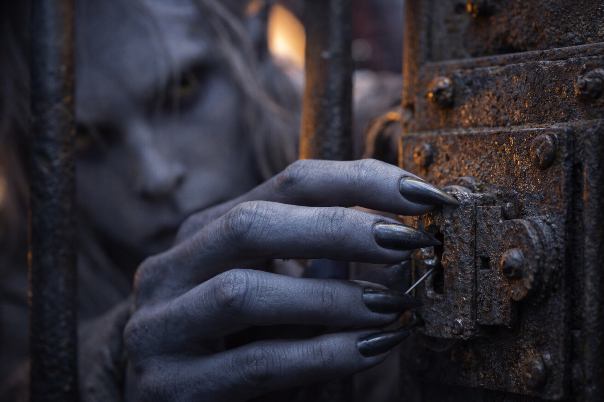
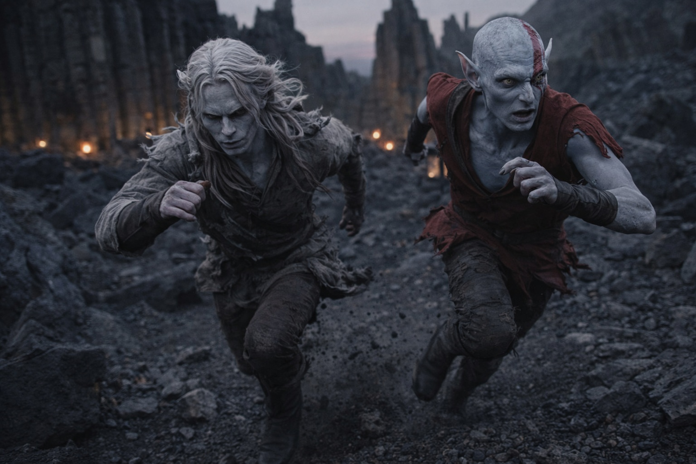

## Chapter 13 | Part 4

---

Elion was already at the bars when Drusniel reached him.

"You came."

"I'm opening your cage. Stay quiet."

Drusniel put his hand against the lock.

Older than his.

More corrosion.

Different pin spacing.

He reached for the air moving through the bars, narrowed it until it fit the keyway, and mapped resistance by pressure.

First pin.

Second.

The third dragged.

Drusniel changed the angle.

Pressed.

Click.

The door opened.

Two locks had burned through almost everything he had recovered.

Elion did not move.

For one breath he simply stood at the threshold.

Open cage.

Open yard.

No chain.

Still he remained inside.

"Elion."

His eyes found Drusniel.

"Move."

Elion stepped out.

They crossed low between the wagons.

Nine prisoners remained in the third cage.

Drusniel looked once.

No magic for another lock.

No time before the watch turned.

He kept moving.

Fourth wagon.

Lamp oil.

A hooded travel lantern hung from the side rail.

Elion took the lantern while Drusniel grabbed a waterskin, ration satchel and rolled blanket.

Drusniel opened the first oil container and poured it across the wagon bed.

Elion looked at the lantern.

Then at the oil.

"Fire."

He tore the hood open and threw the lantern into the wagon.

Glass broke.

Flame ran through the oil.

A guard shouted.

Not confusion now.

A problem.

One guard ran toward the fire.

The other raised the alarm.

Men woke behind them.

"Run."

They ran.

The wagon flared high enough to throw hard shadows across the road.

The nearest guards split—some toward the burning supplies, some toward the cages, some after the fugitives.

That was the window.

Elion reached the stone formations first.

"This way."

"Memory?"

"I think so."

They entered the rocks.

Left.

Narrow gap.

Down between two tilted slabs.

Elion moved without hesitation for twenty paces, then stopped.

"Wait."

"What?"

"I don't remember this turn."

Not a map.

A fragment.

Good to know.

Drusniel listened.

Shouts behind.

Boots on stone.

He looked at the ground.

Fine black dust lay untouched in the right passage.

The left showed old scuffs.

"Left."

They ran left.

Another fifty yards and Elion recognized something.

"Here."

They climbed behind a broken ridge and dropped into a shallow hollow.

The fire behind them was still visible.

Drusniel let the supplies fall.

His hands shook.

"How much of that route was memory?"

Elion sat against the rock.

"Enough to get us lost more efficiently."

Drusniel laughed once despite himself.

"Can you call the rest back?"

"No."

"Good."

Elion looked at him.

"Good?"

"I prefer knowing where the uncertainty is."

Behind them, the fourth wagon burned exactly because they had set it on fire.

That was one uncertainty removed.

---

**End of Chapter 13.4 —> 13.5: [The One Who Walks Free: The Aftermath](/the-one-who-walks-free-the-aftermath/)**
