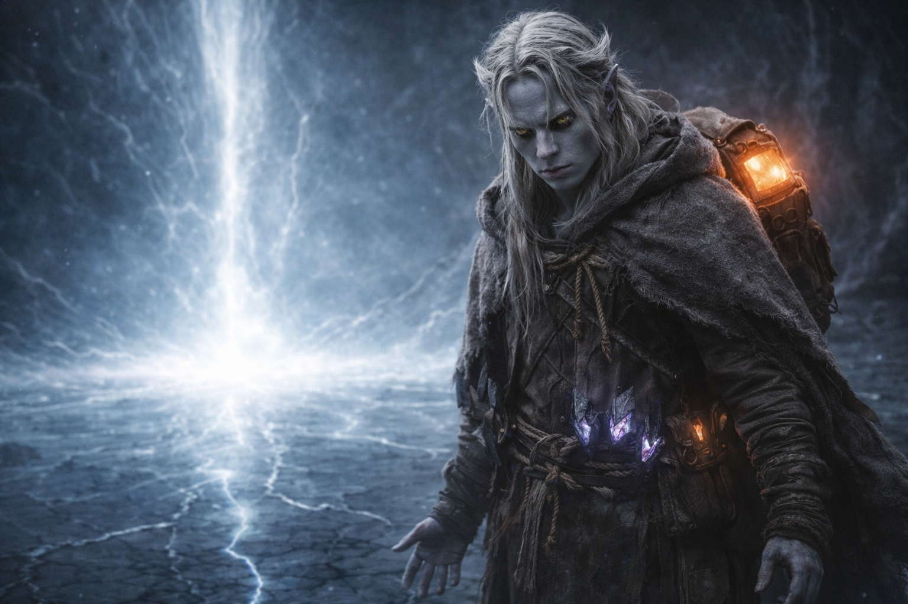
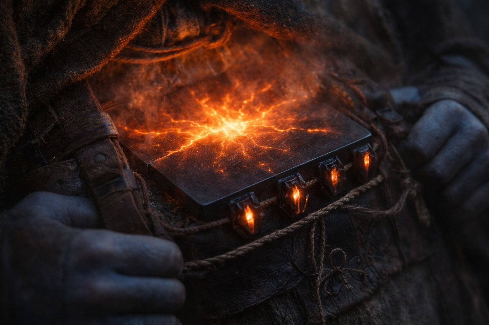
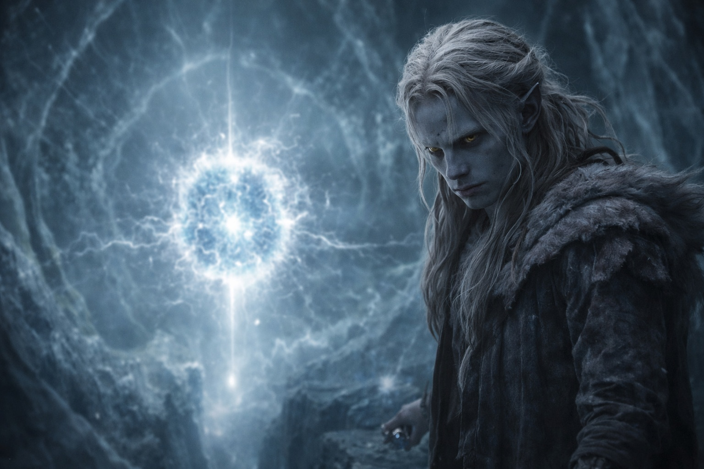
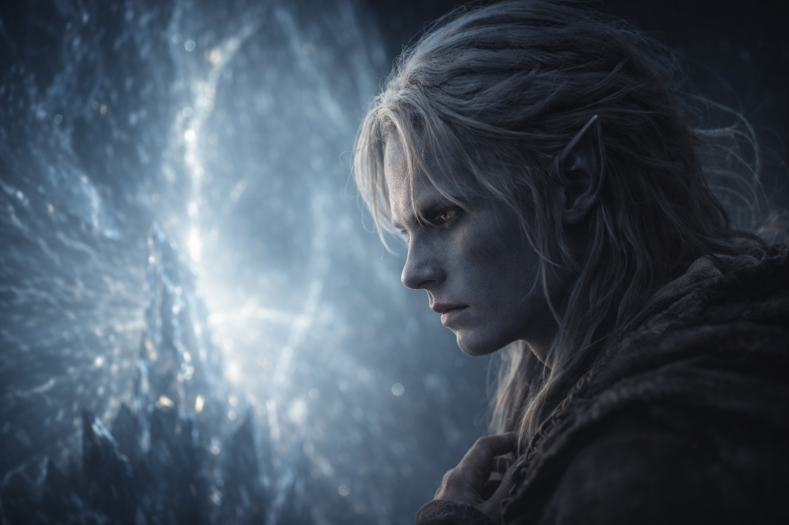
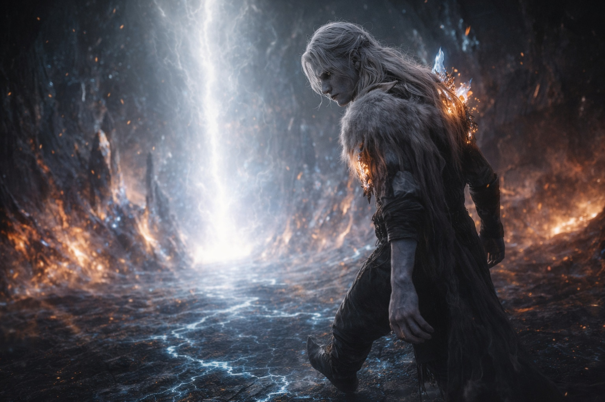

## Chapter 40 | Part 3 | The Approach

---

The barrier's heart was not a place. It was a thinning.

Drusniel walked toward it the way a man walks toward a cliff's edge in a dream: aware that each step reduces the distance to the fall, unable to stop the walking, cataloguing the approach with the precision of a mind that has accepted it cannot control the body and has decided to be useful instead. The seam he had felt forming widened as he approached, the dimensional fracture in the barrier's fabric tracking his position the way the monitoring light had tracked his approach: automatically, without thought, because his presence was the input and the opening was the output.

The barrier's core appeared ahead. Not as a structure, not as a mechanism he could see and understand. As an absence. A point in the barrier's interior where the fabric of separation thinned to nothing, where the dome above met the pulsing ground below in a convergence that was the system's heart the way a river's source is its heart: the place where everything begins, where the flow originates, where the operational logic of a thousand years of containment concentrated into its most essential form.

The maintenance interface.

The Null responded. The artifact against his spine went from warm to hot to something beyond hot, a temperature his adapted skin processed as sensation rather than damage, the Nexus component recognizing the interface the way a child recognizes a parent's voice: instantly, completely, with the full weight of a connection that precedes memory. The artifact vibrated.

Not randomly. In a pattern. The pattern matching the convergence point's rhythm, the two systems synchronizing the way Szoravel's equations had predicted they would, the way the ancient builders had intended, the way everything about this moment was correct except for the one variable that made it catastrophic.

The timing.

Drusniel stood ten feet from the interface. His feet had stopped. Not by his choice. The debts had brought him this far, and the debts recognized the destination. There was no more distance to cross between obligation and arrival. He was here. The place the Voice had paid for, the place Nyxara had marched him to, the place his crystal adaptation had been machined to fit. Here. Now. At the wrong time.

His mind was clear. Horribly, mercilessly clear. The clarity of altitude, the kind that strips away fog and leaves only the terrain, every ridge visible, every valley mapped, every path leading to the same point.

He could throw the artifact away. The thought existed in his mind with the architectural precision of a plan that had been considered and measured and found structurally sound. Remove the Null from his pack. Hurl it into the barrier's interior. Without the Nexus component, he was an adapted body at the wrong time, but not a key in a lock. The barrier would still classify him as a threat. The seam would still widen. But without the artifact's interface, the full activation would not proceed. The catastrophe would be partial. The damage would be real but contained.

He could scream. He could try to stop. He could plant his feet on the pulsing ground and refuse to take the last step and let the barrier's defense protocol work around him rather than through him, and the outcome would be different, not better but different, the damage distributed rather than focused.

He could do any of these things. His body was his. The debts had brought him here, but the Voice was silent, and the silence meant the compulsion had ended, and what remained was Drusniel standing at the edge of the mechanism with the key in his pack and the choice in his hands.

He didn't throw the artifact away.

Not because the Voice prevented it. Not because the debts held his arms. Because the debts were real, and his duty was real, and the system required renewal, and the timing was the only thing wrong, and he could not fix the timing, and he could not undo the debts, and he could not unbelieve the beliefs that had brought him here. The artifact belonged in the interface. He belonged at the interface. Everything about this moment was correct except the clock, and the clock was not his to set.

Szoravel had died to protect this moment. Nyxara had overridden the protection. The Voice had removed the hesitation. The ancient builders had failed to install a safety. And Drusniel stood at the convergence of every failure, every decision, every collision of good-faith actions that added up to catastrophe, and his beliefs said: the duty must be performed.

The duty must be performed even when the timing is wrong.

Because the alternative was that the barrier degraded without renewal, and the degradation was permanent, and the sealed thing would eventually come through anyway, and the thousand years of Drow sacrifice would have been for nothing. The alternative was slower and worse. The timing was wrong, but the act was necessary, and the act being necessary at the wrong time did not make it unnecessary.

This was his belief. He knew it was the belief the Voice had weaponized. He knew it was the belief that was about to breach the barrier. He knew all of this, and the knowing did not change the believing, because the belief was true, and true things do not stop being true because they lead to terrible outcomes.

One step. That was all. One step between maintenance and catastrophe, and the only difference was a clock he couldn't read.

The artifact hummed against his spine. The barrier thinned. The convergence point ahead pulsed with the rhythm of a system that had been waiting for a thousand years for exactly this configuration to arrive. Somewhere behind the barrier's fabric, the entity pressed. Somewhere behind the rejection zone, a goblin wept. Somewhere above, a dragon waited in a sky that was already starting to change color.

One step.

His thumb tapped. One, two, three, four.

His feet moved anyway.

---

**End of Chapter 40.3 —> 41.1: [What They Saw: The Connection](/what-they-saw-the-connection/)**