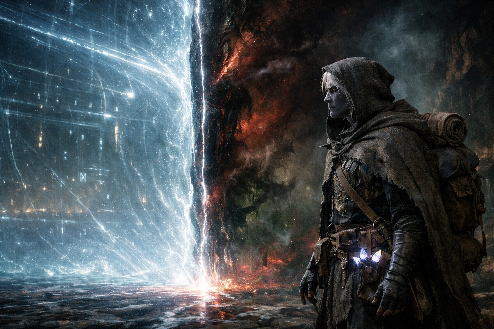
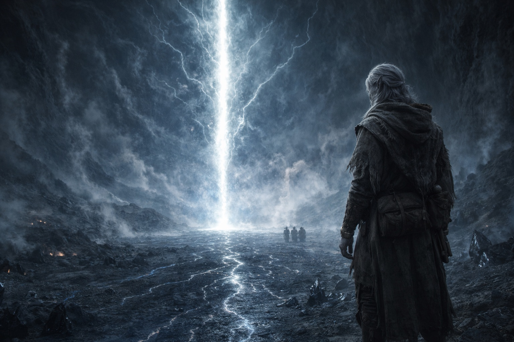

# Chapter 40.2 | The Open Path: The Body

---

The barrier made contact the way a customs official makes contact: by reading documents and checking boxes.

He felt it arrive. Not as a presence, not as a voice, not as anything that had intention or awareness. A process. The barrier's system extending a check to the thing that had entered its operating space, the way an immune system extends antibodies to a foreign body: automatically, impersonally, with the efficiency of something that had been performing this function for a thousand years.

It read his affinities first. The check moved through him like a current, starting at his feet where the energy veins connected to his crystal adaptation and traveling upward through his shins, his hips, his chest, his skull. Air affinity: present. Water affinity: present. Dual configuration: confirmed. He felt the system file this information the way he felt the ground pulse: as a sensation that bypassed his senses and registered directly in the adapted part of his biology that the Voice had installed.

Compatible. The classification landed in his chest. Not a word. A state. His body recognized it the way his body recognized breathing: as a condition that was true and required no confirmation.

The check continued. Crystal adaptation: present. Four active nodes, belt-mounted, frequencies aligned with barrier operational cycle. The system filed this. The Null: Nexus component, intact, activated, interfacing through adapted conductor. The system filed this. Bearer status: confirmed. The accumulation of checks building a profile that the mechanism recognized as maintenance-authorized.

Then the timing check.

Drusniel felt it the way a knife feels the bone it's hit: a sudden stop, a resistance, a moment where the forward motion of a process encounters something it cannot process without reclassification. The timing check ran and the result was not what the system expected. The degradation window: not open. The maintenance cycle: not activated. The seasonal alignment that the ancient builders had calibrated as the authorized approach period: absent.

The system paused.

Drusniel felt the pause in his spine. The Null went cold for one heartbeat, then hot, then cold again. His crystals stuttered, their steady rhythm breaking for two beats, three, before resuming at a different frequency. The barrier's energy veins beneath his feet dimmed. The monitoring light that had been traveling horizontally stopped, held, then reversed direction.

The system was reconsidering.

Compatible bearer. Correct affinities. Correct tool. Wrong time.

The reclassification arrived the way the compatibility classification had arrived: as a state, not a word. But this state did not land in his chest like breathing. It landed like a blade turning inside him, the slow rotation of a knife that enters clean and exits cutting. The system's assessment changed. Not maintenance. Not authorized approach. The system knew what an authorized approach looked like, and this was not it. The variables matched, but the timing was the variable that mattered most, and the timing was wrong.

Threat. Potential intrusion. The barrier's defense protocol activated.

Drusniel felt the defense protocol the way he had felt the compatibility check: systemically, impersonally, without malice. The barrier did not hate him. The barrier did not know him. The barrier processed him the way a dam processes a crack: by responding to the structural implications of his presence according to the rules its builders had inscribed.

The response was opening.

Not to let him through. Not to welcome him. To evaluate the threat by creating a gap at the point of contact through which the sealed side could address the intrusion. The ancient builders had assumed this scenario was impossible. No authorized bearer would approach at the wrong time. The defense protocol existed for a contingency they considered theoretical: what if the mechanism's own components arrived out of schedule?

The answer: open the gap. Let what's sealed deal with the intruder. Close after.

The seam appeared in the fabric of the barrier's interior, six feet ahead of Drusniel, running vertically from the pulsing ground to the dome of light above. Not wide. A hairline. A fracture in the separation between what the barrier contained and what the barrier protected. The seam was not visual. It was dimensional. A place where the fabric of the mechanism thinned from impenetrable to permeable, from wall to membrane, from barrier to suggestion.

Through the seam, Drusniel felt the thing from the mountain.

Not the volcano. Not the entity he had sensed in the passage, the presence the Voice had used to threaten and compel. This was that presence without the intermediary, without the barrier's dampening, without the thousand years of containment reducing its signal to a whisper that only the Voice could translate. This was the raw signal. The unfiltered broadcast of something that had been sealed on the other side of this mechanism for longer than Drusniel's species had existed.

It was not watching. Watching implied eyes, direction, attention. This was pressing. The way water presses against a dam. The way atmosphere presses against a hull. Constant, omnidirectional, mindless in the way that pressure is mindless: not because it lacks intelligence, but because its intelligence expresses as force rather than thought.

The seam widened. One molecule. Drusniel felt the widening as a vibration in his crystals, a single additional frequency added to the chorus his adapted body was conducting. One molecule of separation removed. The pressure on the other side increased by an amount that his senses could measure and his mind could not comprehend.

Then another molecule. Another frequency. Another increment of pressure.

His presence was the chisel. The barrier's defense protocol was the hammer. Each moment he stood in this space, the system processed his wrong-timing presence as a threat that required evaluation, and the evaluation required opening, and the opening let pressure through, and the pressure widened the opening, and the widening let more pressure through.

Szoravel had been right. The mechanism would respond to wrong timing by opening. The opening would be catastrophic. The old man had died mid-sentence trying to protect this moment, and the moment was happening anyway, because the Voice had removed the pause that would have let Drusniel hesitate, and Nyxara had removed the obstacle that would have let Szoravel intervene, and the ancient builders had removed the safety that would have prevented their own defense protocol from destroying what it protected.

The seam widened. Drusniel catalogued it. His feet did not move. His mind did not look away.

The barrier was opening, and his presence was the reason, and the thing on the other side pressed closer with every molecule of separation removed.

---

**End of subchapter — continues in Chapter 40.3**
