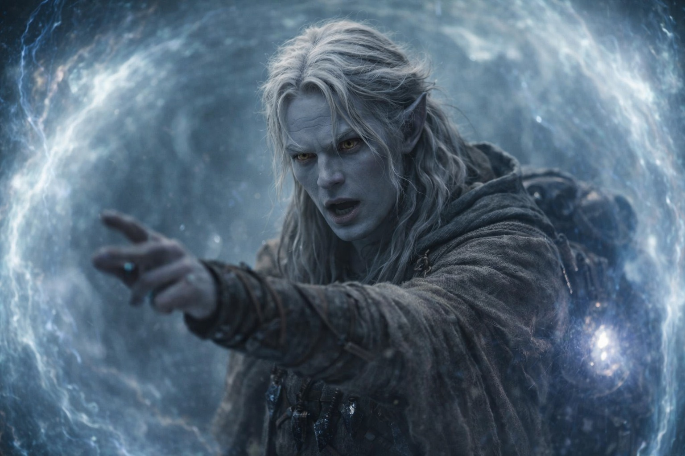
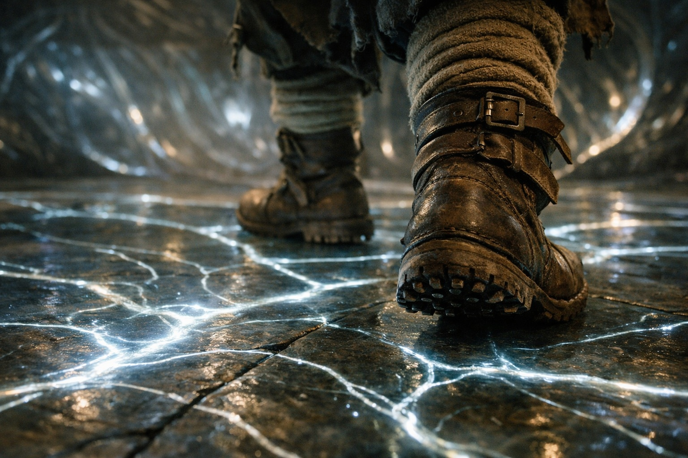
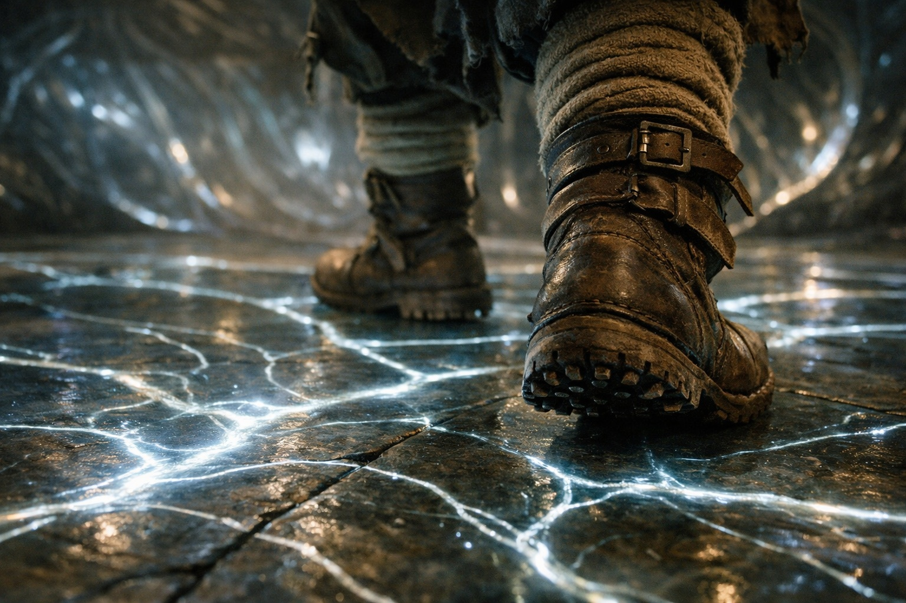
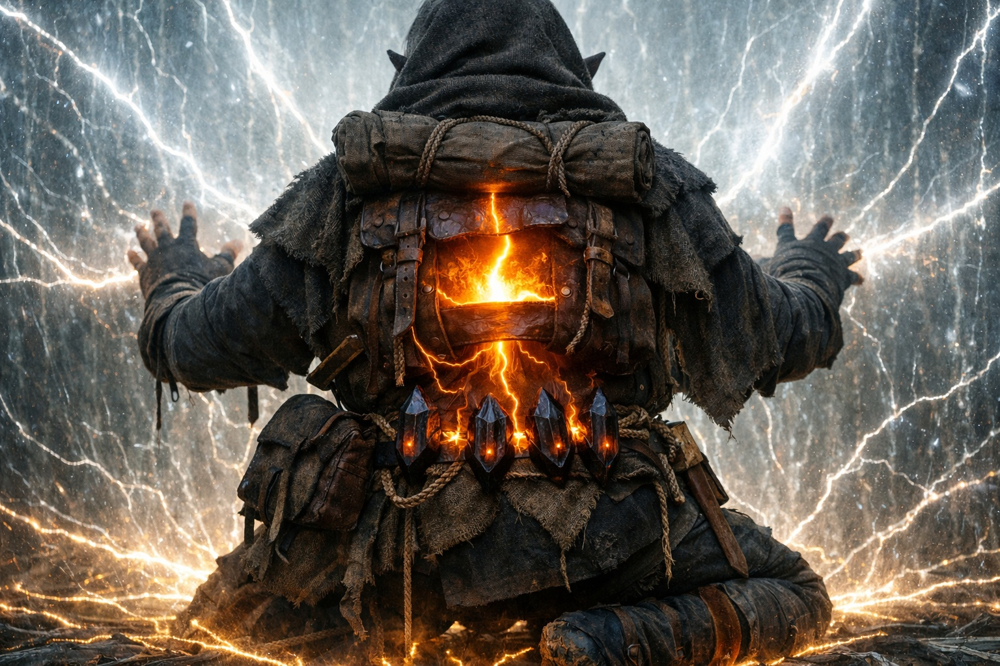
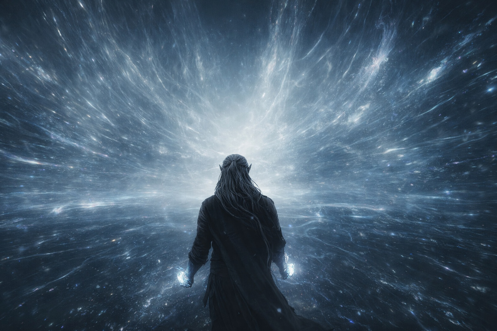

# Chapter 40.1 | The Open Path: The Walk

---

His magic moved without him.

Air shifted six inches ahead of each step, clearing a path through the barrier's thickened atmosphere before his foot landed. Not dramatic. Not visible. A subtle rearrangement of the pressure that surrounded him, his air affinity responding to the environment the way a muscle responds to cold: reflexively, without consultation, because the body knew what was needed before the mind had time to authorize.

Water condensed on the ground ahead. Thin films of moisture appearing on stone that had been dry, giving his boots purchase where the surface would have been too smooth, too alien, too wrong for normal feet. His water affinity laying down traction like a road crew ahead of a march, anticipating the terrain's refusal to cooperate and preempting it with condensation that his adapted feet processed and his unadapted mind noted as impossible.

His affinities were talking to the barrier. The barrier was talking back. And neither had asked his permission.

Drusniel walked through the barrier's interior with his hands at his sides and his mind running an inventory of every phenomenon his eyes could register. The ground beneath him was not ground. It was a surface that approximated ground the way a stage approximates a room: functionally, with visible seams if you knew where to look. The seams glowed. Faintly. Lines of energy running through the surface like veins through flesh, carrying something that his crystals could feel and his vocabulary could not name. The barrier's circulatory system. He was walking on a living mechanism.

Light here did not fall. It moved. Beams of illumination that traveled horizontally, changing direction at intervals that seemed arbitrary but felt, to his crystal-adapted senses, like they followed a rhythm. The rhythm was the barrier's operational cycle. The light was the system monitoring itself, scanning, checking, maintaining the fabric of separation between what was sealed and what was not.

The monitoring light found him. Passed through him. His crystals flared, responding to the scan the way a door responds to a key: recognition, alignment, a conversation in frequencies he could feel but not translate. The light moved on. The system had read him. Filed him. The classification was pending. He could feel the pending the way

you feel a decision being made in a room you're not in: the weight of it reaching you through walls.

Distance here was a suggestion the landscape made and did not keep. He had been walking for what his body said was thirty minutes and what the terrain said was either one league or one hundred, the landmarks repeating with variations that suggested the space was folding on itself at a scale his perception couldn't track. A formation that looked like a broken column appeared ahead of him, then beside him, then behind him, and he had not changed direction. The barrier's interior did not obey the rules his feet assumed.

The Null was warm. Not just warm. Active. The artifact against his spine had shifted from passenger to participant, its Nexus component interfacing with the barrier's system through his body, using his crystal adaptation as a conductor the way electricity uses copper: because the material's properties make it the path of least resistance. He could feel the Null talking to the barrier through his spine, through his ribs, through the crystals at his belt that served as amplifiers for a signal he had not authorized.

His body was comfortable. That was the part he catalogued with the most precision, because the comfort was the cost's receipt. His lungs processed the thickened atmosphere without strain. His skin handled the pressure without pain. His eyes adjusted to the bending light without headache. Everything the adaptation had done to him was expressed here as efficiency: he fit. He belonged in the mechanism. His body had been modified to occupy this space the way a part is machined to occupy a slot in an engine, and the machining was so precise that occupying the slot felt like resting.

The comfort was the horror.

He fit in the place that would undo the world if activated at the wrong time, and the wrong time was now, and his fitting was not accidental. The Voice had paid for this fit. The crystals at his belt were the Voice's investment returns. His adapted biology was the Voice's product, installed in a bearer who believed in duty strongly enough that the bearer would deliver himself to the mechanism without needing to be dragged.

Drusniel catalogued this too. Filed it beside the bending light and the condensing water and the ground that pulsed with a circulatory system that his feet could feel. He catalogued everything because cataloguing was the only act his will still controlled, the only thing the debts hadn't claimed, the only output of a mind that was present and clear and horribly aware of every detail of its own participation in the catastrophe.

His thumb tapped. One, two, three, four. The substitute habit. The count that replaced the fractures, that replaced the walls, that replaced every anchor his old self had used to manage the space between knowing and acting. One, two, three, four. His magic moved without him. His feet moved without him. His thumb moved because he chose it, and the choice was small, and the smallness was the point.

The barrier's interior stretched ahead. Light bending. Ground pulsing. Air clearing itself for his passage. A conduit walking through the conduit's mechanism, cataloguing the destruction he was calibrated to cause.

---

**End of subchapter — continues in Chapter 40.2**
