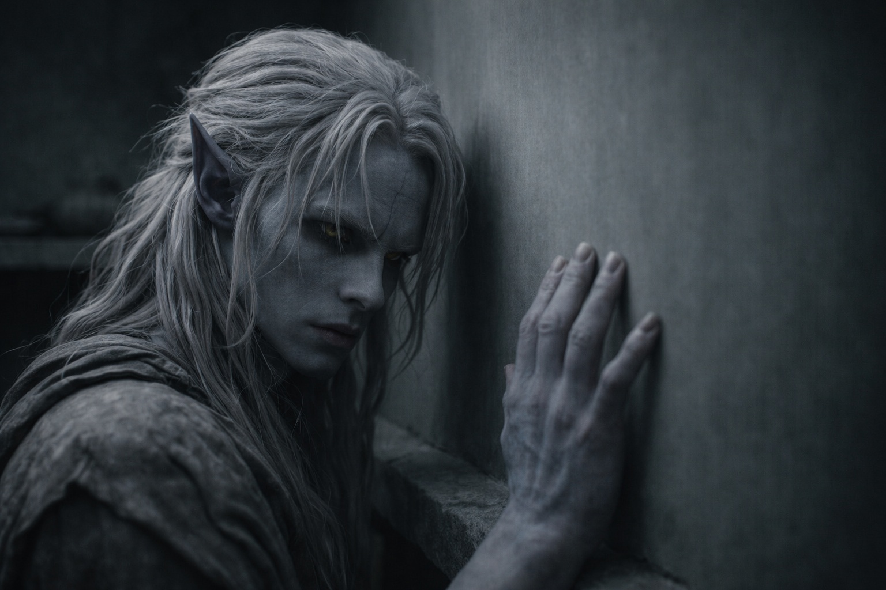
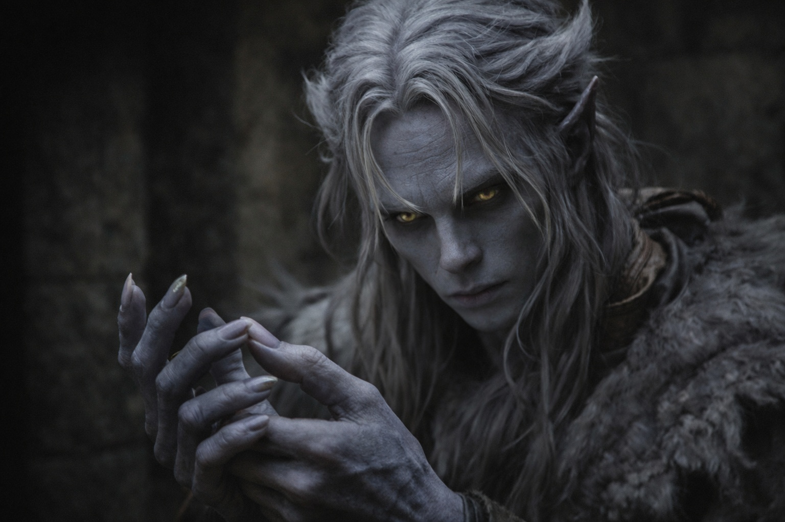

## Chapter 34 | Part 4 | The Night

---

The outpost had no windows.

Drusniel lay on a stone shelf in one of the secondary chambers, the kind of space designed for watchers who slept in shifts and woke to duty. The shelf was smooth, polished by generations of use. The walls were smooth. The ceiling was smooth. Ancient Drow construction built for function, not texture, every surface leveled and sealed until the stone remembered nothing of the fractures it had once contained.

He pressed his fingers against the wall. Too smooth. No cracks. No veins. No fractures to follow with his eyes, no imperfections to trace with the grounding habit that had kept him anchored since Umbra'kor, since the trials, since the first time the world had become too large and he'd found that following a line in the stone could reduce it to a problem with visible edges.

His hand slid off the surface. Nothing to hold.

His thumb tapped against his fingers instead. One, two, three, four. A substitute. Insufficient. The tapping didn't ground the way the tracing did. The tracing imposed order on chaos by following an existing pattern. The tapping was pattern generated from nothing, internal rather than external, and the difference mattered in ways he couldn't articulate but felt in the specific quality of his anxiety, which was no longer the kind that wanted structure but the kind that had stopped believing structure was available.

He catalogued what he knew.

The barrier was failing. The degradation was accelerating. A renewal window would open within weeks, possibly days. The window would be brief. He was the compatible interface. The Null was the mechanism. The procedure was possible but unforgiving, the difference between renewal and catastrophe determined entirely by timing. One action. Two outcomes. The margin between them was measured in hours, and the only person who could identify the margin with precision was Szoravel, who was planning on a timeline that Nyxara had accepted without argument.

He catalogued what he feared.

The volcano entity. The thing he'd sensed in the mountain during the crossing, vast and patient and existing on a scale that made Drusniel's consciousness feel like a crack in a floor that stretched to every horizon. If the barrier opened, that was what came through. Not monsters. Not armies. Something that didn't need categories because it was the space that contained categories, the environment that preceded definition.

He couldn't picture it. The mind refused. What it had felt like was pressure and heat and a consciousness so large that his awareness of it was comparable to a single cell's awareness of the body that contains it. Something that breathed in geological time. Something that the barrier held not because the barrier was stronger but because the barrier was the boundary between the thing and everything that existed in smaller scales.

If he failed. If the timing was wrong. If Szoravel's measurements were off by hours or if Drusniel's interface with the Null was insufficient or if the alignment shifted during the procedure, the barrier would interpret his presence as breach. It would open. And the entity in the mountain would come through.

Not for long. The barrier would close again. Szoravel had said so. But "briefly, catastrophically" were the words he'd used, and briefly, at the scale of what lived in the mountain, meant enough. Enough to fracture whatever was on the other side. Enough to change the world in ways that wouldn't heal.

And he believed in the duty. That was the part that made it worse, the part that sat in his chest alongside the fear like two objects occupying the same space. He believed the barrier was sacred. He believed the Drow existed in relation to it. He believed that maintenance was purpose and that purpose justified the risk, and the belief was a weight he couldn't put down because putting it down meant becoming someone who didn't believe, and he didn't know who that person was.

The duty was clear. The mechanism was clear. The timing was clear. The fear was clear. The belief was clear. And somewhere inside the mountain, something vast breathed in cycles that had nothing to do with clarity, and the barrier between them was failing, and the person responsible for repairing it was lying on a stone shelf in an ancient outpost pressing his fingers against walls too smooth to offer anything.

His thumb tapped. One, two, three, four. One, two, three, four.

He reached for the Voice.

Not deliberately. The way you reach for a railing when you feel yourself falling, the instinctive motion toward something that has been there before. The space behind his sternum where the Voice's influence resided, where the debts lived, where the connection between them was strongest.

Nothing.

The Voice was silent. Had been silent since the stirring at the Thornfield camp, the two words pressed into his awareness with the weight of an approaching season. Almost ready. Almost there. Since then, nothing. No interventions. No observations. No debts called. Just silence.

But the silence was different now. It had been absence. Now it was patience. The silence of someone who is waiting because the waiting is almost over, the silence of a system that has positioned itself exactly where it needs to be and is running down the clock until the clock reaches zero.

The Voice was waiting. For the window. For the moment. For Drusniel to become what the Voice needed him to become, whatever that was, for whatever purpose the debts had been building toward since the Nightmare Sea.

He didn't ask it. The asking would make the answer real, and the answer, he suspected, would remove the last comfort he had: the fiction that his choices were still his.

He closed his eyes. The walls offered nothing. The ceiling offered nothing. The shelf was smooth and cold and the dark behind his eyelids was the particular dark of enclosed spaces where the only company was the architecture of fear and the duty that insisted on existing alongside it.

"Are you ready?"

The voice wasn't the Voice. It was Elion, standing in the doorway. Grey skin, amber-orange eyes, the red markings on his face barely visible in the low light. He was holding his body the way he always held it: precisely, controlled, as if the body were a tool he was operating rather than a thing he was.

"No," Drusniel said.

"Are you?"

"For what?"

"To watch me become what they need me to be."

Elion was quiet for a long time. The quiet of someone processing a question that required more truth than comfort.

"Srietz says we should leave. Tonight. Without Nyxara. Without Szoravel."

"And go where?"

"Anywhere the barrier isn't."

Drusniel looked at his hands. Dark grey-black in the low light. Adapted hands. Hands that Wyrmreach no longer rejected. Hands that fit the environment the way a key fits a lock, not because the key chose the lock but because the lock was specific and the key happened to match.

"There is nowhere the barrier isn't," he said. "That's the point."

Elion didn't argue. He stood in the doorway and said nothing, and the nothing was the nothing of someone who had asked his question and received the answer he'd expected and wished he hadn't.

He left. Drusniel was alone in the windowless room with the smooth walls and the tapping thumb and the duty and the fear and the silence that was waiting for something he wasn't ready to name.

He didn't sleep. He lay in the dark and counted his heartbeat and felt the Voice's patience filling the space where its silence used to be.

---

**End of Chapter 34.4 —> 34.5: [The Price of Answers: The Interruption](/the-price-of-answers-the-interruption/)**