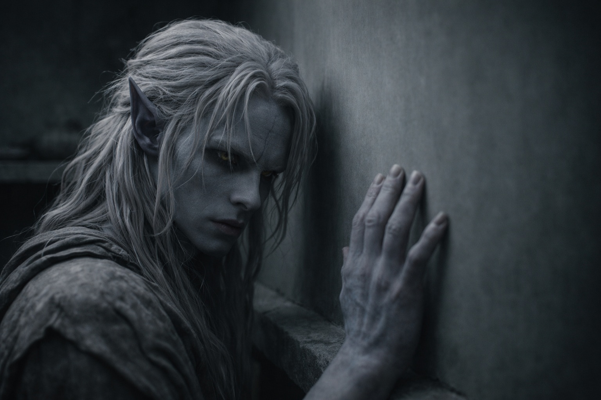

## Chapter 34 | Part 4 | The Night

---

The outpost had no windows.

Drusniel lay on a stone shelf in a side chamber. The surface had been worn smooth by earlier occupants. His blanket did little to soften it.

He pressed his fingers against the wall, looking for a crack to trace. There were none within reach.

His hand slid off the surface. Nothing to hold.

He tapped his thumb against each finger. It kept his hand busy, but he was still thinking about the workbench.

Three weeks, Szoravel had said.

They still lacked components. Even with those, the wrong timing could open a breach. Szoravel had offered measurements, not a demonstration that any of this would work.

He remembered the mountain.

The presence he'd felt there had dwarfed his own. He'd barely endured contact with it. What would happen if the barrier opened?

He pressed harder against the stone. He could still remember the heat.

Szoravel could be wrong by hours. Drusniel could lose control halfway through. He'd been given no way to stop once the process began.

Briefly. Catastrophically. Those were Szoravel's words. Drusniel had no way to judge how much could pass through in that time.

He'd been taught to call the barrier sacred. That didn't tell him whether touching it would kill more people than leaving it alone. He needed the readings, and he needed to understand them himself.

He moved his blanket aside and sat up. He would ask about stopping the procedure in the morning.

His thumb tapped. One, two, three, four. One, two, three, four.

He reached for the Voice.

He held his breath and listened inward, toward the cold pressure behind his sternum.

Nothing.

It hadn't spoken since Thornfield. Almost ready. Almost there. He remembered both phrases exactly. Neither told him what was coming.

He waited until he had to breathe.

Was it waiting for the same window? He had no evidence beyond those four words.

He owed it twice. He would not offer a third debt just to end the silence.

He lay back down, still counting the hours until morning.

"Are you ready?"

Elion stood in the doorway. The red marks on his pale bluish-white face were barely visible in the dim light.

"No," Drusniel said.

"Are you?" Drusniel asked.

"For what?"

"To stay for the tests. We don't know what they'll cost."

Elion glanced down the corridor before answering.

"Srietz says we should leave. Tonight. Without Nyxara. Without Szoravel."

"And go where?"

"Anywhere the barrier isn't."

Drusniel looked at his hands. He'd pressed hard enough to leave red marks on the bluish-ash skin.

"There is nowhere the barrier isn't," he said. "That's the point."

Elion stayed in the doorway a moment longer.

Then he left. Drusniel pulled the blanket over his shoulders.

He lay awake, hearing his own heartbeat.

---

**End of Chapter 34.4 —> 34.5: [The Price of Answers: The Interruption](/the-price-of-answers-the-interruption/)**
