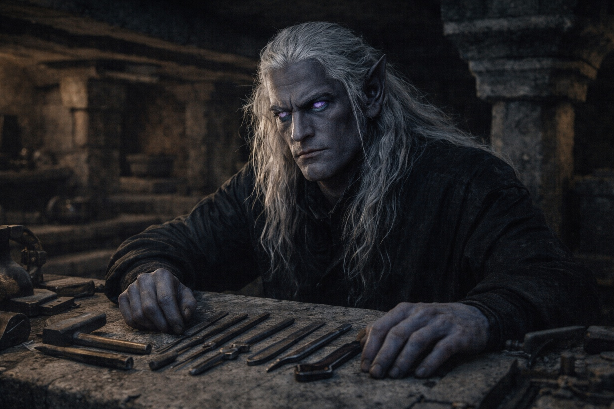
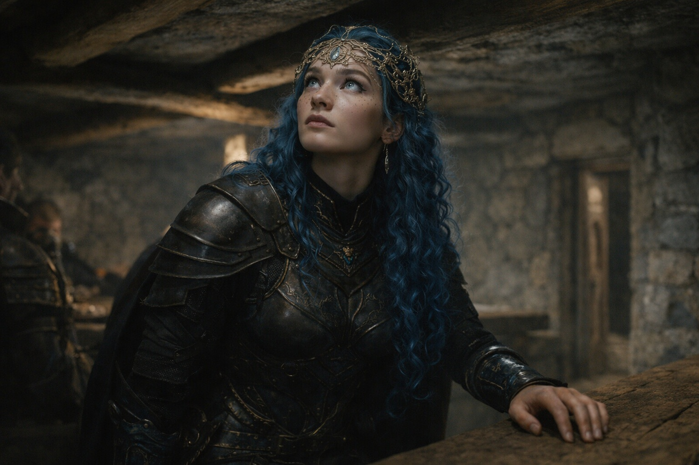

## Chapter 34 | Part 1 | The Outpost

---

The outpost was older than anything Szoravel had built.

The walls were cut from black basalt. Faded Old Drow script covered the lintels above the narrow doorways. Drusniel recognized the letters but couldn't read them.

Two ridges hid the outpost until they were almost at its entrance. Watchers could have stayed here for years without anyone on the road seeing them.

Szoravel was waiting inside.

He had reached it ahead of them and was sitting at a stone workbench. Drusniel wondered which route he'd taken.

"You brought her," Szoravel said. His black eyes moved to Nyxara in the doorway.

"She brought herself."

"Unscheduled presence." He returned to the instruments arranged on the workbench.

Nyxara entered.

She checked the low ceiling and the width of the doorway. Then she chose a seat where two corridors branched, clear of the beams, with her back to the open space.

"You weren't invited," Szoravel said. He was looking at the instruments.

"Since when do you control the roads?"

"Since I built the outposts they lead to."

"You built nothing. Your predecessors built. You maintain. There's a difference."

Szoravel left that unanswered. Drusniel kept his pack on.

Srietz slipped past Elion and stopped beside the secondary corridor. He checked the exit before watching Szoravel. Elion stayed in the doorway.

"Shall we begin?" Szoravel said. He wasn't speaking to Nyxara.

She smiled anyway.

Szoravel pulled a stool toward the bench. Nyxara stayed seated.

Drusniel touched the Null beneath his shirt. They both wanted him to use it. He still hadn't seen either of them do so.

Drusniel sat at the workbench across from Szoravel.

"Begin," he said.

---

**End of Chapter 34.1 —> 34.2: [The Price of Answers: The Prophecy](/the-price-of-answers-the-prophecy/)**
