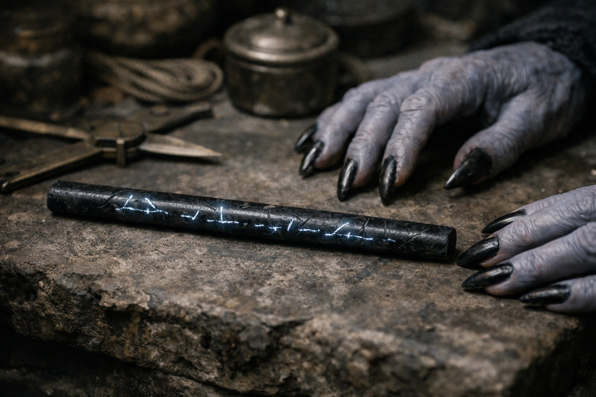

## Chapter 34 | Part 2 | The Prophecy

---

---

Szoravel began with the barrier.

He set a thin rod of dark stone between them. Markings pulsed along its length.

"Degradation has accelerated over fourteen months. Current estimate: critical failure within the year." He turned the rod toward Drusniel. "These readings have tripled since the last calibration."

"Tripled," Drusniel said.

"Tripled. Consistent with the recorded periods before renewal."

"And you waited until now to tell me."

"The required affinities are air and water. Both confirmed in your assessment." Szoravel set the rod down. "Preparation remains incomplete."

"I know."

"No other confirmed bearer available. You meet the requirements recorded in the prophecy."

Drusniel stopped watching the rod.

Prophecy.

He remembered the cave writings. He'd hoped the resemblance was coincidence, or a mistake in his reading.

Szoravel had used the word without even looking up.

"Compatibility confirmed," Szoravel said. "Successful execution is not."

"And if I execute incorrectly?"

Szoravel checked a mark on the rod.

"Contact is restricted to the renewal window. Timing, elemental support and the required components must all be verified."

"And outside the window?"

"Premature contact is recorded as a breach."

Drusniel took a shallow breath. "What happens?"

"The recorded result is an opening."

"Opens."

"Passage through it. Briefly. Catastrophically."

Nyxara watched from beside the branching corridors. She asked no questions.

"The Null," Drusniel said. "That alone can do it?"

"No. Erase removes a signature. It does not restore or stabilize a barrier. Unsupported use is lethal. Your affinities permit preparation; they do not replace the missing components."

"And even with those, the timing can kill us."

"Correct. Calibration first. Measurements taken here, near the barrier. No activation before assessment."

"And after that, still no certainty."

"No guaranteed outcome. Timing is one requirement."

Drusniel laid his bluish-ash hands flat on the workbench. The crystals at his belt hummed as Szoravel turned the rod.

He had the affinities. He still lacked the means to do what Szoravel wanted.

He looked at Nyxara. She met his gaze and waited.

"When is the window?" Drusniel asked.

Szoravel picked up the measuring rod. The markings pulsed.

"Weeks, not months. Further measurements required. The estimate is narrowing."

"How long?"

"Hours. Perhaps a day. No more."

He would have hours to act on measurements he couldn't yet read for himself. He pulled the rod closer.

"Then we prepare," Drusniel said.

Szoravel opened the instrument case.

Nyxara watched his hands.

---

**End of Chapter 34.2 —> 34.3: [The Price of Answers: The Timeline](/the-price-of-answers-the-timeline/)**
