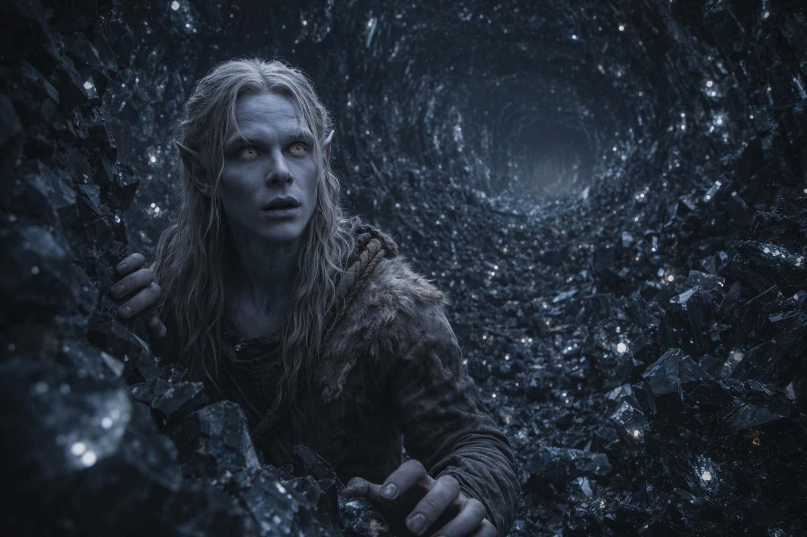
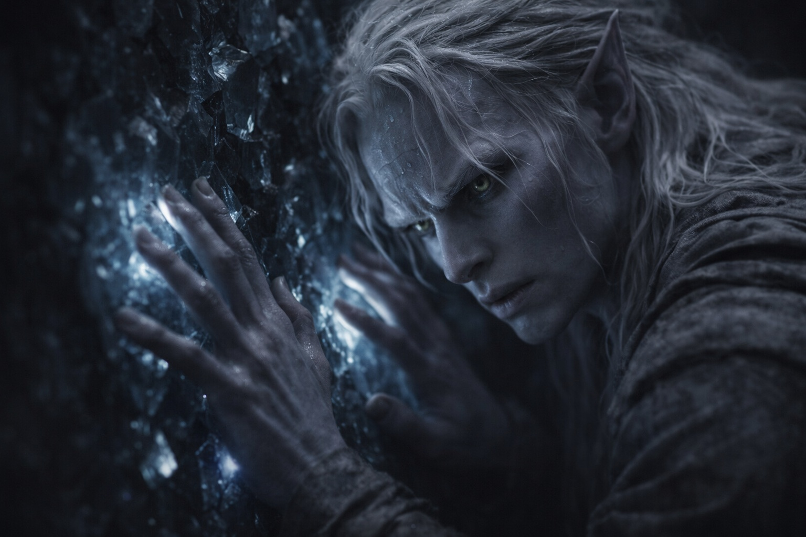
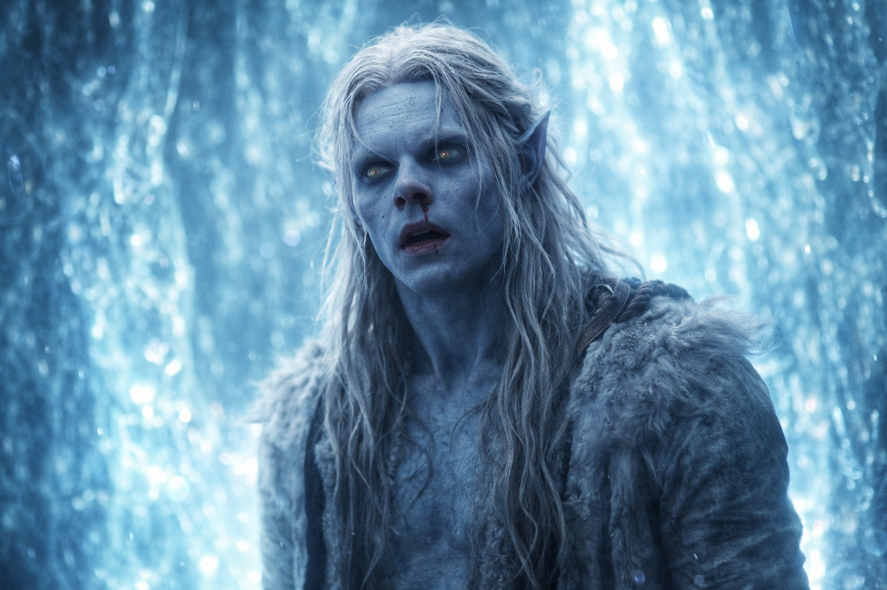
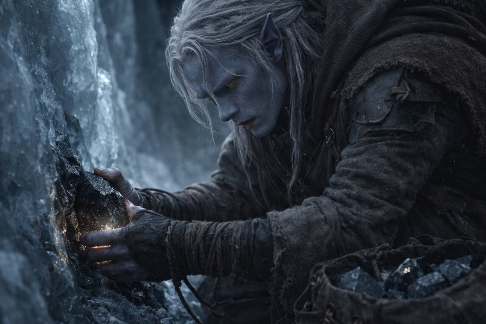

# Chapter 27.2 | The Price of Passage: The Depths

---

The tunnel narrowed until his body became the seal between what was behind and what was ahead.

Red light filled the passage at his back, heat pressing against his skin with a physicality that felt intentional, as if the mountain were testing how much he could absorb before he stopped. The compound was tapering. He could feel the clarity fading, the surgical edges of his perception blurring into something merely sharp. His heart rate dropped from its chemical high toward its natural rhythm, which was still fast enough to count as fear.

He moved deeper. The crack he'd chosen led him through a descending passage barely wider than his shoulders, the stone warm against both arms, crystal veins thickening in the walls. What had been thin threads in the upper tunnels were now ropes of dark material running through the basalt, each the width of his thumb, warm to the touch and vibrating at a frequency too low to hear but present in his teeth, his breastbone, the small bones of his inner ear.

The Scorchshells were down here. He found them burrowed into the junction where his passage opened into something larger, their armored bodies clustered in the gaps like living insulation. They didn't move as he squeezed past. Their antennae tracked him, dozens of sensor organs following his passage with the focused attention of animals that had catalogued him as irrelevant but worth monitoring.

The passage opened.

The ceiling vanished. The walls spread. His footsteps changed from the tight compression of a tunnel into something that echoed, the sound bouncing back from surfaces far enough away that the delay told him the space was enormous. He couldn't see the boundaries. Even his dark-adapted eyes found nothing beyond the immediate few paces of stone floor beneath his feet and the crystal veins that covered the walls like a circulatory system exposed.

Because the walls were crystal. Not veined with it. Made of it.

Black crystal, dense and faceted, covering every surface his hands could reach. The floor, the walls, as far up as his arms could stretch. Not smooth. Grown. Each crystal face angled differently from its neighbors, creating a surface that caught the faint luminescence from deeper deposits and scattered it in patterns that shifted when he moved. The chamber was a geode cracked open at the heart of the mountain, and the mountain had been building it for longer than anyone had been alive to notice.

The humming was louder here. Not sound. Vibration that bypassed his ears entirely and arrived in his skeleton, a bass frequency that made his vision pulse at its edges and his fingertips itch where they pressed against the crystal wall. He felt it in his teeth the way he felt cold water against a filling. Pervasive. Inescapable. Coming from everywhere and nowhere, from the crystals themselves or from something the crystals were connected to.

He reached for the Voice again.

Not deliberately. The reflex was deeper than thought, built into whatever part of him had learned to expect an answer when the world exceeded what he could process alone. His awareness shifted inward, toward the hollow space, the empty room.

Nothing. The same nothing as before, but here, in the crystal chamber, the nothing felt larger. As if the space the Voice had occupied was being measured against a much bigger scale, and the comparison made it seem even smaller.

He breathed. The air tasted of minerals and something older, a staleness that had nothing to do with circulation and everything to do with time. The air in this chamber had been here for a very long while. He was breathing what the mountain had stored.

His pack brushed the crystal wall as he moved along the perimeter, and the contact produced a tone, brief and clear, that hung in the air like a struck bell. The vibration in his bones shifted. Not louder. Closer. As if the hum had been happening at a distance and had just noticed the door was open.

He stopped walking.

The chamber changed.

Not visually. The crystal walls looked the same, the scattered light patterns continued their slow drift, and the darkness beyond his reach stayed dark. But something had shifted in the way the space felt. A pressure that wasn't thermal and wasn't physical and didn't have a name in any language Drusniel had learned, because the thing it described existed in a direction he hadn't known was there.

Something was present that hadn't been before. Or had always been, and was now paying attention.

He stood still. The crystal hummed. The frequency in his bones intensified, not painfully but insistently, as if the vibration were trying to match something in him and kept finding the wrong resonance. His vision pulsed. The edges of the chamber blurred and sharpened in a rhythm that had nothing to do with his heartbeat.

The awareness came like weather. Not a contact. Not a voice. Not an image or a thought or any of the categories his mind kept for things-that-happen. It arrived the way a change in air pressure arrives before a storm, unlocalized, systemic, felt in every part of him simultaneously without any part being able to say where it came from.

Something existed here. In the crystals, behind them, through them. The distinctions collapsed. It operated on layers he had no framework for, a presence that was to consciousness what the ocean was to a tide pool: technically the same substance, incompatibly scaled. He felt the edge of it the way a stone feels a current. Not enough to understand. Enough to be moved.

His nose bled. The blood hit his upper lip warm and sudden, and the taste of copper grounded him in his body the way the wall-tracing grounded him in stone. He was still standing. His legs worked. His lungs worked. His mind had bent around something it couldn't hold and come back to a shape that was mostly the same as before.

Mostly.

The awareness receded. Or it stayed, and he stopped being able to perceive it, which amounted to the same thing from where he was standing. The crystal hum settled back to its original register. His vision stopped pulsing. The pressure in the air normalized, or his ability to feel it burned out, and the chamber was just a chamber again, dark and crystalline and very far underground.

He wiped the blood from his lip. His hand shook. He let it shake because fighting it would cost energy he couldn't spare.

A black crystal the size of his fist had separated from the wall near the floor, its base cracked by some thermal cycle or structural shift, sitting loose on the stone. He picked it up. It was warm. Not hot. The warmth of something alive, which crystals were not, which didn't change the fact that the warmth was there. It sat in his palm and vibrated, and the vibration in his bones dampened, as if the crystal were absorbing some of the frequency the chamber was generating.

He put it in his pack. Practical. Whatever had just happened, the crystal's stabilizing effect on his senses was real and measurable. His vision sharpened. The shaking in his hands eased. The hum became background instead of foreground.

He gathered more. Three pieces from the floor, two pried from a section of wall where the thermal cycling had weakened their bases. Each one dampened the ambient vibration further, until the chamber felt almost quiet, almost normal, almost like a place where nothing had looked at him from a direction that didn't exist.

His pack was heavy. His nose had stopped bleeding. The blood on his lip was drying, pulling his skin tight.

He crouched in the crystal chamber and breathed air that tasted of ages and waited for his body to stop telling him to run. Above him, through unknowable tons of stone, the mountain continued its cycle. Somewhere in its structure, something vast continued to exist in whatever manner vast things exist. He was alive. That felt less like a choice than an oversight.

---

*Next: The Price of Passage: The Hum*

**End of Chapter 27.2 — continues in Chapter 27.3: [The Price of Passage: The Hum](/the-price-of-passage-the-hum/)**
