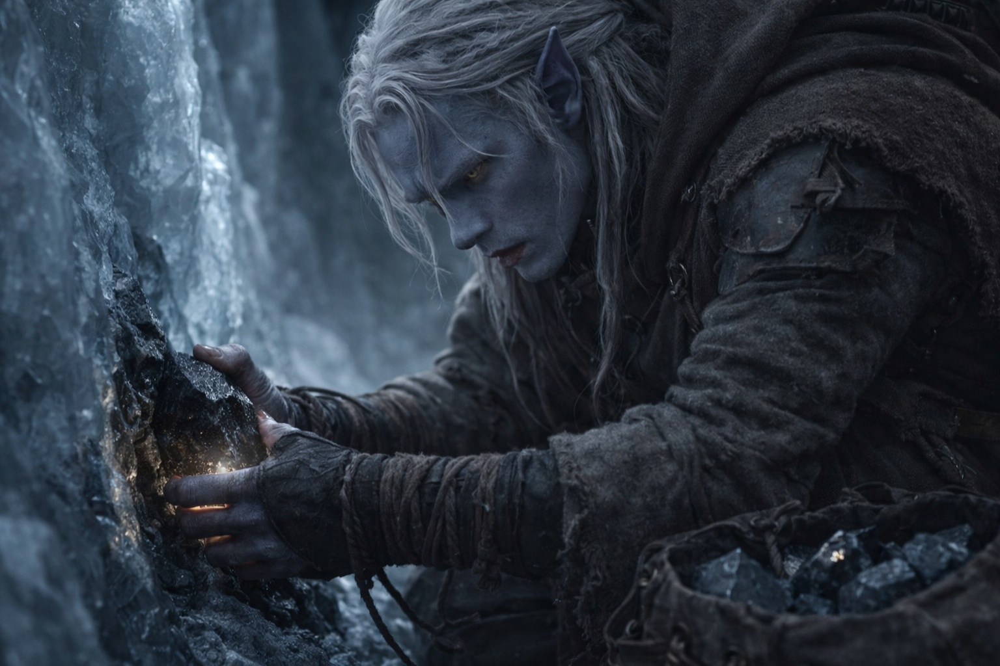

## Chapter 27 | Part 2 | The Depths

---

His shoulders wedged in the narrow passage. He turned sideways and pushed on.

Red light followed him. The heat burned his back, and the compound was wearing off. He had to feel for holds he would have spotted moments earlier.

He moved deeper. The crack he'd chosen led him through a descending passage barely wider than his shoulders, the stone warm against both arms, crystal veins thickening in the walls. What had been thin threads in the upper tunnels were now ropes of dark material running through the basalt, each the width of his thumb, warm to the touch and vibrating at a frequency too low to hear but present in his teeth, his breastbone, the small bones of his inner ear.

He found the Scorchshells packed into gaps at the next junction. Only their antennae moved as he squeezed past.

The passage opened.

His footsteps echoed across a space too large for him to see. He could make out a few paces of floor and the wall beside him.

Because the walls were crystal. Not veined with it. Made of it.

Facets of black crystal covered the floor and walls. Light from deeper deposits caught on their edges as he moved.

The hum made his teeth ache. He took his hand off the wall, but the vibration remained. His vision pulsed at the edges.

He reached for the Voice again.

He waited with his palm against his chest.

Nothing answered.

The air was stale. He breathed slowly until the tightness in his chest eased.

His pack brushed the wall. A clear note rang through the chamber, and the vibration in his bones changed.

He stopped walking.

The chamber changed.

The walls looked the same. Yet he felt pressure building around him and couldn't find its source.

Something was present that hadn't been before. Or had always been, and was now paying attention.

He stood still. The crystal hummed. The frequency in his bones intensified, not painfully but insistently, as if the vibration were trying to match something in him and kept finding the wrong resonance. His vision pulsed. The edges of the chamber blurred and sharpened in a rhythm that had nothing to do with his heartbeat.

He knew he was being watched. The certainty came without words or an image he could understand.

He tried to locate the presence. The moment he concentrated on one part of the chamber, he felt it behind him as well. There was no safe direction to turn.

Blood ran onto his upper lip. He pressed a hand against the wall to stay upright. He could still move his legs.

He tested one step.

The pressure eased. His vision steadied. He couldn't tell whether the presence had withdrawn or he had lost the ability to feel it.

He wiped the blood from his lip. His hand shook. He let it shake because fighting it would cost energy he couldn't spare.

A fist-sized black crystal lay loose beside the wall. He picked it up. It was warm and vibrated in his palm. The ache in his teeth eased, though his fingers grew numb around it.

He put it in his pack. His hands still shook, but he could see clearly enough to search the floor.

He took four more loose pieces and pried two from a cracked section of wall. Seven in all. The hum grew quieter with each addition. He had to watch his fingers to keep from dropping them.

His pack was heavy. His nose had stopped bleeding. The blood on his lip was drying, pulling his skin tight.

He crouched under the weight of the pack and waited until he could stand without swaying. The mountain shook again above him.

---

**End of Chapter 27.2 —> 27.3: [The Price of Passage: The Hum](/the-price-of-passage-the-hum/)**
