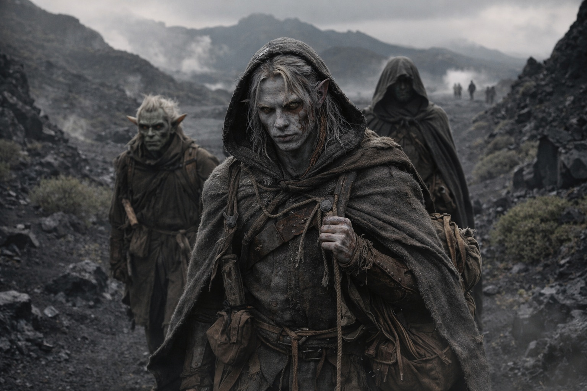

## Chapter 27 | Part 5 | The Far Side

---

Drusniel kept turning northwest, even when the easier ground lay elsewhere.

Northwest. Through the cooling ash fields where the eruption had reshaped the terrain into ridges of new stone, black and glassy and still warm enough to feel through his boot soles. Past the plate-fields where thermal vents hissed steam into a sky that grew clearer the farther they walked from the volcanic core. Into territory that none of them had mapped, on a heading that Drusniel couldn't justify and didn't try to.

Srietz stayed two paces behind and to his left. Elion walked farther out on the right. They had asked where he was going once; he hadn't been able to tell them more than the direction.

The landscape changed as they moved northwest. The volcanic plate-fields gave way to older terrain, basalt weathered into soil, scrub vegetation pushing through cracks where centuries of ash had decomposed into something that could sustain roots. The air cooled in increments. The sulfur smell faded. By the time they crested the ridge that marked the boundary between the active volcanic zone and whatever lay beyond it, the air smelled of dirt and green things and the particular metallic tang that preceded rain.

He still felt the pull in his chest. At each turn, he checked it against the ridge ahead.

The part that should have worried him was how little it worried him.

Something in the chamber had given him a destination. He knew nothing about it. Yet here he was, leading the others toward it.

The Voice hadn't answered in the tunnels. He'd got out by reading the stone and following the air.

He'd expected more relief. He still owed it twice.

The crystals in his pack hummed. Fainter now, away from the mountain's core, but still present. He felt them against his spine through the leather, warm and vibrating at a frequency that seemed to tune itself to his footsteps. Each crystal he'd harvested from the chamber carried a fraction of the mountain's frequency, and collectively they produced something that didn't amplify anything in him but smoothed the edges of Wyrmreach's particular wrongness. Colors stayed where they were. Distances behaved. The subtle disorientation that Wyrmreach fed to newcomers and never quite stopped feeding was quieter with the crystals close.

A useful tool. A dangerous dependency. He'd figure out which later.

"Srietz has a question," Srietz said from behind him.

"One."

"How long."

"I don't know." He could feel a direction, not a distance.

"Srietz will adjust his expectations downward," he said. "Srietz's expectations were already low."

The terrain shifted again. They crossed into what had once been forest, the trees stripped to black trunks by some older eruption, the ground between them covered in a carpet of grey ash and new growth fighting through it. Ferns, mostly. Small tough plants with leaves like leather. Life reasserting itself in the space between catastrophes.

A stone marker.

Drusniel crouched and cleared ash from the marker's base. Interlocking cuts joined it to a buried foundation stone. Drow work, the same construction he'd seen in the vision.

The Null pressed against his chest as he bent. He checked it beneath his shirt. Still inert. The crystals in his pack continued to hum.

He stood and kept walking. The direction had narrowed from a general heading to a specific bearing, as if the compass in his chest had gained resolution. Northwest had become this path, this ridge, this particular line through the stripped forest.

Beyond the dead trees stood a stone tower. He recognized it before he reached the clearing.

The paths were clear and the walls repaired. Someone had cut back the undergrowth recently.

The sky above the tower was pale grey with unfallen rain. He'd seen it before. In the crystal chamber, through a vision that had arrived without permission and lodged in his bones without consent.

The door was open.

A broad-shouldered drow stood in the entrance, taller and older than Drusniel. His skin was bluish ash, his eyes black. He watched them approach without leaving the doorway.

"You're Zaelar's errand," Szoravel said.

Drusniel stopped at the step.

"You're late."

Szoravel looked at the pack. The crystals hummed.

"You went through the mountain. Put the crystals on the bench inside."

Drusniel stood at the threshold. His legs ached. His elbows were raw. The blood on his face had dried to a brown crust that pulled when he moved his mouth. Behind him, Srietz had stopped six paces back, one hand on his belt pouch, assessing the tower and its occupant with the concentrated suspicion of someone whose survival had depended on accurate first impressions.

Szoravel looked at Srietz. At Elion, further back, still as a held breath. Then back to Drusniel.

"Come in," he said, and stepped aside.

The doorway was dark. The tower interior smelled of old stone and something chemical and the particular dry warmth of a fire that burned without behaving like fire. Drusniel could see the edge of a workspace, shelves, tools organized by a system he didn't recognize.

He looked back once. Srietz's ears were flat. Elion hadn't moved. The dead forest stood behind them, and beyond it the volcanic fields, and beyond those the mountain he'd walked through, carrying crystals that hummed and a direction that had led him here.

He went in.

---

**End of Chapter 27.5 —> 28.1: [The Second Blood: The Cost](/the-second-blood-the-cost/)**
