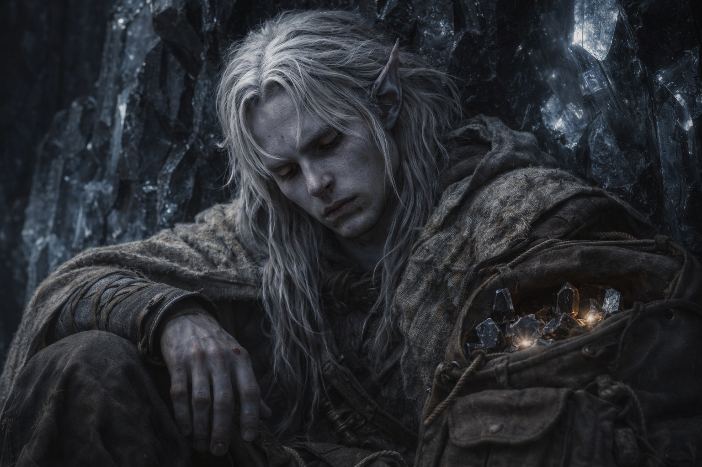
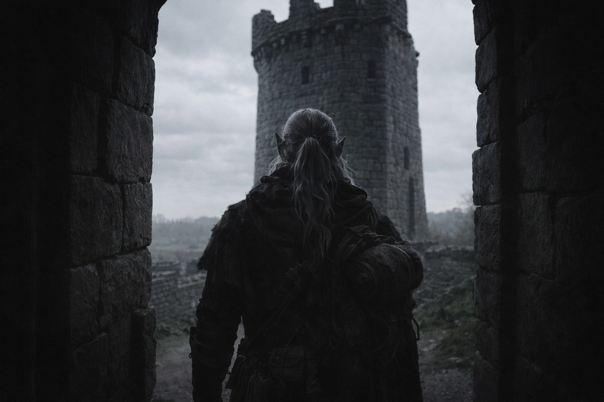

## Chapter 27 | Part 3 | The Hum

---

The crystals knocked together as he lowered his pack.

He sat against the wall. His nose had stopped bleeding, but he still tasted blood and couldn't feel the tips of his fingers.

With seven crystals in the pack, he could bear the chamber's hum. He kept them close.

He needed another way out before the next eruption. First he needed his legs to stop shaking.

So he sat, and the crystals hummed, and the vision came without warning.

The crystal wall disappeared. He still felt it against his back, but now he saw daylight.

A tower. Stone, old, maintained with the deliberate care of someone who had been maintaining it for generations. The masonry was drow work. He recognized the jointing technique, the way the blocks interlocked without mortar, each stone cut to distribute load through friction and geometry rather than adhesive. The kind of work that required either centuries of institutional knowledge or a single craftsman who'd had centuries to perfect the method.

The sky above the tower was pale. Not the sulfurous haze of Wyrmreach's interior, not the perpetual glow of the volcanic fields. A sky that had weather. Clouds moved across it, grey and thin, carrying rain that hadn't fallen yet. Beyond the tower, the land was tended. Not farmed. Maintained. Paths cleared of debris, stone walls repaired along their tops where frost would crack them, drainage channels kept open through undergrowth that someone had cut back within the season.

Someone stood in the tower's entrance. He couldn't make out a face.

Northwest. The direction came to him as clearly as the tower, though nothing in the view could have told him where it was.

Other fragments. The tower's interior, glimpsed as if through a window he was passing at speed. Shelves of materials organized by a system he didn't recognize. A workspace. Tools that looked alchemical and tools that looked surgical and tools that looked like nothing he had a word for. A fire that burned without visible fuel in a hearth built to specifications no standard architecture would produce.

The figure appeared closer. Drusniel strained to see its face, but the image wouldn't sharpen.

Then it was over. The chamber reasserted itself around him. Crystal walls. Hum. The smell of minerals and ancient trapped air. His pack against his back, the crystals vibrating gently against his spine through the leather.

He was still sitting where he'd been. His eyes were wet. He didn't know when that had happened or what it meant, and he didn't try to find out. He wiped them the way he'd wiped the blood, with the back of his hand, and the gesture was enough.

The direction remained after the vision ended. Northwest. He turned his head, testing it. The pull stayed fixed.

He didn't question it. Not because he trusted visions, or crystals, or the mountain, or whatever had looked at him from a direction that shouldn't exist. He didn't question it because the alternative was sitting in a crystal chamber underneath a volcano waiting for the next eruption to finish what the last one had started, and direction, any direction, was better than that.

He stood too quickly and had to brace against the wall. When his balance returned, he checked the exits.

He followed the chamber's edge, feeling for openings and testing the stone around them.

Three tunnels led out of the chamber. Two ran roughly south, back toward the passages he'd come from. The third ran northwest.

He pressed his palm against the stone at the northwest tunnel's mouth. Cool air moved against his skin from somewhere ahead, pushing through the cracks in a steady flow that meant connection to a larger space. The temperature was lower than the chamber. The stone here was older, the crystal veins thinner, which meant the volcanic activity was weaker in that direction. Cooler stone, less crystal, farther from the source.

Northwest. Toward the tower and the figure who waited and the sky that had weather.

He shouldered the pack and entered the northwest tunnel. The crystals hummed against his back.

He was alone in the mountain with a direction he couldn't explain and a pack full of warm crystals and a nosebleed that had dried brown on his face. Somewhere above him, Srietz was counting minutes and running out of optimism. Somewhere ahead, a tower waited in a place the volcanic haze couldn't reach.

He walked. His fingers traced the tunnel wall. The cracks told him the way was sound.

---

**End of Chapter 27.3 —> 27.4: [The Price of Passage: The Way Back](/the-price-of-passage-the-way-back/)**
