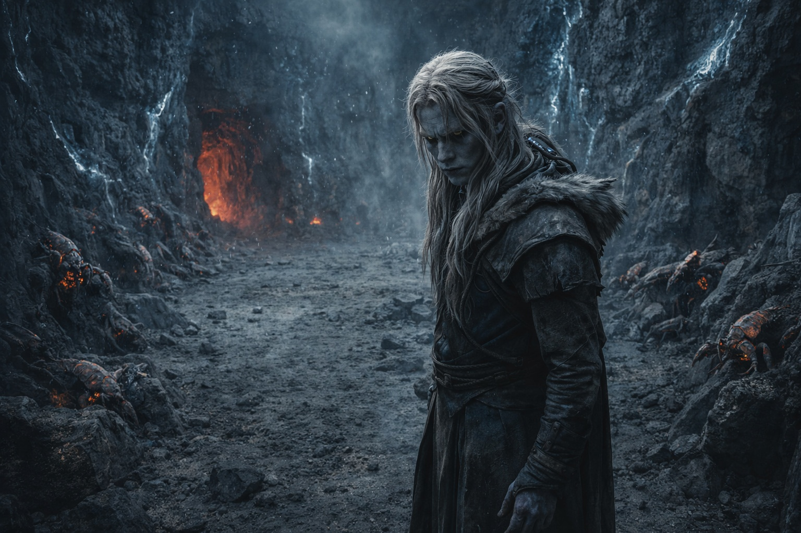

## Chapter 27 | Part 1 | The Mouth

---

The dark had weight. He felt it settle against his shoulders the moment the tunnel curved and the entrance light died.

The speed compound turned the darkness into data. His ears became instruments. The Scorchshells ahead of him produced a layered percussion: armored legs on basalt, carapace plates shifting as bodies compressed through narrow gaps, the wet click of mandibles testing the air temperature. Dozens of them, moving fast, and Drusniel ran behind them with his left hand trailing the tunnel wall, fingers reading the stone.

Wide fracture, vertical, mineral deposits in the gap. Old. Stable. The wall here had survived centuries of thermal cycling. Good stone.

The tunnel dropped at an angle that steepened as he went, each stride carrying him deeper into the mountain. The heat increased in gradients he could measure by the sweat on his forearms. Warm. Warmer. The stone under his fingers went from cool to blood-temperature in thirty paces.

He counted. Three minutes since the window opened. Srietz had estimated eleven to thirteen. The compound's peak would last eight.

The Scorchshells led him through a branching junction where three tunnels converged. They didn't hesitate. The bulk of them flowed left and down, their armored bodies creating a living current that scraped the walls with a sound like chain being dragged across slate. Drusniel followed. His fingers found the left tunnel's wall and traced it. Horizontal fractures, layered deposits, tight grain. The stone here was compressed, load-bearing, the deep architecture of a mountain that had spent millennia learning to hold its own weight.

Six minutes.

The passage narrowed. His shoulders brushed both walls. He turned sideways and pushed through, stone pressing hot against his chest and back, and his fingers never left the wall beside his face. The fracture pattern shifted. Finer grain. Fewer deposits. The stone was younger here, laid down by more recent flows, which meant it was less tested. Less proven.

He filed that and kept moving.

The Scorchshells flowed through gaps that shouldn't have admitted anything larger than a fist, their segmented bodies compressing with an efficiency that looked like liquid poured through cracks. Drusniel's body did not compress. He pushed through spaces that scraped skin from his elbows and left volcanic grit in his teeth, and the compound kept his pulse from spiking into panic because the chemistry in his blood had no opinion about tight spaces, only about speed.

Seven minutes.

The tunnel opened. Not gradually. The walls fell away on both sides and the ceiling vanished upward into a darkness his potion-sharpened eyes couldn't resolve, and the sound changed, his footsteps suddenly echoing off surfaces far enough away that the delay told him the chamber was large. Maybe forty paces across. Maybe more.

The Scorchshells spread across the floor like spilled mercury, some continuing through smaller exits, others curling against the walls in the clusters he'd learned to read as resting behavior. The heat here was lower. Not comfortable. Survivable.

Crystal veins in the walls caught whatever trace light his dark-adapted eyes could find. Thin lines of something that wasn't quite reflective, more like the stone was threaded with material that held light differently than basalt. The veins ran deeper into the mountain, branching and converging, following a pattern his fingers wanted to trace.

Nine minutes.

The ground shook.

Not the slow swell of pressure building toward release. A sharp jolt from below, sudden, as if something inside the mountain had shifted position. The Scorchshells froze mid-stride. Every one of them. Their bodies went rigid on the stone, antennae pressed flat, a collective stillness that communicated a single word in a language made of absence.

Wrong.

A second jolt. Stronger. Dust fell from the darkness above, fine particles that caught in his throat and tasted of sulfur and something metallic. One of the crystal veins in the nearest wall cracked, a clean sound like a struck tuning fork, and a hair-thin line appeared across its surface.

The Scorchshells began to burrow.

Not the measured retreat he'd watched from the surface. This was frantic. Armored bodies drove into gaps between rocks, into crevices, into any space that would accept them. In seconds the chamber floor was empty except for Drusniel and the grit still settling from above.

He had time. Minutes, at least. The cycle wasn't due to peak for another three or four minutes.

The tunnel behind him glowed.

Red light crept up the passage he'd come through, not flames but heat itself becoming visible, the stone walls radiating energy that turned the air into something thick and shimmering. The temperature in the chamber jumped. Ten degrees. Twenty. His exposed skin prickled, then stung.

The breathing cycle had broken. The mountain was exhaling early, from channels that shouldn't have been active yet, and the route he'd taken in was filling with thermal energy that would turn tissue to charcoal before fire ever reached him.

He reached for the Voice.

The motion was involuntary. A reflex carved into him by months of crisis, the part of his mind that had learned to expect an answer in the dark. Like reaching for a railing at the edge of a drop. His awareness shifted inward, toward the place where the presence lived, the cold space behind his thoughts where something had spoken before.

Nothing. Not silence, because silence implied a room that had gone quiet. This was emptier. The space itself was hollow, as if whatever had occupied it had been gone so long the walls had forgotten the shape of it.

He was alone in the mountain, and the mountain was closing.

If he failed here, Nyxara would calculate the loss and continue. The thought was cold and useful.

The red glow in the tunnel behind him brightened. He could feel its heat against his back, a physical pressure that would become unbearable in minutes. The compound was beginning to taper. He could feel that too, a softening at the edges of his perception, the razor clarity starting to blur.

Drusniel turned to the chamber wall. Two cracks ran from the crystal veins into deeper stone. His fingers traced them both.

The left crack ran upward, thin and branching, and cool air pressed against his fingertips from somewhere above. Connection to the surface. An escape route, maybe, if the passages were wide enough and the stone held and the eruption didn't seal them before he reached open air.

The right crack ran deeper into the mountain. Wide. Warm. Following the direction the Scorchshells had fled.

Follow the small ones.

The cave writings from another life. Instructions left by someone who had survived this, or instructions left by someone who had watched others try. He didn't know which. It didn't matter. The Scorchshells had gone deep, and the Scorchshells were still alive after a thousand thousand eruptions.

He chose deeper. The red light behind him filled the chamber and turned his shadow into something long and fleeing.

---

**End of Chapter 27.1 —> 27.2: [The Price of Passage: The Depths](/the-price-of-passage-the-depths/)**