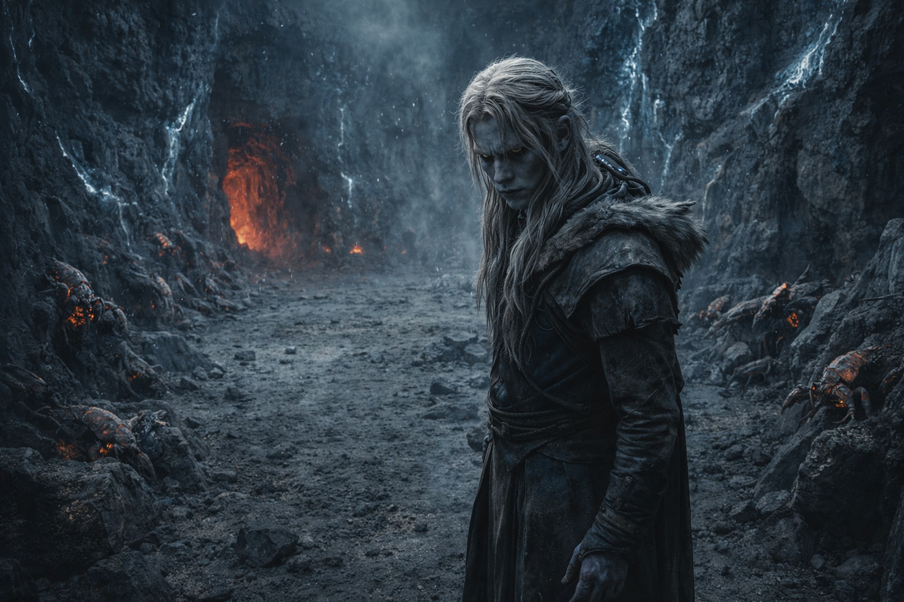

## Chapter 27 | Part 1 | The Mouth

---

The entrance light disappeared as he rounded the bend. He kept his hand against the wall.

The speed compound sharpened his hearing. He could distinguish the Scorchshells' feet scraping basalt from the clicks of their armored plates. Dozens ran ahead of him. He followed, testing the stone with his fingertips.

Wide fracture, vertical, mineral deposits in the gap. Old. Stable. The wall here had survived centuries of thermal cycling. Good stone.

The tunnel steepened. Sweat ran down his forearms, and within thirty paces the wall was warm under his hand.

Three minutes since the cooling window opened. Srietz had estimated eleven to fourteen. The compound's peak would last eight.

At a three-way junction, most of the Scorchshells turned left and down. Drusniel followed. The fractures in this wall were tight and filled with mineral deposits. He could trust his weight to it.

Six minutes.

The passage narrowed. His shoulders brushed both walls. He turned sideways and pushed through, stone pressing hot against his chest and back, and his fingers never left the wall beside his face. The fracture pattern shifted. Finer grain. Fewer deposits. The stone was younger here, laid down by more recent flows, which meant it was less tested. Less proven.

He filed that and kept moving.

The Scorchshells compressed their segmented bodies through gaps barely wider than his fist. Drusniel had to find larger openings. Even those scraped his elbows raw. He kept moving before he could think about getting stuck.

Seven minutes.

The tunnel opened. Not gradually. The walls fell away on both sides and the ceiling vanished upward into a darkness his potion-sharpened eyes couldn't resolve, and the sound changed, his footsteps suddenly echoing off surfaces far enough away that the delay told him the chamber was large. Maybe forty paces across. Maybe more.

The Scorchshells scattered. Some took smaller exits; others curled against the walls. The chamber was cooler than the tunnel. He could breathe here.

Faint light showed in the crystal veins along the walls. They branched and joined again, running deeper into the mountain.

Nine minutes.

The ground shook.

The jolt came from below, sharp enough to jar his knees. Every Scorchshell stopped, antennae pressed flat.

Wrong.

A second jolt. Stronger. Dust fell from the darkness above, fine particles that caught in his throat and tasted of sulfur and something metallic. One of the crystal veins in the nearest wall cracked, a clean sound like a struck tuning fork, and a hair-thin line appeared across its surface.

The Scorchshells began to burrow.

Not the measured retreat he'd watched from the surface. This was frantic. Armored bodies drove into gaps between rocks, into crevices, into any space that would accept them. In seconds the chamber floor was empty except for Drusniel and the grit still settling from above.

He had time. Minutes, at least. The cycle wasn't due to peak for another three or four minutes.

The tunnel behind him glowed.

The passage walls glowed red. Air shimmered above the stone, and the heat stung his exposed skin.

The eruption had started early. He couldn't return through that tunnel.

He reached for the Voice.

He hadn't meant to. Yet he waited for the words, as he had when Srietz fell.

No answer.

He was alone in the mountain, and the mountain was closing.

If he failed here, Nyxara would calculate the loss and continue. The thought was cold and useful.

The red glow in the tunnel behind him brightened. He could feel its heat against his back, a physical pressure that would become unbearable in minutes. The compound was beginning to taper. He could feel that too, a softening at the edges of his perception, the razor clarity starting to blur.

Drusniel turned to the chamber wall. Two cracks ran from the crystal veins into deeper stone. His fingers traced them both.

The left crack ran upward, thin and branching, and cool air pressed against his fingertips from somewhere above. Connection to the surface. An escape route, maybe, if the passages were wide enough and the stone held and the eruption didn't seal them before he reached open air.

The right crack ran deeper into the mountain. Wide. Warm. Following the direction the Scorchshells had fled.

Follow the small ones.

He remembered the cave writing. He didn't know who had left it, but the Scorchshells had gone deeper. They had survived this before.

He took the deeper passage before the heat reached him.

---

**End of Chapter 27.1 —> 27.2: [The Price of Passage: The Depths](/the-price-of-passage-the-depths/)**
