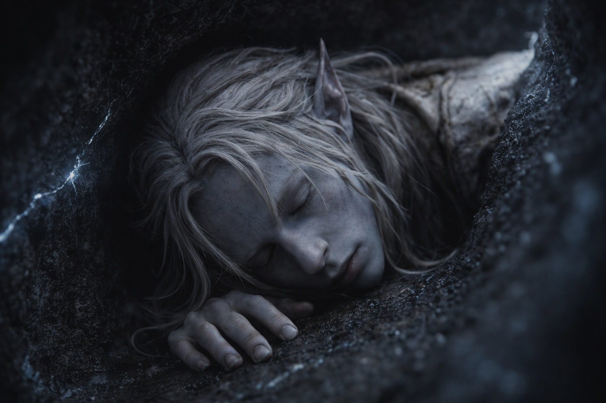

## Chapter 27 | Part 4 | The Way Back

---

A side passage led back toward his entry route. He checked it and found fallen stone sealing the way.

He stood in front of the blockage and let his fingers tell him what his eyes already knew. The collapse was fresh, the broken edges sharp under his fingertips, the stone still warm from whatever thermal surge had brought the ceiling down. Fine dust hung in the air, catching the faint blue-white glow from the crystal veins behind him. The compound had worn off entirely now. His body moved at its own pace, which was the pace of a man who had been running, climbing, and bleeding inside a volcano for hours, which was slow.

He turned back.

He returned to the northwest tunnel. Cool air moved through it. He hoped it would lead to the surface.

He walked.

Without the Scorchshells, the mountain was his to read alone. His left hand never left the wall. Every ten paces, he stopped, pressed his palm flat against the stone, and felt. Temperature. Vibration. The faint pressure of air moving through fissures he couldn't see. The cracks in the basalt told him stories if he listened with his fingers instead of his ears. Where stress fractures radiated from a collapse, the path was compromised. Where the grain ran smooth and unbroken, the stone had been stable for centuries. Where thin lines of crystal veined the rock, the volcanic energy was closer. Where the veins thinned to nothing, the surface was nearer.

He followed the cold.

The tunnels branched. Three times in the first hour, by his rough count, and each time he stopped at the junction, traced both walls with both hands, and chose the passage where the air was cooler against the back of his knuckles. At the second junction, both tunnels breathed cold. He crouched and pressed his cheek to the stone floor of each. The left one carried a draft that smelled of sulfur, faint but present. The right smelled of nothing. He chose nothing. Sulfur meant vents. Vents meant activity.

At each junction the hum changed. He kept choosing by the air and the stone.

His calves cramped. The pack straps rubbed his shoulders raw, and his right knee clicked each time he straightened it. He shortened his stride.

He kept walking.

The tunnel climbed. Gradually at first, then steeply enough that he needed both hands and had to brace his pack against the wall behind him to keep its weight from pulling him backward. The crystals shifted and clicked against each other in the leather, warm against his spine. The stone under his hands was cool. Actually cool, not the relative coolness of slightly-less-hot. Cold enough that moisture condensed on its surface and made his grip uncertain.

He was close.

A stronger draft struck his face, carrying ash and the smell of scorched earth. Outside air.

He climbed toward it.

The tunnel narrowed, then widened, then narrowed again in a pattern that felt organic, as if the passage had been carved by water that no longer ran here. His hand found a ledge. He pulled himself up. Another ledge. His arms shook. He pulled himself up again. The wind grew stronger with each climb, and the crystal veins in the walls disappeared entirely, replaced by plain basalt, dark and cold and blessedly ordinary.

Light.

Grey daylight filtered through cracks above him. He could see the next ledge.

He climbed toward it. The passage steepened into a near-vertical chimney, and he braced his back against one wall and his feet against the other and pushed upward, inch by inch, the pack on his chest now, the crystals pressing warm against his ribs. His arms burned. His legs shook. The light brightened with each body-length of altitude, and the wind pushed down around him as if the mountain were exhaling him.

He pushed the pack through the opening first, then squeezed after it. Stone scraped his back. Outside, he sat on the gravel with the pack between his knees and looked up at the clouds.

The world outside the mountain was unchanged. The volcanic plate-fields stretched in every direction, grey and cooling, the recent eruption's evidence visible in fresh flows that had reshaped the terrain he'd studied from above. Steam rose from fissures in the new stone. The air was acrid and warm but a different warm, the kind that came from above instead of below.

His nose was crusted with dried blood. His elbows were raw. His hands were steady, though he couldn't have said why. Something about the crystals against his body, or the direction lodged in his chest, or the simple fact of being alive when the mountain had offered several alternatives.

Movement below. On the slope beneath him, where the terrain leveled into the shelf they'd camped on before the crossing, a small green figure was running. Legs too short for the stride they were attempting, arms pumping, equipment bouncing, moving uphill with the desperate gracelessness of someone who had been watching a tunnel entrance for hours and had given up expecting anything good.

Srietz reached him out of breath and gripped his shoulders.

"What happened?" His ears lay flat against his skull.

Drusniel blinked against the daylight. The greyness of the overcast sky felt blinding after the tunnels. Behind him, in his pack, the crystals hummed.

"I found crystals," he said. "And I know where Szoravel is."

"How?"

Drusniel wiped his nose. The dried blood flaked under his fingers, brown and brittle.

"I can't explain it. But I know."

Srietz looked from the dried blood to the pack, then at the opening behind him.

"Srietz does not find that reassuring."

"Neither do I," Drusniel said.

---

**End of Chapter 27.4 —> 27.5: [The Price of Passage: The Far Side](/the-price-of-passage-the-far-side/)**
